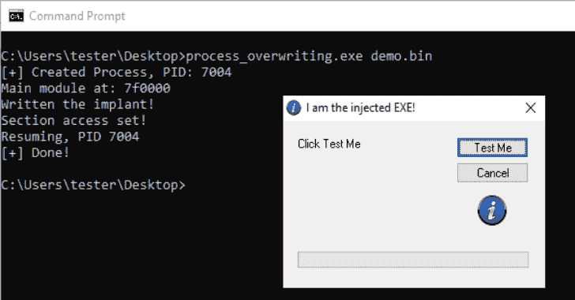
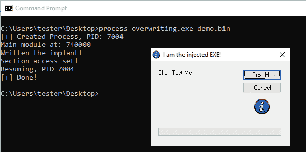

# Process_Overwriting:进程空洞化的另一种变体

> 原文：<https://kalilinuxtutorials.com/process_overwriting/>

%20(1).png)

**进程覆盖**是一种 PE 注入技术，与进程空洞化和模块重载密切相关

工艺中空(又名 RunPE)是一种古老而流行的 PE 注射技术。它有多种口味，但有一些共同的步骤:

*   首先创建一个处于挂起状态的流程
*   在它的内存中编写我们自己的 PE 模块
*   重定向到新模块
*   恢复线程

进程中空化不需要手动加载有效负载的导入。由于 step 3，Windows loader 将我们的 PE 植入视为该过程的主要模块，并在执行恢复时自动加载导入。

要使我们的植入程序被 Windows loader 识别，它的模块库必须设置在 PEB 中。通常通过以下两种方式之一完成:

*   在最经典的变体中，原始 PE 从内存中被取消映射，新 PE 被映射到它的位置，在相同的地址。
*   在另一个常见的变体中，旧模块保持原样，另一个 PE 被映射到新的内存区域。然后，新模块的基址被手动写入 PEB(这里演示了这种变体)

作为这些经典实现的结果，我们得到了一个作为主模块运行的有效载荷，然而它被映射为`**MEM_PRIVATE**`(不像典型加载的 PE 那样映射为`**MEM_IMAGE**`)。为了获得映射为`M**EM_IMAGE**`的有效载荷，我们可以使用一些密切相关的技术，比如事务中空化或者它的变体“幽灵中空化”。

进程覆盖是解决这个问题的另一种方式。

与经典的过程空洞化相反，我们不是取消原始 PE 的映射，而是覆盖它。没有分配新的内存:我们使用的是最初分配给进程主模块的内存。

优点:

*   植入的 PE 看起来像是由 Windows 加载程序加载的:
    *   映射为`**MEM_IMAGE**`
    *   分为具有特定访问权限的部分
    *   该图像被命名为
*   装载方便:
    *   无需在注射前手动重新定位植入物:Windows 加载程序会处理此事(*在传统的挖空过程中，我们必须重新定位模块*
    *   不需要填充进口(*像在每一个变种的过程中空*
    *   在这个过程中不需要分配新的内存

缺点:

*   如果目标启用了 GFG(控制流保护),它就不起作用(但是在进程创建时可以禁用它)
*   目标的 ImageSize 不得小于有效负载的 ImageSize(记住我们只使用已经分配的内存！)–*这种限制不会出现在其他类型的进程空洞化中*
*   可以通过将内存中的模块与相应的文件进行比较来检测(PE-sieve 检测到它)–*就像每一个进程空洞的变体*

## 演示

注入到 Windows Calc 中的演示负载(`**demo.bin**`)(默认目标)

## 克隆

使用递归克隆获得 repo 以及所有子模块:

**git 克隆–递归 https://github.com/hasherezade/process_overwriting.git**

[**Download**](https://github.com/hasherezade/process_overwriting)