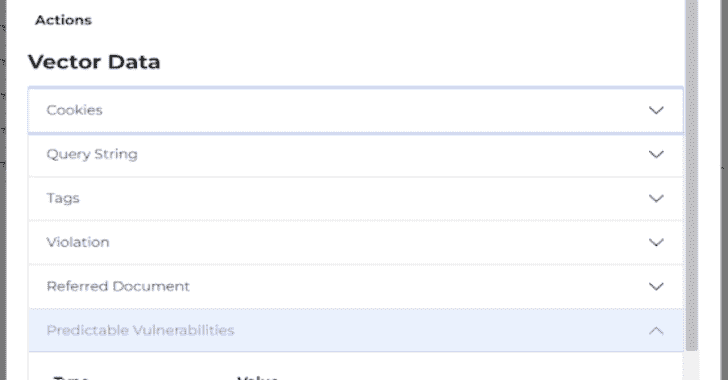

# BWASP : BoB Web 应用程序安全项目

> 原文：<https://kalilinuxtutorials.com/bwasp/>

.png)

**BWASP** 是 BoB Web 应用安全项目(BWASP)的一款开源的分析工具，用于支持黑客对 Web 漏洞的人工分析。

BWASP 工具基本上是通过漏洞分析提供预测信息，而不进行攻击。

BWASP 支持执行自动分析和手动分析。

BWASP 项目支持:

*   自动寻找攻击媒介。(例如，SQL 注入、跨站点脚本)
*   检测网站技术。
*   Log4J 漏洞扫描(部分支持 java 语言)
*   HTTP REST API
*   指导结果
*   测试有效载荷选项(攻击测试)

## 入门指南

**pip 3 install-r requirements . txt
python 3 start . py**

[**Download**](https://github.com/BWASP/BWASP)