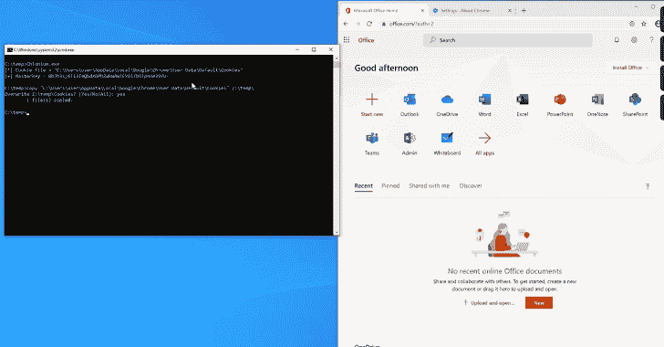

# Chlonium : Chromium Cookie 导入/导出工具

> 原文：<https://kalilinuxtutorials.com/chlonium/>

.png)

Chlonium 是一个为克隆 Chromium Cookies 设计的应用程序。

从 Chromium 80 及更高版本开始，cookies 使用 AES-256 GCM 加密，状态密钥存储在本地状态文件中。该状态密钥使用 DPAPI 加密。这与旧版本有所不同，旧版本使用 DPAPI 来加密 cookie 数据库中的每个 cookie 项。这意味着，如果您有状态密钥，您将总是能够离线解密 cookie 数据库，而不需要持续访问 DPAPI 密钥。

这实质上使 cookie 数据库变得“可移植”，意味着它们可以在机器之间移动，前提是您已经转储了状态密钥。cookies 本身在导入时需要重新加密，因为每个用户配置文件和机器上的状态密钥是不同的。这可以使用与解密相同的过程来完成，首先从“目标”浏览器解密状态密钥，然后用新密钥重新加密每个项目。

这个项目是用 C#编写的，有两个独立的组件。第一个组件`**chlonium.exe**`是收集器二进制文件。它只是解密状态密钥并打印出来。请记下这个密钥，将来需要更新 cookie 时，您可以通过下载`**Cookies**`数据库文件来解密 cookie。默认情况下，它会尝试解密 Chrome 状态密钥。如果要转储另一个浏览器(如 Edge)的状态密钥，可以指定密钥的路径。

例如:

**Chlonium.exe“c:\ users \ User \ AppData \ Local \ Microsoft \ Edge \ User Data \ Local State”
[+]State key = 3 CMS 3 yxfxvyjrubulycnxqy2 do/jubDkYBQBoYIvqfc =**

第二个组件是“导入器”工具。它负责用给定的状态密钥解密给定的 cookie 数据库文件，用当前用户的状态密钥重新加密这些值，并将 cookie 导入到您选择的浏览器中。您可以在想要导入 cookies 的机器上运行这个程序。

要使用它，运行`**ChloniumUI.exe**`可执行文件。输入之前提取的状态密钥，选择您希望导入的`**Cookies**`文件，并选择您希望将 cookies 导入的浏览器。现在点击“导入 Cookies ”, Cookies 将被导入。

目前支持三种基于 Chromium 的浏览器:Edge、Chrome 和 Vivaldi。可以在`**Browsers.cs**`中添加额外的浏览器。这增加了一个意想不到的好处，即能够将边缘 cookie 文件导入 Chrome，反之亦然(例如)，尽管这可能不是一个好主意，因为用户代理将会不匹配。

**重要提示**:将 cookie 文件导入浏览器时，所有旧的 cookie 都会被清除！将备份复制到当前目录(带有相关时间戳)。如果您需要恢复以前的 cookies，只需将备份文件复制到`Cookies`文件上。

## 为什么

像 Mimikatz 和 SharpChromium 这样的工具已经有能力转储 Chrome 80 cookies 了，为什么还要用另一个工具呢？

这个工具是专门为了让*导入* cookies 到另一个浏览器更容易。虽然这些工具在转储铬饼干方面做得很好(以及更多！)，我想拥有一些可以让我轻松导入另一个浏览器的东西。第三方 cookie 管理器插件是存在的，但是我总是发现这些插件很复杂并且容易失败。`**CloniumUI**`旨在通过将 cookies 直接导入浏览器的 sqlite 数据库来简化这一过程。

虽然这个项目带有`**chlonium.exe**`收集器，有助于转储状态密钥，但这只是一个例子。其他工具，比如 Mimikatz，也会以一种潜在的更隐秘的方式为你转储状态密钥(取决于你的操作环境，执行方法等等)。).此外，如果您有 DPAPI 状态密钥、当前密码或域备份密钥，SharpDPAPI 将允许您解密 Chromium 状态密钥文件，从而允许您通过 SMB 远程转储 cookies！

在执行 Red Teaming 时，我有时需要在一段持续的时间内(例如每天/每周)多次转储用户的 cookies。使用. NET 程序集、反射 DLL 或其他内存执行技术直接在目标系统上从 cookie 文件中提取单个 cookie 是不必要的，并且会增加操作员被检测到的风险。相反，您可以简单地转储一次状态密钥，并在需要新的 cookies 时复制掉`**Cookies**`数据库文件，而不需要额外的执行。

## 密码导入/导出

`**ChloniumUI**`还支持密码导入导出。要使用这个特性，只需提供`**Login Data**`数据库路径而不是`**Cookies**`数据库，以及状态键，并选择您希望将它们导入的浏览器(对于导出来说，这无关紧要)。这允许您以纯文本格式将密码导出到文件中，或者将它们导入到浏览器中。与 cookies 一样，你可以将 Chrome 密码导入 Edge，将 Edge 密码导入 Vivaldi 等。

## 离线状态密钥解密

Chlonium 支持离线状态密钥解密，如果您拥有以下所有文件的*,那么您可以离线解密用户的状态密钥:*

*   本地状态文件来自:`**C:\Users\<user>\AppData\Local\<browser>\User Data\Local State**`
*   DPAPI 主密钥文件来自:`**C:\Users\<user>\AppData\Roaming\Microsoft\Protect\<SID>\**`

*和*下列之一:

*   域备份密钥。pvk 文件(例如，来自 NTDS.dit)
*   base64 中的域备份密钥(例如，来自 Mimikatz/SharpDPAPI `**LsaRetrievePrivateData**` API 方法)
*   用户的密码

现在只需在“Offline statekey decryption”选项卡下提供这些值，Chlonium 将尝试通过首先解密 DPAPI 主密钥(使用备份密钥或密码)，然后使用这些密钥来解密 statekey 来解密加密的 statekey。一旦 statekey 被解密，就可以在“导入或导出数据库”选项卡中使用它来检索 cookies 密码。

使用说明:当使用用户的密码解密 DPAPI 主密钥时，Chlonium 将首先尝试从 DPAPI 主密钥文件夹内的 **`BK-<NETBIOSDOMAINNAME>`** 文件中提取用户的 SID。如果失败(或者文件不存在)，它将尝试从 DPAPI masterkey 文件夹名称获取 SID(默认情况下将根据用户的 SID 命名)。如果您重命名了该文件夹，或者没有 BK 文件的副本，您将无法使用密码解密主密钥。

这个特性利用了@harmj0y 优秀的 SharpChrome 和 SharpDPAPI 项目。完全归功于 SharpDPAPI 的原作者。

## 检测

在 Chrome `**Local State**`和`**Cookies**`文件上设置一个 SACL(还有其他敏感文件如`**Login** **Data**`和`**History**`)。查找打开这些文件的可疑(例如，与浏览器无关的)进程。

看看@cryps1s 的这篇关于设置 SACLs 进行检测的博文吧。

对于使用文件系统过滤驱动程序的反病毒软件供应商，可以考虑阻止与浏览器无关的进程打开这些文件。例如 PowerShell 打开`**Cookies**`文件。

[**Download**](https://github.com/rxwx/chlonium)