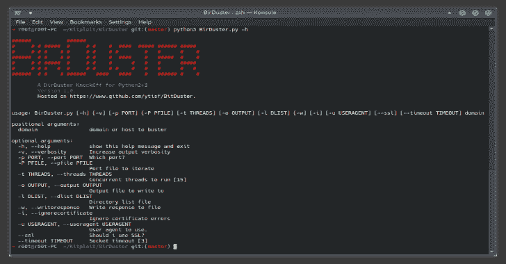

# BirDuster:一个多线程的 Python 脚本，用于暴力破解目录

> 原文：<https://kalilinuxtutorials.com/birduster/>

.png)

是基于 Python 的原版 DirBuster 的仿制品。

`**BirDuster**`是一个多线程 Python 应用程序，旨在暴力破解 web/应用服务器上的目录和文件名。现在经常出现的情况是，默认安装状态下看起来像 web 服务器的东西实际上并不是，并且其中隐藏了页面和应用程序。

## 安装

使用画中画:`**pip3 install --user BirDuster**`

克隆源:

**git 克隆 https://www.github.com/ytisf/BirDuster
CD 捕鸟者
pip 3 install–user-r requirements . txt
python 3 bird uster . py–help**

## 使用

`**BirDuster**`有以下标志和选项(可以通过`**-h**`标志看到):

*   **`-h` / `--help`** :显示帮助并退出。
*   **`-v`、`-vv`、`-vvv` / `--verbosity`** :详细程度。
*   **`-p`/`--port`**:dir busting 时使用的端口。默认 80/443。
*   **`-P` / `--pfile`** :如果你想测试几个端口，只需用换行符将它们写到一个文件中。
*   **`-t` / `--threads`** :并发线程数。默认值为 15。
*   **`-o` / `--output`** :输出响应的 CSV。默认是`**domain_output.csv**`。
*   **`-l` / `--dlist`** :目录列表文件。默认是`**dir_list.txt**`。
*   **`-w` / `--writereponse`** :将 HTTP/S 响应写入文件。默认值为 False。
*   **`-i` / `--ignorecertificate`** :忽略 SSL 证书错误。默认值为 False。
*   **`-u` / `--useragent`** :用户代理使用。默认为随机用户代理。
*   `**--ssl**`:是否使用 SSL。`**-i**`标志会自动开启 SSL。
*   `**--timeout**`:更改默认套接字超时。默认值为 3 秒。

**用法:dirbus . py[-h][-v][-P PORT][-P PFILE][-t THREADS][-o OUTPUT]
[-l DLIST][-w][-I][-u user agent][–SSL]
[–time out]
域
位置参数:
域或主机要巴斯特**

[**Download**](https://github.com/ytisf/BirDuster)