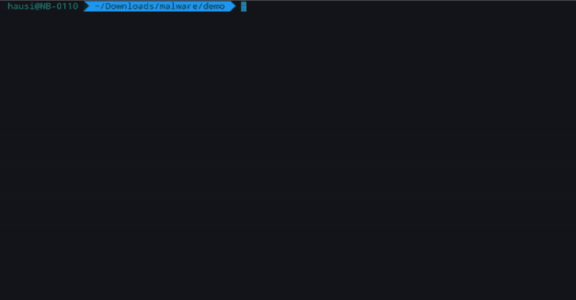

# Vaas 裁决即服务 SDK:分析文件中的恶意内容

> 原文：<https://kalilinuxtutorials.com/vaas-verdict-as-a-service-sdks/>

**VaaS** ( *裁决即服务*)是一项服务，它提供了一个平台来扫描文件中的恶意软件和其他威胁。它允许在您的应用程序中轻松集成。只需几行代码，您就可以开始扫描文件中的恶意软件。

## 集成恶意软件检测

轻松将恶意软件检测集成到任何种类的应用程序、服务或平台中。

用几行代码创建一个命令行扫描程序来查找恶意软件:例如

## SDK

目前，Rust、Java、Typescript 和 PHP 的 SDK 已经上市。

| 功能 | 锈 | Java 语言(一种计算机语言，尤用于创建网站) | 服务器端编程语言（Professional Hypertext Preprocessor 的缩写） | 以打字打的文件 |
| --- | --- | --- | --- | --- |
| 检查 SHA256 | 981 号房 | 981 号房 | 981 号房 | 981 号房 |
| 检查 SHA256 列表 | 981 号房 | -好的 | -好的 | 981 号房 |
| 检查文件 | 981 号房 | 981 号房 | 981 号房 | 981 号房 |
| 检查文件列表 | 981 号房 | -好的 | -好的 | 981 号房 |

[**Download**](https://github.com/GDATASoftwareAG/vaas)