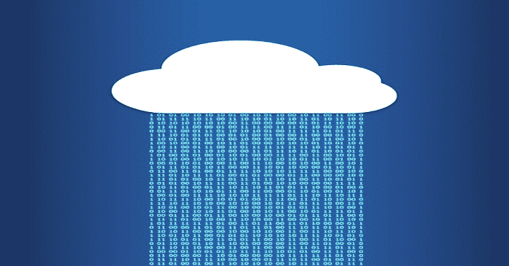

# 暗影克隆:释放云的力量

> 原文：<https://kalilinuxtutorials.com/shadowclone/>

**ShadowClone** 旨在通过将输入数据分配给多个无服务器功能(AWS Lambda、Azure 函数等)来将耗时的任务委托给云。)并并行运行任务，从而大幅提升性能！

ShadowClone 使用 IBM 的 awesome Lithops 库将工作负载分配给无服务器功能，这是该工具的核心。实际上，这是一个概念验证脚本，展示了云计算在执行常规测试任务时的强大功能。

用例

*   DNS 暴力在几秒钟内使用非常大的单词列表
*   在一台主机上使用 ffuf 模糊处理一个巨大的单词列表
*   模糊来自不同 IP 地址的单一路径上的 URL 列表
*   几秒钟内端口扫描数千个 IP
*   在主机列表上运行 nuclei 模板

# 开始

## 先决条件

*   AWS/GCP/Azure/IBM 云帐户
*   Docker 安装在本地机器上。(仅初始设置需要)
*   Python 3.8 以上版本

## 配置

配置分为两部分——云和本地

虽然最终的脚本是云不可知的，应该可以在任何支持的平台上工作，但到目前为止我只在 AWS 上测试过。设置 GCP、Azure 和 IBM 云环境的说明将很快添加。

### 云

*   登录您的 AWS 帐户并获取 API 凭证(访问密钥和密码)
*   转到 AWS 控制台中的 IAM，创建一个具有以下权限的新策略:

**{
"版本": " 2012-10-17 "，
"语句":[
{
"Sid": "VisualEditor0 "，
"效果":"允许"，
"动作":[
"s3: *，" lambda:* "，
"ec2: *，【ecr:* ，
" STS:getcalleriddentity "
。**

*   使用“Lambda”用例创建一个新角色，并将上述策略附加到它上面。
*   请记下该角色的 ARN，您以后会用到它。
*   去 S3，在你的 lambda 将要被执行的同一个区域创建两个桶。
    *   一个存储桶用于存储日志、运行时信息等。另一个桶将用于存储上传的文件

如果您正在使用 AWS，并希望将成本控制在自由层预算内，我强烈建议您遵循本文，并设置一些预算和警报。

### 本地机器

*   确保 docker 安装在您的本地机器上。这仅在初始设置时需要。
*   克隆 repo 并安装 python 依赖项

**git 克隆 https://github.com/fyoorer/ShadowClone.git
CD shadow clone
python-m venv env
source env/bin/activate
pip install-r requirements . txt**

所有的神奇都发生在 lithops 库中，这个库应该是在前面的命令之后安装的。

*   通过运行以下命令，验证是否安装了`**lithops**`命令行实用程序

**光刻测试**

**⚡ lithops 测试
2022-01-18 08:08:45832[info]lithops . config—lithops v 2 . 5 . 8
2022-01-18 08:08:45833[info]lithops . storage . backends . localhost . localhost—创建的本地主机存储客户端
2022-01-18 08:08:45833[info]lithops . localhost jobid a000–启动函数调用:hello()–总计:1 次激活
2022-01-18 08:08:46，111[info]lithops . invokers-executor id b 9419 a-0 | jobid a000–查看执行日志，位置为/tmp/lithops/logs/b 9419 a-0-a000 . log
2022-01-18 08:08:46，111 [INFO] lithops.wait Lithops 正在按预期工作🙂**

如果你看到这个，这意味着 Lithops 已经安装并正常工作。

*   现在，为了让 lithops 与您的云提供商一起工作，在`**~/.lithops/config**`创建一个配置文件，并将以下内容复制到其中

**vi ~/。光刻/配置**

**lithops:
后端:aws_lambda
存储:AWS _ S3
AWS:
access _ key _ id:AKIA【编校】# change me
secret _ access _ key:xxxx【编校】xxxx # change me
# account _ id:# Optional
AWS _ lambda:
execution _ role:arn:AWS:iam::123123123123:role/lithops-execution-role # change me**

标有`**#changeme**`的行需要用上述值更新

*   **`access_key_id`&`secret_access_key`**–您帐户的 API 凭证
*   `**execution_role**`–输入上面提到的 IAM 角色 ARN
*   `**storage_bucket**`–输入您希望用于存储日志的存储桶的名称

确保配置文件位于`**~/.lithops/config**`

## 建造

现在，我们需要构建一个容器映像，其中包含无服务器功能将使用的所有工具。

使用 **`lithops build`** 命令构建图像:

**lithops 运行时构建 sc-runtime -f Dockerfile**

接下来，使用以下命令在您的云环境中注册运行时:

**lithops 运行时创建 sc-运行时–内存 512–超时 300**

检查运行时是否成功注册

**lithops 运行时列表**

复制输出中显示的运行时名称。我们将在下一步中需要它。

最后，用您的运行时和 bucket 的名称更新`**config.py**`:

**LITHOPS _ RUNTIME = " LITHOPS _ v2-5-8 _ ke73/sc-RUNTIME " #从上面获得的运行时名称
STORAGE _ BUCKET = " mytest BUCKET " #上面创建的第二个存储桶的名称**

### 奔跑

最后，我们准备好运行一些兰姆达斯！

**用途**

**python shadowclone.py -h
用法:cloud CLI . py[-h]-I INPUT[-s split num][-o OUTPUT]-c COMMAND
可选参数:
-h，–help 显示此帮助信息并退出
-i INPUT，–INPUT INPUT
-s split num，–split split num
文件每块的行数
-o OUTPUT，–OUTPUT OUTPUT
-c COMMAND，–COMMAND COMMAND
命令执行**

## 它是如何工作的

我们在初始设置期间创建了一个容器映像，并将其注册为 AWS/GCP/Azure 等中我们函数的运行时。当您在计算机上执行 ShadowClone 时，该容器的实例会自动激活，并且仅在其执行期间处于活动状态。根据所提供的输入文件的大小和分割因子，在运行时动态决定要激活多少个实例。然后，输入被分成块，平均分配给所有实例并行执行。例如，如果您的输入文件有 10，000 行，您将分割因子设置为 100 行，那么它将被分割成 100 个块，每个块 100 行，100 个实例将并行运行！

## 特性

*   极快
*   不需要维护 VPS(或一个车队)
*   每月几乎不花一分钱
    *   兼容大多数云服务的免费层
*   云不可知
    *   相同的脚本工程与 AWS，GCP，Azure 等。
*   支持多达 1000 个并行调用
*   动态决定调用次数
*   在云上并行运行*任何*工具
*   通过管道输出到其他工具

## 比较

这个工具的灵感来自于 awesome Axiom 和 Fleex 项目，它超越了 VPS 的概念，通过使用无服务器函数和容器来运行工具。

| 特征 | 公理/弗利斯 | 影子克隆 |
| --- | --- | --- |
| 例子 | 10-100 个* | 千片装 |
| 费用 | 每个实例/每分钟 | 大部分免费** |
| 启动时间 | 4-5 分钟 | 2-3 秒 |
| 最大执行时间 | 无限的 | 15 分钟 |
| 闲置成本 | $++ | 自由的 |
| 按需可扩展性 | 不 | ∞ |

默认情况下，大多数云提供商不允许运行太多的实例，所以你最多只能运行 10-15 个实例。您必须请求支持人员增加此数量。

AWS & Azure 允许每月 100 万次免费调用。谷歌允许每月免费调用 200 万次。只有当你超过这些限制时，你才会被收费

[**Download**](https://github.com/fyoorer/ShadowClone)