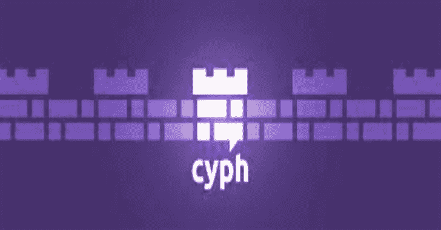

# 密码安全信息和社交网络服务

> 原文：<https://kalilinuxtutorials.com/cyph/>

**Cyph** 是一种加密的安全信息和社交网络服务，提供极高的隐私级别和一流的易用性。

Cyph 的专利技术由前 SpaceX 工程师构建，经 Cure53 审核，是黑帽和 DEF CON 上研究演示的基础，独特地允许 Cyph 解决传统解决方案的主要安全性和可用性限制。

可在本地运行的命令(需要 Node.js 和 Docker):

*   `**npm run serve**`:服务于 http://localhost:42002 的本地实例
*   `**npm run verify**`:验证已签名的产品版本是否可在代码的本地副本上重现

第一次运行这些命令将在本地构建 Docker 映像，这可能需要一段时间。

Cyph 由创始人瑞安·莱斯特(Ryan Lester)和乔希·博恩(Josh Boehm)运营，他们是 SpaceX 的前工程师，也是 20 多年来最好的朋友，他们在各种软件项目上密切合作了许多个通宵。Cyph 最初通过 Mach37 网络加速器启动，目前得到了 Goel 基金和创新技术中心的支持。

Cyph 是我们一起开始的一个自然项目，因为我们一直都对 cypherpunk 增强个人自由和隐私的努力感兴趣。

我们十几岁的时候就迷上了编程；修补 Tor、Linux 和 OTR 加密；和挖矿比特币还没凉。作为成年人(他们经常在 SpaceX 处理 ITAR 敏感信息)，私下在线交流的困难已经成为我们明显的眼中钉——现有的解决方案使用起来很麻烦，缺少基本功能，在实践中也不太安全。爱德华·斯诺登揭露的真相最终激励我们承担起这个责任。

我们知道可能有更好的方法，所以我们创建了 Cyph。

[**Download**](https://github.com/cyph/cyph)