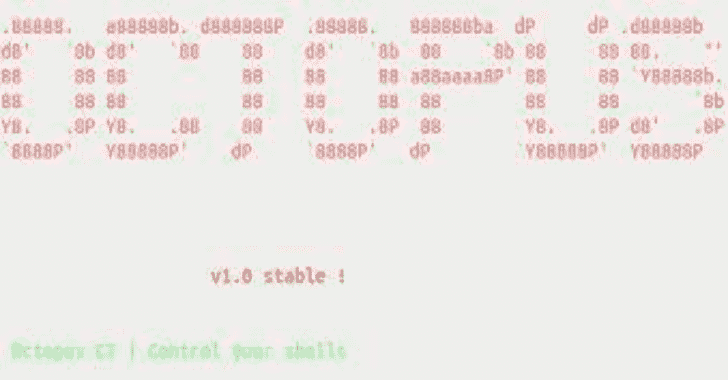

# Octopus:基于 Python 和 Powershell 的开源预运营 C2 服务器

> 原文：<https://kalilinuxtutorials.com/octopus/>

.png)

**Octopus** 是基于 python 的开源预运行 C2 服务器，可以通过 HTTP/S 控制 Octopus powershell 代理

创建 Octopus 的主要目的是在任何红队行动之前使用，在红队行动开始之前，你可以先使用 Octopus 攻击目标并收集信息，而不是使用你的全部作战武器和基础设施。

Octopus 以非常简单的方式执行命令，并通过加密良好的通道与 C2 交换信息，这使得几乎所有反病毒、端点保护和网络监控解决方案都无法察觉和检测到它。

Octopus 中有一个很酷的功能叫做 ESA，代表“端点态势感知”，它将收集一些关于目标的重要信息，这些信息将帮助您更好地了解您在操作过程中将要面对的目标网络端点，从而让您有机会根据这些信息定制您的真实操作。

Octopus 在与 C2 通信时被设计为隐秘的，因为它默认使用 AES-256 作为 powershell 代理和 C2 服务器之间的加密通道。您也可以选择使用 SSL/TLS，为您的域提供有效的证书，并配置八达通 C2 服务器使用它。

# 八达通的主要特点

Octopus 包含许多功能，可让您在实际需要部署完整的工具和技术之前，洞察即将到来的项目，例如:

*   通过 HTTP/S 控制代理。
*   执行系统命令。
*   下载/上传文件。
*   加载外部 powershell 模块。
*   在 C2 和代理之间使用加密通道(AES-256)。
*   使用不显眼的技术来执行命令和传输结果。
*   为每个目标创建自定义的多个侦听器。
*   产生不同类型的有效载荷。
*   支持 powershell 2.0 及更高版本的所有 windows 版本。
*   运行 Octopus windows 可执行代理，无需接触 powershell.exe 进程。
*   **从端点(端点环境感知)功能自动收集信息。**

# 要求

您可以通过以下方式安装 Octopus 的所有要求:

`**pip install -r requirements.txt**`

您需要安装`**nasm**` for linux 和‘mingw-w64’编译器来使用 shellcoding 特性和欺骗 args 代理。

您可以使用以下命令在基于 Debian 的发行版上安装 nasm:

`**apt install nasm**`

你可以在基于 Debian 的发行版上安装`**mingw-w64**`,使用:

`**apt install mingw-w64**`

Octopus 已在以下操作系统上进行测试:

*   Ubuntu (18.04)
*   Ubuntu (16.04)
*   卡利 Linux (2019.2)

您还需要安装 mono，以确保您可以顺利编译 C#源代码。

Octopus 依靠 mono-csc 二进制来编译 C#源代码，你可以通过下面的命令`**apt** **install mono-devel**`来安装它，这个命令已经在 kali 和 ubuntu 16.04 上测试过了。

你可以在没有安装 mono 的情况下使用 Octopus，但是你将不能使用`**generate_exe**`命令。

另外请注意，编译 C#依赖于带有 SHA1 哈希 a 43 ed 886 b 68 C 6 ee 913 da 85 df 9 ad 2064 f1 d 81 C 470 的`**System.Management.Automation.dll**`程序集。

如果您在使用 Octopus 时遇到任何问题，请随时提交错误报告！

# 安装

首先，确保使用以下命令下载最新版本的 Octopus:

`**git clone https://github.com/mhaskar/Octopus/**`

然后，您需要使用以下命令安装需求:

`**pip install -r requirements.txt**`

之后，您可以通过运行以下命令来启动 octopus 服务器:

`**./octopus.py**`

一旦运行它，您将看到以下内容:

## 使用

使用 Octopus 非常简单，因为您只需要启动一个监听器并根据监听器的信息生成您的代理。

您可以根据需要生成任意多的侦听器，然后您可以开始与连接到它们的代理进行交互。

### 配置文件设置

在开始使用 Octopus 之前，您必须设置一个 URL 处理配置文件，它将控制 C2 的行为和功能，因为 Octopus 是一个基于 HTTP 的 C2，因此它依赖于 URL 来处理连接，并保证 URL 不会在您当前攻击的网络中充当签名或 IoC，URL 可以根据需要轻松定制和重命名。

配置文件设置目前仅支持 URL 处理、自动删除值和标题。

**设置您的个人资料**

要开始设置您的个人资料，您需要编辑`**profile.py**`文件，该文件包含许多关键变量，它们是:

*   file_rreceive_url:处理文件下载。
*   处理 ESA 报告。
*   command_send_url:处理将发送到目标的命令。
*   command_receiver_url:处理将在目标上执行的命令。
*   first_ping_url:处理来自目标的第一个连接。
*   server_response_header:这个头将显示在每个响应中。
*   auto_kill:变量，用于控制在与 C2 连接失败 N 次后何时终止代理

示例:

# ！/usr/bin/python3

**这是 Octopus C2 的 web 侦听器配置文件
您可以定制您的配置文件以处理特定的 url 来与代理进行通信
TODO:添加定制请求头的能力
处理文件下载
Ex:/any
Ex:/any . PHP
file _ receiver _ URL = "/messages "
处理报告生成
Ex:/any
Ex:/any . PHP
report _ URL = "/calls "
命令发送到代理(代理 在主机上执行)
保留相同格式
Ex:/profile/
Ex:/messages/
Ex:/bills/
command _ send _ URL = "/view/"
处理已执行的命令
Ex:/any
Ex:/any . PHP
command _ receiver _ URL = "/bills "
处理来自代理的第一个连接
Ex:/any
Ex:/any . PHP
first _ ping _ URL = "/log in "
将在每个响应中作为服务器头返回
Server _ response _ header = " nginx "** 

代理和侦听器将被配置为使用此配置文件相互通信。接下来，我们需要知道如何创建一个监听器。

### 听众

Octopus 有两个主要的监听器，“http 监听器”和“https 监听器”，两个监听器的选项大多相同。

**HTTP 监听器**

`**listen_http**`命令以下列参数开始:

*   BindIP 定义侦听器将使用的 IP 地址。
*   BindPort 定义了您想要监听的端口。
*   主机名将用于从请求有效负载。
*   间隔代理在检查命令之前等待的秒数。
*   URL 承载有效负载的页面的名称。
*   Listener_name 要使用的侦听器名称。

您还可以通过运行`**listen_http**`命令来查看它的示例:

**章鱼> > listen_http
[-]请检查监听器参数！【语法:listen_http BindIP BindPort 主机名区间 URL listener_name
示例(带域):listen _ http 0 . 0 . 0 . 0 8080 myc 2 . live 5 comments.php op1 _ Listener
示例(不带域):listen _ http 0 . 0 . 0 . 0 8080 172.0.1.3 5 profile.php op1 _ Listener
选项信息:
BindIP 将由侦听器使用的地址
BindPort 您要在
主机名上侦听的端口将用于请求来自**

我们可以使用以下命令启动一个监听器:

`**listen_http 0.0.0.0 8080 192.168.178.1 5 page.php operation1**`

将返回以下结果:

章鱼> > listen _ http 0 . 0 . 0 . 0 8080 192 . 168 . 178 . 1 5 page.php 操作 1
章鱼> > *服烧瓶 app“core . web listener”(懒加载)

*   **环境:生产
    警告:不要在生产环境中使用开发服务器。
    使用一个生产 WSGI 服务器。**
*   **调试模式:关
    章鱼> >**

**`listen_https`** 命令采用以下参数开始:

*   BindIP:这是侦听器将使用的 IP 地址
*   绑定端口:您想监听哪个端口
*   主机名:将用于从请求有效负载
*   时间间隔:代理在检查命令之前等待秒数
*   URL 页面:名称将包含有效负载
*   Listener_name:要使用的监听器名称
*   cert copy _ path:有效 ssl 证书的路径(对于 letsencrypt 证书，称为 fullchain.pem)
*   key _ path:SSL 证书的有效密钥的路径(对于 letsencrypt 证书，称为 key.pem)

请注意，您需要提供与所使用的域相关联的有效 SSL 证书。

### 生成代理

**Powershell oneliner**

要为监听器`**operation1**`生成代理，我们可以使用以下命令:

`**generate_powershell operation1**`

HTA oneliner

要为 listener1 `**operation1**`生成 HTA 在线程序，我们可以使用以下命令:

`**generate_hta operation1**`

[**Download**](https://github.com/mhaskar/Octopus)