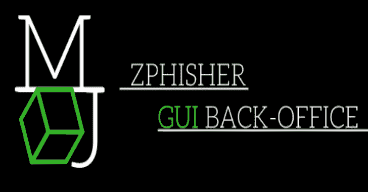
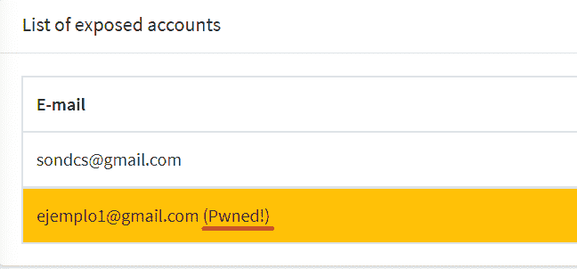
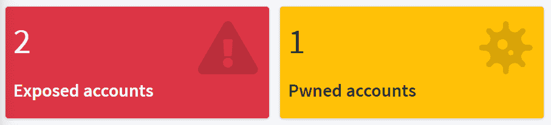
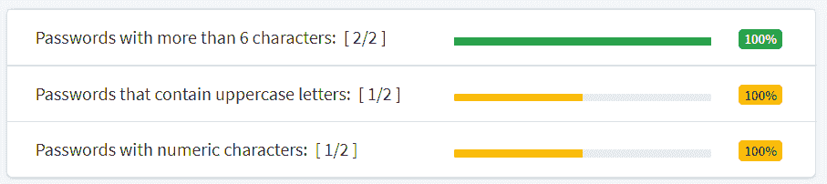

# Zphisher-GUI-Back_office:一个 Zphisher GUI 后台插件

> 原文：<https://kalilinuxtutorials.com/zphisher-gui-back_office/>

%20(1).png)

Zphisher-GUI-Back_office 是一个插件，您可以实时查看网络钓鱼活动的受害者，您只需更改 Zphisher 文件即可。轻松点。

这个工具为 zphish 工具创建了一个图形化的后台办公室(虽然不是 100%需要使用这个工具，但是您可以通过将它托管在本地主机上来使用这些文件)。

## 说明

*   您需要使用模板部署服务器，在“login.html”文件中确定两个 post 参数的名称。
*   用 Zphisher 的原始标识符修改插件的“login.php”文件的 post 参数(第 7 行和第 8 行)。
*   用插件文件替换所有部署的 http 服务器文件(login.html 除外)。
*   设置“网络钓鱼父目录中的 chmod 777 -R”。

如果你有一个来自 haveibeenpwned.com 的 api 密匙，你必须把它插入到“programa interprete”目录下的“api_key.txt”文件中，这样后台会告诉你哪些账户暴露在互联网上。

## 不需要 100%的耐心

您也可以通过 Ngrok 从本地主机硬共享项目来使用这个插件，而不使用 Zphisher。

这个插件附带了一个示例登录页面，在这个例子中来自 Office 365，你可以为这个插件使用任何 Zphisher 模板，使用 Ngrok 来共享你的本地主机。

## 后台办公室属性

您可以查看插入的帐户是否在互联网上公开:

-账户和“Pwned”账户总数:

-评估所有插入账户的密码的安全性；

[**Download**](https://github.com/micro-joan/Zphisher-GUI-Back_office)