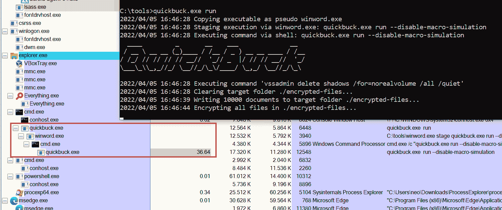

# 勒索软件模拟器:用 Golang 编写的勒索软件模拟器

> 原文：<https://kalilinuxtutorials.com/ransomware-simulator/>

**勒索软件模拟器，**该库的目标是提供一种简单、无害的方法来检查您的反病毒软件对勒索软件的保护。

该工具模拟典型的勒索行为，例如:

*   从 Word 文档宏暂存
*   删除卷影副本
*   加密文档(由模拟器嵌入并放入新文件夹)
*   将勒索邮件放到用户的桌面上

勒索软件模拟器不会对设备上预先存在的文件进行加密，也不会删除卷影副本。然而，任何反病毒产品寻找这样的行为仍然应该有希望触发。

上面列出的每个步骤也可以通过命令行标志禁用。这允许您检查对后面步骤的响应，即使 AV 已经检测到前面的步骤。

## 使用

**勒索软件模拟器
用法:
勒索软件-模拟器[命令]
示例:
勒索软件-模拟器运行
可用命令:
帮助关于任何命令的帮助
运行运行勒索软件模拟器
标志:
-h，–帮助勒索软件-模拟器的帮助
使用“勒索软件-模拟器[命令]–帮助”了解关于命令的更多信息。**

运行命令:

**运行勒索软件模拟器
用法:
勒索软件-模拟器运行【标志】
标志:
–将要加密的文件应该存放的 dir 字符串目录(默认)。/encrypted-files ")
–disable-file-encryption 不模拟文档加密
–disable-macro-simulation 不模拟通过构建以下过程链从一个宏开始:winword.exe->cmd.exe->ransomware-simulator.exe
–disable-note-drop 不要丢弃伪勒索病毒注释
–disable-shadow-copy-deleting 不模拟卷影副本删除
-h，–help 帮助运行
–note-location 字符串勒索病毒注释位置(默认为“C:\”**

## 截屏

[Download](https://github.com/NextronSystems/ransomware-simulator)