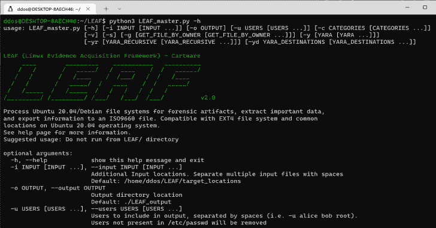

# LEAF : Linux 证据获取框架

> 原文：<https://kalilinuxtutorials.com/leaf/>

.png)

**LEAF**(Linux Evidence Acquisition Framework)从 Linux EXT4 系统中获取工件和证据，接受用户输入来定制工具的功能，以实现更容易的可扩展性。通过提供几个模块和参数作为输入，LEAF 能够使用智能分析来提取 Linux 工件并输出到 ISO 映像文件。

## 用法

**LEAF _ master . py[-h][-I INPUT[INPUT…]][-o OUTPUT][-u USERS[USERS…]][-c CATEGORIES[CATEGORIES…]][-v]
[-s][-g[GET _ FILE _ BY _ OWNER[GET _ FILE _ BY _ OWNER…]]]][-y[YARA[YARA…]]]]
[-yr[YARA _ 递归[YARA _ 递归…]]]][-yd[YARA _ DESTINATIONS[YARA _ DESTINATIONS…]]]]]【T3]LEAF
////////*///*///*_//////_*///*//*//*/*/v 2.0**

处理 Ubuntu 20.04/Debian 文件系统的取证工件，提取重要数据，并将信息导出到 ISO9660 文件。兼容 EXT4 文件系统和 Ubuntu 20.04 操作系统上的常用位置。有关更多信息，请参见帮助页面。建议用法:不要从叶/目录运行

## 参数

**可选参数:
-h，–help 显示此帮助信息并退出
-i INPUT [INPUT …]，–INPUT INPUT[INPUT…]
附加输入位置。用空格分隔多个输入文件
默认:/home/user 1/Desktop/LEAF-3/target _ locations
-o OUTPUT，–OUTPUT OUTPUT
输出目录位置
默认:。/LEAF _ output
-u USERS[USERS…]，–USERS USERS[USERS…]
要包含在输出中的用户，用空格分隔(即-u alice bob root)。
不在/etc/passwd 中的用户将被删除
默认值:所有在/etc/passwd 中的非服务用户
-c 类别[CATEGORIES …]，–CATEGORIES 类别[CATEGORIES …]
获取期间要包括的显式工件类别。
类别必须用空格隔开，(即-c 网络用户 apache)。
内置类别的完整列表包括:
应用程序、执行、日志、杂项、网络、SHELL、启动、服务、系统、回收站、用户
类别与用户输入的文件兼容，只要它们遵循以下符号:
#类别
/位置 1
/位置 2
…/位置[n]
#结束类别
默认:" all"
-v，–在详细模式下详细输出，(可能与进度条冲突)

启用此选项将增加解析时间。
单独使用-g 来解析/根目录。
在-g 之后包含指定目标位置的路径(即“-g/etc/home/user/Downloads/
默认:禁用
-y【YARA【YARA……】】，–亚拉【YARA……】】
配置亚拉 IOC 扫描。单独选择-y 启用 Yara 扫描。
指定'-y /path/to/yara/'来指定自定义输入位置。
对于多个输入，在项目之间使用空格，
即'-y rule file 1 . yar rule file 2 . yara rule _ dir/'
所有 yara 文件必须有"。yar“或者”。亚拉”分机。
默认:无
-yryara _ 递归 yara _ 递归…]]，–亚拉 _ 递归 yara _ 递归[YARA _ 递归…]]
配置递归亚拉 IOC 扫描。
对于多个输入，在项目之间使用空格，
即'-yr rule file 1 . yar rule file 2 . yara rule _ dir/'。
该列表中的目录将被递归扫描。
可以和 normal -y 标志、
一起使用，但是交叉目录将采用递归优先级。
默认值:无
-ydyara _ 目的地 yara _ 目的地…]]，–亚拉 _ 目的地 yara _ 目的地[YARA _ 目的地…]]
运行亚拉文件的目的地。
用空格分隔多个目标。(即/home/alice/ /bin/star/)
默认:所有用户目录**

## 示例用法

**使用默认参数【这将使用默认输入文件(。/target_locations)、用户(所有用户)、类别(所有类别)和输出位置(。/LEAF_output/)。克隆的数据不会存储在本地目录中，详细模式关闭，yara 扫描被禁用]:
LEAF_main.py
所有参数:
LEAF _ main . py-I/home/Alice/Desktop/custom file 1 . txt-o/home/Alice/Desktop/example output/-c logs 启动服务 Apache-u Alice bob Charlie-s-v-y/path/To/yara _ rule 1 . yar-yr/path 2/To/yara _ rules/-yd/home/frank-g/中**

# 如何使用

*   安装 Python 要求:
    *   Python 3(最好是 3.8 或更高版本)(`**apt install python3**`)
    *   pip 3 ( `**apt install pip3**`)
*   下载所需模块
    *   从 requirements.txt ( **`pip3 install -r requirements.txt` )** 安装模块
    *   如果出现安装错误，请尝试`**sudo -H pip3 install -r requirements.txt**`
*   运行脚本
    *   `**sudo python3 LEAF_master.py**`带可选参数

[**Download**](https://github.com/alex-cart/LEAF)