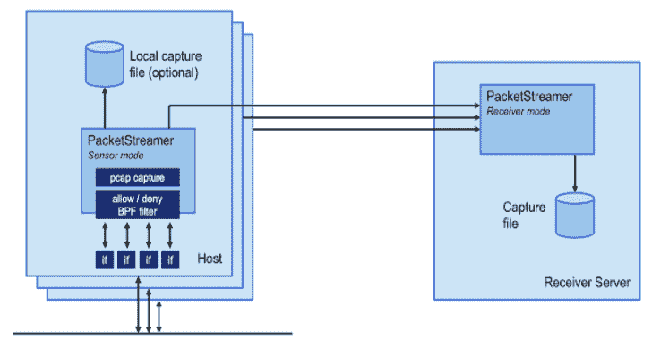

# Hakoriginfinder:用于发现反向代理背后的原始主机的工具。适用于绕过云 WAFs

> 原文：<https://kalilinuxtutorials.com/hakoriginfinder/>

.png)

**hakooriginfinder**是一个发现反向代理背后的源主机的工具。用于绕过 WAFs 和其他反向代理。

## 它是如何工作的？

该工具将首先向您提供的主机名发出 HTTP 请求并存储响应，然后通过 HTTP (80)和 HTTPS (443)向您提供的每个 IP 地址发出请求，并将`**Host**`头设置为原始主机。然后，使用 Levenshtein 算法将每个 HTTP 响应与原始响应进行比较，以确定相似性。如果响应相似，则认为匹配。

## 用法

通过 stdin 提供 IP 地址列表，通过-h 选项提供原始主机名。例如:

example.com

您可以使用`**-l**`设置 Levenshtein 距离阈值。数字越小，匹配就越相似，才能被认为是匹配，默认值为 5。

线程数可以用`**-t**`设置，默认为 32。

主机名用`**-h**`设置，没有默认。

## 输出

输出是由空格分隔的 3 列。第一列是“匹配”或“不匹配”，这取决于是否达到了 Levenshtein 阈值。第二列是被测试的 URL，第三列是 Levenshtein 分数。

### 输出示例

**客库$ prips 1.1.1.0/24 |客源查找器-h 1 . 1 . 1 .
修补程序名称 http://1.1.1.0 54366
修补程序名称 http://1.1.1.30 54366
修补程序名称 http://1 . 1 . 20 54366
修补程序名称 http://1 . 1 . 1 . 4 544**

## 装置

安装 golang，然后运行:

**去安装 github.com/hakluke/hakoriginfinder@latest**

[**Download**](https://github.com/hakluke/hakoriginfinder)