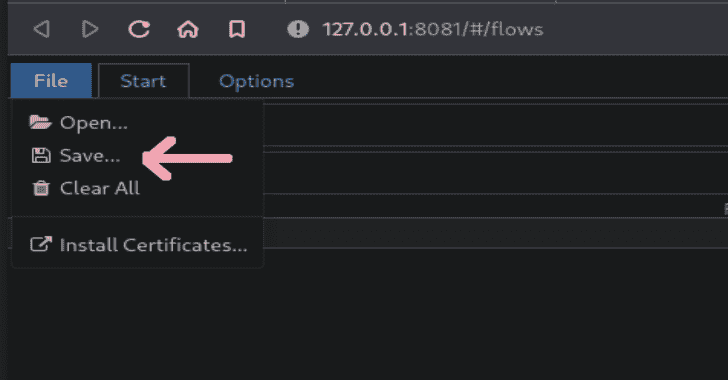

# Mitmproxy2Swagger:通过捕获流量自动逆向工程 REST APIs

> 原文：<https://kalilinuxtutorials.com/mitmproxy2swagger/>

.png)

**Mitmproxy2Swagger** 是一个自动将 Mitmproxy 捕获转换为 OpenAPI 3.0 规范的工具。这意味着您可以通过运行应用程序并捕获流量来自动对 REST APIs 进行逆向工程。

## 装置

首先你需要 python3 和 pip3。

**pip 安装 mitmproxy 2 摇摆器
…或…
pip3 安装 mitmproxy 2 摇摆器**

然后克隆 repo 并按照下面的示例运行`**mitmproxy2swagger**`。

## 用法

### Mitmproxy

要通过检查 HTTP 流量来创建规范，您需要:

*   使用 mitmproxy 工具捕获流量。我个人推荐使用 mitmweb，这是 mitmproxy 内置的一个 web 界面。

**$ mitmweb
Web 服务器监听 http://127.0.0.1:8081/
代理服务器监听 http://*:9999
……**

*   **重要信息**要配置您的客户机使用 mitmproxy 公开的代理，请查阅 mitm proxy 文档以了解更多信息。
*   将流量保存到流文件。在 mitmweb 中，您可以通过使用“文件”菜单并选择“保存”来完成此操作

运行 mitmproxy2swagger 的第一遍:

**$ mitmproxy2swagger -i -o -p**

请注意，您可以使用现有的模式，在这种情况下，现有的模式将使用新数据进行扩展。您还可以使用不同的流捕获来运行它几次，捕获的数据将被安全地合并。

`**<api_prefix>**`是您要反向工程的 API 的基本 url。您需要通过观察在 mitmproxy 中发出的请求来获得它。

例如，如果某个应用程序发出了如下请求:

**https://api.example.com/v1/login
https://api.example.com/v1/users/2
https://api.example.com/v1/users/2/profile**

*   可能的前缀是 **`https://api.example.com/v1`。**
*   运行第一遍应该会在模式文件中创建一个如下所示的部分:

**x-path-templates:
删除 ignore:前缀以生成一个端点，其 URL
越靠近顶部的行优先，匹配越贪婪
ignore:/addresses
ignore:/basket
ignore:/basket/add
ignore:/basket/checks
ignore:/basket/coupons/attach/{ id }
ignore:/basket/coupons/attach/104754**

*   您应该使用文本编辑器编辑模式文件，并从您希望生成的路径中删除前缀`**ignore:**`。您也可以调整出现在路径中的参数。
*   运行第二遍 mitmproxy2swagger:

**$ mitmproxy 2 swagger-I-o-p[–示例]**

再次运行该命令(使用相同的模式文件)。它将选取编辑过的行并生成端点描述。

请注意，mitmproxy2swagger 不会覆盖现有的端点描述，如果要覆盖它们，可以在运行第二遍之前删除它们。

传递`**--examples**`会将示例数据添加到请求和响应中。使用此选项时要小心，因为它可能会添加敏感数据(令牌、密码、个人信息等。)添加到模式中。

### 海港咨询雷达

*   从浏览器开发工具中捕获和导出流量。在浏览器 DevTools 中，转到网络选项卡，然后单击“导出 HAR”按钮。
*   继续使用与 mitmproxy 转储相同的方法。`**mitmproxy2swagger**`将自动检测并处理 HAR 文件。