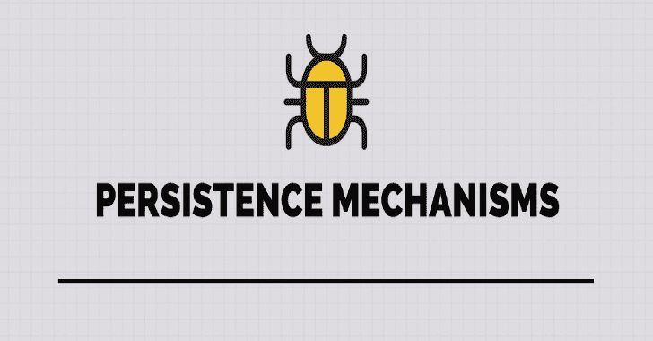

# PersistBOF:帮助自动化常见持久性机制的工具

> 原文：<https://kalilinuxtutorials.com/persistbof/>

PersistBOF 是一个帮助自动化常见持久性机制的工具。目前支持打印监视器(系统)、时间提供者(网络服务)、开始文件夹快捷劫持(用户)和连接文件夹(用户)

## 用法

克隆，运行 make，添加。cna 呼叫 Cobalt Strike 客户。

运行:帮助持久化-在 CS 控制台中冻结

语法:

*   persist-ice [PrintMon，TimeProv，快捷方式，连接] [persist 或 clean][项/文件夹名] [dll / lnk exe 名]；

## 技术概述

所有这些技术都依赖于单独放在磁盘上的 Dll 文件。它本质上不是美国银行的一部分。

### 打印监视器

在运行 BOF 之前，Dll 必须在磁盘上，并且位于 PATH (Dll 搜索顺序)**中的某个位置。否则就会失败。spoolsv.exe 将立即加载该 Dll 作为系统。这可以用于从管理员提升到系统，也可以用于持久性。将在系统启动时执行。**必须拔高才能跑。****

*   项目中的演示打印监视器 Dll

示例:

*   将 NotMalware.dll 上传到 C:\Windows\NotMalware.dll
*   持久化-ice PrintMon 持久化 TotesLegitMonitor NotMalware.dll
*   立即作为系统执行
*   将在启动时执行，直到删除
*   persist-ice print mon clean TotesLegitMonitor C:\ Windows \ not malware . dll >将删除注册表项并卸载 Dll，然后尝试删除 Dll(如果提供了正确的路径)。应该会成功。

### 时间提供者

由 svchost.exe 加载为网络服务(准备好你的土豆！)运行 BOF 后启动。**必须提升才能运行。**

*   在项目中演示时间提供程序 Dll

示例:

*   persist-ice time prov persist TotesLegitTimeProvider C:\ anywhere \ not malware . dll
*   persist-ice time prov clean up TotesLegitTimeProvider C:\ anywhere \ not malware . dll >将删除注册表项，并尝试删除 dll(如果提供了正确的路径)。可能会失败，因为 dll 没有被进程卸载。

### 连接文件夹

与 7 号金库泄露中演示的技术相同。在用户登录时执行。非高架。Dll 将被加载到 explorer.exe

示例:

*   persist-ice Juction persist TotesLegitFolder C:\ user-writable-folder \ not malware . dll**保存 CLSID**
*   persist-ice junction clean TotesLegitFolder C:\ user-writable-folder \ not malware . dll 6be 5e 092-90cc-452d-be83-208029 e 259 E0 >将删除注册表项、连接文件夹，并尝试删除 dll。

### 开始文件夹劫持

创建一个新的用户可写文件夹，将可劫持的 windows 二进制文件复制到该文件夹，然后在启动文件夹中创建一个快捷方式。在用户登录时执行。非高架。

示例:

*   persist-ice 快捷方式 persist C:\TotesLegitFolder C:\ Windows \ System32 \ dism . exe >将您的 dll 作为代理 Dll 上传到 dismcore.dll 的 C:\ TotesLegitFolder 中
*   persist-ice 快捷方式 persist C:\ TotesLegitFolder C:\ Windows \ System32 \ dism . exe >将尝试删除新文件夹中的所有文件，然后删除文件夹本身。如果 Dll 仍然加载在进程中，那么这将失败。

[**Download**](https://github.com/IcebreakerSecurity/PersistBOF)