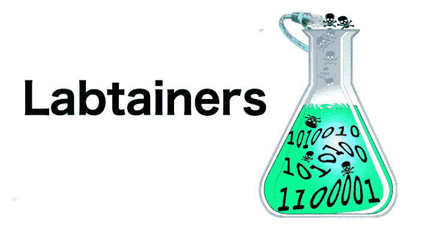

# Labtainers:一个基于 Docker 的网络实验室框架

> 原文：<https://kalilinuxtutorials.com/labtainers/>

.png)

**Labtainers** 包括 50 多种网络实验室练习和工具，供您打造自己的实验室。导入单个虚拟机设备或在 Linux 系统上安装，您的学生就完成了资源调配和管理设置，可用于这些练习和未来的实验练习。

*   一致的实验室执行环境和通过 Docker 容器实现的自动化配置
*   性能一般的笔记本电脑上的多组件网络拓扑
*   自动评估学生实验活动和进度
*   个性化的实验练习不鼓励共享解决方案

Labtainers 提供了受控和一致的执行环境，在该环境中，学生可以完全在其计算机范围内进行实验，而不用考虑学生计算机上安装的 Linux 发行版和软件包。Labtainers 运行在我们的[VM appliance][VM-appliance ee]上，或者运行在任何安装了 Dockers 的 Linux 上。Labtainers 作为基于云的虚拟机可用，例如在 Azure 上

有关安装和使用，请参见学生指南；有关学生评估，请参见教师指南。设计人员指南中介绍了如何开发和定制实验练习。有关该框架的更多信息，请参见相关文章。实验室容器网站和下载(包括预装实验室容器的虚拟机设备)位于 https://nps.edu/web/c3o/labtainers.

[**Download**](https://github.com/mfthomps/Labtainers)