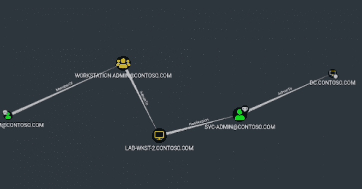

# SMB 会话欺骗:创建假 SMB 会话的工具

> 原文：<https://kalilinuxtutorials.com/smb-session-spoofing/>

.png)

**SMB-Session-Spoofing** 是一个可以用 Visual Studio 2019(或更新版本)编译的实用程序。这个程序的目标是创建一个假的 SMB 会话。这样做的主要目的是作为一种引诱攻击者访问蜜罐设备的方法。这个程序没有担保或保证。

### 程序修改说明

这个程序需要你稍微修改一下代码。在第 144 行，调用了带有 LogonW API 的 Windows API 创建进程，默认情况下提供了两个参数—SVC-admin(用户名)和 contoso.com(域)。您有必要将这些值更改为与您的**生产网络**相匹配的值。

**CreateProcessWithLogonW(L " domain minuser "，L"YourDomain.com "，NULL，LOGON_NETCREDENTIALS_ONLY，)；**

### 实施说明

修改并编译代码后，您必须安装服务。您可以使用以下命令来完成此操作:

**sc create service name bin path = " C:\ program data \ Services \ Inject \ service . exe " start = " auto "**

### 验证步骤

要验证程序是否正常运行，您应该检查并查看系统上存在哪些会话。这可以通过以下命令完成:

**C:\ program data \ Services \ Inject>net sessions
计算机用户名客户端类型打开空闲时间
\[::1] svc-admin 0 00:00:04
命令成功完成。**

您应该在大约 13 分钟后回来检查，以验证是否已经创建了一个新的会话，以及程序是否正常工作。

### 攻击者看到了什么

这背后的理论是，当对手运行 SharpHound 并收集会话和分析来自所拥有的主体的攻击路径时，他们可以识别出一个高特权用户登录到第 2 层基础架构(工作站)，然后他们可以访问并转储凭据以获得域管理访问权限。

在上面的场景中，攻击者已经危害了用户“wadm-tom@contoso.com ”,他是 lab-wkst-2.contoso.com 上的本地管理员。用户 svc-admin 登录到 lab-wkst-2.contoso.com，这意味着攻击者只需登录到工作站，运行 Mimikatz 并转储凭据。那么，如何对此进行监控呢？

### 您应该如何配置监控

实施这一工具很重要，监测也很重要。如果您在没有监控的情况下实现该工具，它实际上是无用的；因此，监测是必须的。监控该主机的最有效方法是在任何登录时发出警报。该程序最好在没有用户活动的主机上使用，该主机通过标准的公司监控工具(EDR、反病毒、Windows 事件日志转发等)加入到域中。强烈建议您设置电子邮件警报、短信警报以及其他多种警报，以确保尽快对涉及该机器的事件进行分类，因为这最有可能让真正的对手接触到有问题的工作站。

[**Download**](https://github.com/Sq00ky/SMB-Session-Spoofing)