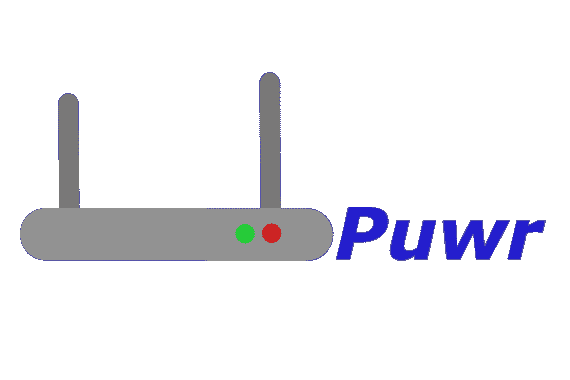

# Puwr:用于在本地网络上扩展攻击面的 SSH 旋转脚本

> 原文：<https://kalilinuxtutorials.com/puwr/>

.png)

Puwr 将通过 SSH 发现更多的主机，轻松扩大您在本地网络上的攻击面。使用运行 SSH 服务的机器，Puwr 使用给定的子网范围来确定 IP 的范围，发送回任何成功的 ping 请求。这可以用来创建一个从受损机器的旋转攻击，通过返回您的主机，您通常不能发现从自己的设备。然后可以在这些发现的设备上探测开放的端口，以找到攻击更多设备的网关。

## 即将来临的

下面是我计划在即将到来的更新中加入的一些新特性。

*   扫描已发现主机的开放端口**(完成)**
*   更改 CLI 输出，使其看起来更加整洁有序**(完成)**
*   枚举“受害者”主机上权限提升的信息
*   可选彩色输出

# 用法

Puwr 运行简单，只需要 4 个标志:
`**python3 puwr.py (MACHINE IP) (USER) (PASSWORD) (SUBNET VALUE)**`

例:
`**python3 puwr.py 10.0.0.53 xeonrx password123 10.0.0.1/24**`

如果需要通过 22 以外的端口连接，使用`**-p**`标志。(示例:-p 2222)
如果您想保持安静，使用`**-s**`标志在请求之间等待指定的秒数。(示例:-s 5)
您现在可以使用`**--scan**`来发现已发现设备上的开放端口。(示例:–scan 80 443)
在脚本中使用`**-h**`标志作为用法参考。

**paramiko 和 netaddr 模块是该脚本运行所必需的！**
可以用 pip 工具安装:`**pip install netaddr paramiko**`

在这里，我扫描了设备，检查了哪些设备的端口 80 和 443 对目标 web 应用程序开放。注意 TTL 数字是如何显示的，给你一个设备可能运行的提示。

# 经过测试的操作系统

到目前为止，我只确认了 Puwr 可以在几个操作系统上工作:

*   Kali Linux
*   鹦鹉操作系统
*   Windows 10

然而，它应该可以在几乎任何安装了 Python 和所需模块的操作系统上工作。

# 端口扫描

正如前面几次提到的，您现在不仅可以发现主机，还可以扫描它们是否有开放的端口。
这可用于查找运行可访问服务的设备上的攻击媒介。默认情况下，端口不会被扫描，但是您可以使用`**--scan**`标志，并添加您想要扫描的端口号。
但是请记住，端口扫描确实需要额外的时间来完成。**端口扫描目前只适用于安装了 PYTHON 3 的机器**

[**Download**](https://github.com/Xeonrx/Puwr)