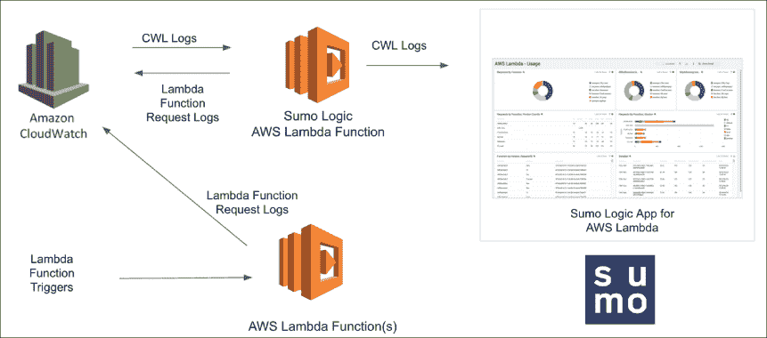
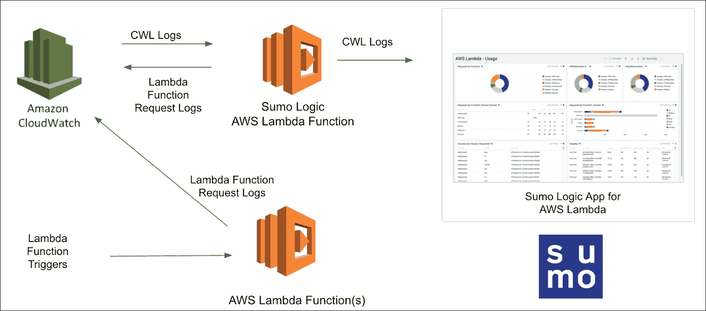

# AWS-威胁模拟和探测:与 Stratus 红队和 SumoLogic 一起玩

> 原文：<https://kalilinuxtutorials.com/aws-threat-simulation-and-detection/>

.png)

**AWS-威胁模拟和检测**，这个存储库记录了我与 Stratus 红队的冒险经历——一个用于云的对手仿真工具。

Stratus 红队是“云的原子红队”,允许以精细和独立的方式模拟攻击技术。

我们在我们的 AWS 帐户上一个接一个地运行 Stratus 红队知识库中的攻击。为了监控它们，我们将使用 CloudTrail 和 CloudWatch 进行日志记录，并将这些日志导入 SumoLogic 以供进一步分析。

| 攻击 | 描述 | 环 |
| --- | --- | --- |
| AWS . credential-access . ec2-get-password-data | 检索 EC2 密码数据 | 环 |
| AWS . credential-access . ec2-steal-instance-credentials | 窃取 EC2 实例凭据 | 环 |
| AWS . credential-access . secrets manager-retrieve-secrets | 检索大量机密管理器机密 | 环 |
| AWS . credential-access . SSM-retrieve-securestring-parameters | 检索和解密 SSM 参数 | 环 |
| AWS . defense-闪避. cloud trail-删除 | 删除 CloudTrail 踪迹 | 环 |
| AWS . defense-闪避. cloud trail-事件选择器 | 通过事件选择器禁用 CloudTrail 日志记录 | 环 |
| AWS . defense-evasion . cloud trail-life cycle-rule | CloudTrail 通过 S3 生命周期规则记录损失 | 环 |
| AWS . defense-闪避. cloudtrail-stop | 停止 CloudTrail 踪迹 | 环 |
| AWS . defense-escape . organizations-leave | 试图离开 AWS 组织 | 环 |
| AWS . defense-evasion . VPC-remove-flow-logs | 移除 VPC 流量日志 | 环 |
| AWS . discovery . ec2-从实例中枚举 | 在 EC2 实例上执行发现命令 | 环 |
| AWS . exfiliation . ec2-security-group-open-port-22-ingress | 在安全组上打开入口端口 22 | 环 |
| AWS . exfiliation . ec2-share-ami | 通过共享来获取 AMI | 环 |
| AWS . exfiliation . ec2-share-EBS-snapshot | 通过共享来过滤 EBS 快照 | 环 |
| AWS . exfiliation . rds-share-snapshot | 通过共享过滤 RDS 快照 | 环 |
| AWS . exfiliation . S3-后门桶策略 | 通过一个 S3 桶的桶策略来后门这个桶 | 环 |
| AWS . persistence . iam-后门-角色 | 后门一个 IAM 角色 | 环 |
| AWS . persistence . iam-后门-用户 | 在 IAM 用户上创建访问密钥 | TBD |
| AWS . persistence . iam-create-admin-user | 创建管理 IAM 用户 | TBD |
| AWS . persistence . iam-create-user-log in-profile | 在 IAM 用户上创建登录配置文件 | TBD |
| AWS . persistence . lambda-后门-函数 | 通过基于资源的策略实现后门 Lambda 功能 | TBD |

[**Download**](https://github.com/sbasu7241/AWS-Threat-Simulation-and-Detection)