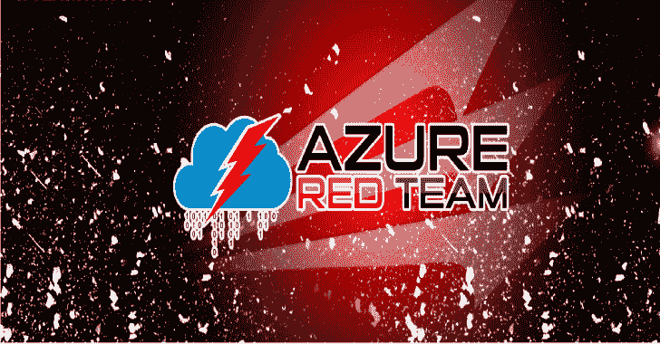

# AzureRT:一个 Powershell 模块，实现了各种 Azure 红队战术

> 原文： [https://kalilinuxtutorials.com/azurert/](https://kalilinuxtutorials.com/azurert/)

.png)

**AzureRT** 是一个 Powershell 模块，实现各种 cmdlets，从进攻的角度与 Azure 和 Azure AD 进行交互。

处理基于访问令牌的身份验证的有用实用程序，从`**Az**`切换到`**AzureAD**`和`**az cli**`界面，易于使用预制攻击，如基于 Runbook 的命令执行等。

## 最有价值的 Cmdlets

这个工具包提供了许多不同的 cmdlets。这一部分强调了最重要和最有用的。

从失窃凭证开始的典型红队/审计工作流程可总结如下:

**凭证被盗- >向 Azure/AzureAD 认证- >查看它们是否有效- >查看您可以对它们做些什么**

以下 cmdlets 非常适合帮助您遵循以下顺序:

1.  **`Connect-ART`**–提供多种方式向 Azure 进行身份验证–凭据、PSCredential、令牌
2.  **`Connect-ARTAD`**–提供多种方式向 Azure AD 进行身份验证–凭据、PSCredential、令牌
3.  **`Get-ARTWhoami`**–当你认证时–运行这个来检查 *whoami* 并验证你的访问
4.  **`Get-ARTAccess`**–然后，当你知道你有权限时–找出你能做什么&通过执行 Azure 情境感知有什么可能
5.  **`Get-ARTADAccess`**——同样，你也可以在 Azure AD 范围内找到你能做的事情。

## 使用案例

本模块中实现的 Cmdlets 有助于以下使用和攻击场景:

*   用访问令牌从 **`Az`** 变戏法到`**AzureAD**`再变回来。
*   同时在 **`Az`、`AzureAD`、`Microsoft.Graph`、**和`**az cli**`中打印认证上下文(又名 *whoami* )
*   显示在目标 Azure VM 上授予用户的可用权限
*   显示可访问的 Azure 资源以及我们对它们拥有的权限
*   轻松读取所有可访问的 *Azure Key Vault* 秘密
*   作为服务主体进行验证，以利用分配给该服务主体的*特权角色管理员*角色
*   通过恶意 Runbook 对 Azure Automation 执行攻击

## 安装

该模块依赖于预装的 Powershell `**Az**`和`**AzureAD**`模块。`**Microsoft.Graph**`和`**az cli**`是可选的，但仍然非常有用。在一个人开始围绕 Azure 工作之前，以下命令可以用来准备一个人的攻击性环境:

**安装模块 Az-Force-Confirm-allow clobber-Scope CurrentUser
安装模块 azread-Force-Confirm-allow clobber-Scope CurrentUser
安装模块微软。graph-Force-Confirm-allow clobber-Scope CurrentUser # OPTIONAL
Install-Module ms online-Force-Confirm-allow clobber-Scope CurrentUser # OPTIONAL
Install-Module azure preview-Force-Confirm-allow clobber-Scope CurrentUser # OPTIONAL
Install-Module aad internals-Force-Confirm-allow clobber-Scope CurrentUser # OPTIONAL
Import-Module Az
Import-Module azure**

尽管`**AzureRT**`只需要前两个模块，但是预装其他模块也是很好的。

然后，要加载该模块，只需键入:

**PS >。。\AzureRT.ps1**

## 含电池

该模块将逐渐接收下一批工具和实用程序，并自然分类到后续压井链阶段。

每个 cmdlet 都有一个很好的帮助消息，详细说明参数、描述和示例用法:

**PS C:>Get-Help Connect-ART**

**目前包括以下实用程序:**

### 认证&令牌机制

*   **`Get-ARTWhoami`**–在 **`Azure`、`AzureAD`、`Microsoft.Graph`** 和`**AZ CLI**`界面上显示*并验证*我们的认证上下文。
*   **`Connect-ART`**–调用`**Connect-AzAccount**`通过提供的访问令牌或凭证向 Azure 门户验证当前会话。通过从提供的令牌中自动提取租户 ID 和帐户 ID，跳过提供租户 ID 和帐户 ID 的负担。
*   **`Connect-ARTAD`**–调用`**Connect-AzureAD**`(以及可选的`**Connect-MgGraph**`)通过提供的访问令牌或凭证向 Azure Active Directory 验证当前会话。通过从提供的令牌中自动提取租户 ID 和帐户 ID，跳过提供租户 ID 和帐户 ID 的负担。
*   **`Connect-ARTADServicePrincipal`**–调用`**Connect-AzAccount**`通过提供的访问令牌或凭证向 Azure 门户验证当前会话。通过从提供的令牌中自动提取租户 ID 和帐户 ID，跳过提供租户 ID 和帐户 ID 的负担。然后，它创建自签名的 PFX 证书，并将其与服务主体相关联以进行身份验证。之后，作为该服务主体向 AzureAD 进行身份验证，并取消该证书与清理的关联
*   **`Get-ARTAccessTokenAzCli`**–通过`**az account get-access-toke**n`从 az cli 获取访问令牌
*   **`Get-ARTAccessTokenAz`**–通过 **`Get-AzAccessToken`从 Az 模块获取访问令牌。**
*   **`Get-ARTAccessTokenAzureAD`**–从 Azure Active Directory 获取访问令牌。作者西蒙·瓦林，@西蒙·瓦林
*   **`Get-ARTAccessTokenAzureADCached`**–尝试检索在`C**onnect-AzureAD**`发生后存储的本地缓存的 AzureAD 访问令牌(https://graph.microsoft.com)。
*   **`Remove-ARTServicePrincipalKey`**–运行`**Connect-ARTADServicePrincipal**`后执行清理动作

### 侦察&态势感知

*   **`Get-ARTAccess`**–执行 Azure 情境感知。
*   **`Get-ARTADAccess`**–执行 Azure AD 情境感知。
*   **`Get-ARTTenants`**–列出当前认证用户(或基于提供的访问令牌的用户)可用的租户
*   **`Get-ARTDangerousPermissions`**–分析可访问的 Azure 资源和用户对其拥有的相关权限，以找到所有可能被攻击者滥用的危险资源。
*   **`Get-ARTResource`**–使用提供的访问令牌向 https://management.azure.com 进行身份验证，并提取令牌所有者拥有的可访问资源和权限。
*   **`Get-ARTRoleAssignment`**–显示分配给当前使用的主体的 Azure RBAC 角色的更易于阅读的表示。
*   **`Get-ARTADRoleAssignment`**–显示当前用户或所有 Azure AD 用户的 Azure AD 角色分配。
*   **`Get-ARTADScopedRoleAssignment`**–显示当前用户或所有 Azure AD 用户上的 Azure AD 作用域角色分配，与管理单位相关联
*   **`Get-ARTRolePermissions`**–显示指定 Azure RBAC 角色的所有授予权限。
*   **`Get-ARTADRolePermissions`**–显示指定 Azure AD 角色的所有授予权限。
*   **`Get-ARTADDynamicGroups`**–显示 Azure AD 动态组及其用户成员规则、成员计数和当前用户成员状态
*   **`Get-ARTApplication`**–列出当前用户拥有的 Azure AD Enterprise 应用程序(或全部使用时的所有现有应用程序)及其所有者和服务主体
*   **`Get-ARTApplicationProxy`**–列出具有应用程序代理设置的 Azure AD Enterprise 应用程序。
*   **`Get-ARTApplicationProxyPrincipals`**–显示分配给指定应用程序代理应用程序的用户和组。
*   **`Get-ARTStorageAccountKeys`**–显示所有可用的存储账户密钥。
*   **`Get-ARTKeyVaultSecrets`**–列出所有可用的 Azure Key 金库机密。此 cmdlet 假定发出请求的用户使用 KeyVaultAccessToken(作用域为 https://vault.azure.net)连接到 Azure AD，并且分配了“密钥库机密用户”角色(或同等角色)。
*   **`Get-ARTAutomationCredentials`**–列出所有可用的 Azure Automation 帐户凭据并尝试提取它们的值(无法提取值！).
*   **`Get-ARTAutomationRunbookCode`**–调用 REST API 方法拉取指定 Runbook 的源代码。
*   **`Get-ARTAzVMPublicIP`**–检索 Azure 虚拟机公共 IP 地址
*   **`Get-ARTResourceGroupDeploymentTemplate`**——根据输入参数显示资源组部署模板 JSON，或者一次拉全部。
*   **`Get-ARTAzVMUserDataFromInside`**–通过到达实例元数据端点，从虚拟机内部检索 Azure 虚拟机用户数据。

### 权限升级

*   **`Add-ARTADGuestUser`**–发送 Azure AD 访客用户邀请电子邮件，允许外部攻击者扩展对 AAD 租户的访问&返回用于轻松接受邀请的 Invite redempt URL。
*   **`Set-ARTADUserPassword`**——滥用`**Authentication Administrator**`角色分配重置其他非管理员用户密码。
*   **`Add-ARTUserToGroup`**–将指定的 Azure AD 用户添加到指定的 Azure AD 组。
*   **`Add-ARTUserToRole`**–将指定的 Azure AD 用户添加到指定的 Azure AD 角色。
*   **`Add-ARTADAppSecret`**–向 Azure 广告应用程序添加客户端机密。作者 Nikhil Mittal，@nikhil_mitt

### 横向移动

*   **`Invoke-ARTAutomationRunbook`**–在指定的自动化帐户下，根据选定的工人组创建自动化操作手册。该 Runbook 将包含要在所有受影响的 Azure 虚拟机上执行的 Powershell 命令。
*   **`Invoke-ARTRunCommand`**–针对指定的 Azure 虚拟机滥用`**virtualMachines/runCommand**`权限来运行自定义 Powershell 命令。
*   **`Update-ARTAzVMUserData`**–通过直接 API 调用修改 Azure VM 用户数据脚本。
*   **`Invoke-ARTCustomScriptExtension`**–创建新的或修改 Azure VM 自定义脚本扩展，从而实现远程代码执行。

[Download](https://github.com/mgeeky/AzureRT)