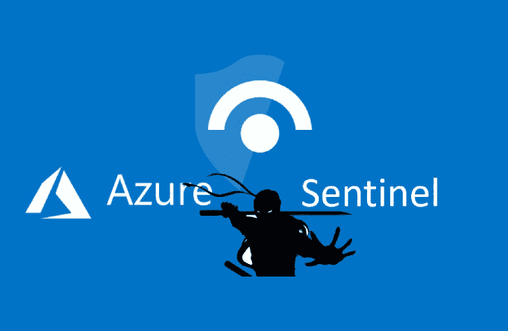

# Sentinel-Attack:在 Azure Sentinel 上快速部署威胁搜索功能的工具

> 原文：<https://kalilinuxtutorials.com/sentinel-attack/>

ATT 哨兵& CK 旨在利用 Azure Sentinel 上的 Sysmon 和米特 ATT & CK 简化威胁搜索功能的快速部署

### 概观

ATT CK 哨兵提供以下工具:

*   一个 ARM 模板，用于自动将 ATT CK 哨兵部署到您的 Azure 环境中
*   一个 Sysmon 配置文件，与 Azure Sentinel 兼容，并映射到特定的 ATT 和 CK 技术
*   映射到 OSSEM 数据模型的 Sysmon 日志解析器
*   涵盖 156 种 ATT 和 CK 技术的 117 种随时可用的 Kusto 检测规则
*   受 Splunk 威胁搜索应用程序启发的 Sysmon 威胁搜索工作簿，有助于简化威胁搜索
*   一个 Terraform 脚本提供一个实验室来测试哨兵 ATT 和 CK
*   帮助您使用该存储库中材料的全面指导

### 用法

前往维基，了解如何部署和运行哨兵 ATT 和 CK。

[**Download**](https://github.com/BlueTeamLabs/sentinel-attack)