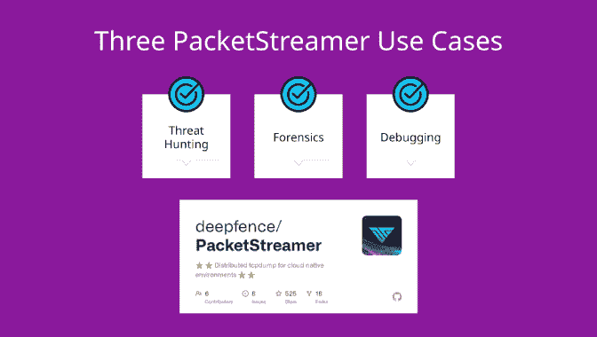

# PacketStreamer:用于云本地环境的分布式 Tcpdump

> 原文：<https://kalilinuxtutorials.com/packetstreamer/>

.png)

PacketStreamer 是一个高性能的远程数据包捕获和收集工具。Deepfence 的 ThreatStryker 安全可观察性平台使用它来根据需要从云工作负载中收集网络流量，以便进行取证分析。

主要设计目标:

*   保持轻，捕捉和流，没有额外的处理
*   可移植性，跨**虚拟机、Kubernetes 和 AWS Fargate** 工作。Linux 和 Windows

PacketStreamer **传感器**在目标服务器上启动。传感器捕获通信量，应用过滤器，然后将通信量传输到中央接收器。可以使用 TLS 来压缩和/或加密业务流。

PacketStreamer **接收器**接受来自多个远程传感器的 PacketStreamer 流，并将数据包写入本地`**pcap**`捕获文件。

数据包流传感器收集远程主机上的原始网络数据包。它使用 BPF 过滤器选择要捕获的数据包，并将它们转发到中央接收器进程，在那里它们以 pcap 格式写入。传感器非常轻便，对远程主机的性能影响很小。PacketStreamer 传感器可以在裸机服务器、Docker 主机和 Kubernetes 节点上运行。

PacketStreamer 接收器接受来自多个传感器的网络流量，将其收集到一个单一的中央`**pcap**`文件中。然后，您可以处理 pcap 文件，或者将流量实时馈送到您选择的工具，如 **`Zeek`、`Wireshark` `Suricata`** ，或者作为机器学习模型的实时流。

## 何时使用 PacketStreamer

PacketStreamer 比现有的替代产品满足更多的通用用例。例如，PacketBeat 捕获并解析多个远程主机上的数据包，组装事务，并将处理后的数据发送到一个中央 ElasticSearch 收集器。ksniff 从单个 Kubernetes pod 中捕获原始数据包数据。

如果您需要一种轻量级、高效的方法来从多台机器收集原始网络数据以进行集中日志记录和分析，请使用 PacketStreamer。

## 快速启动

有关完整说明，请参考 PacketStreamer 文档。

在构建 PacketStreamer 之前，您需要安装 golang 工具链和`**libpcap-dev**`。

先决条件(Ubuntu): sudo 安装 golang-go libpcap-dev
git 克隆 https://github.com/deepfence/PacketStreamer.git
CD 包 Streamer/
make

运行 PacketStreamer 接收器，监听端口 **8081** 并将 pcap 输出写入 **/tmp/dump_file** (参见 receiver.yaml):

**。/packetstreamer 接收器-配置。/contrib/config/receiver . YAML**

## 谁使用 PacketStreamer？

*   Deepfence ThreatStryker 使用 PacketStreamer 从生产平台捕获流量，用于取证和异常检测。

[**Download**](https://github.com/deepfence/PacketStreamer)