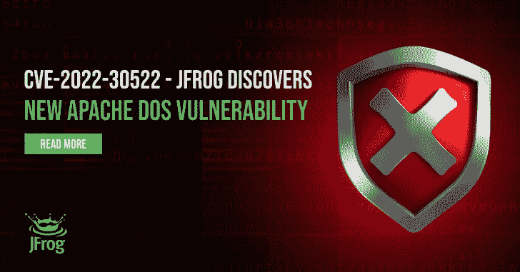

# 汇合点:亚特兰蒂斯汇合点的简单蜜罐(CVE-2022-26134)

> 原文：<https://kalilinuxtutorials.com/confluencepot/>

.png)

**ConfluencePot** 是针对 Atlassian Confluence 未经认证的远程 OGNL 注入漏洞(CVE-2022-26134)的简单蜜罐。

## 关于漏洞

您可以在此处找到 Atlassian 针对此漏洞的官方建议。有关内部工作和野外开发的详细信息，您应该参考 Rapid7 和 Cloudflare 的报告。在进一步调查之前，受影响但尚未打补丁的系统应被视为**受损**。

## 关于工具

ConfluencePot 是用 Golang 编写的，它实现了自己的 HTTPS 服务器，以最小化整体攻击面。为了让它看起来像一个合法的 Confluence 实例，它返回了一个 Confluence 登录页面的基本版本。日志输出被写入 stdout 和磁盘上的日志文件。confluence port**不**允许攻击者在你的机器上执行命令/代码，它只记录请求并返回虚假响应。

### 大楼&运行它

您需要一个 Golang 的最新版本来运行/构建 confluencePot，并需要适当的权限来绑定到端口 443。为了更容易处理，我们建议在 tmux 会话中执行它。要运行 ConfluencePot，您需要使用 *openssl* 创建一个自签名 TLS 证书，或者从*请求一个证书，让我们加密*。

去建造汇合点。/汇合点

[**Download**](https://github.com/SIFalcon/confluencePot)