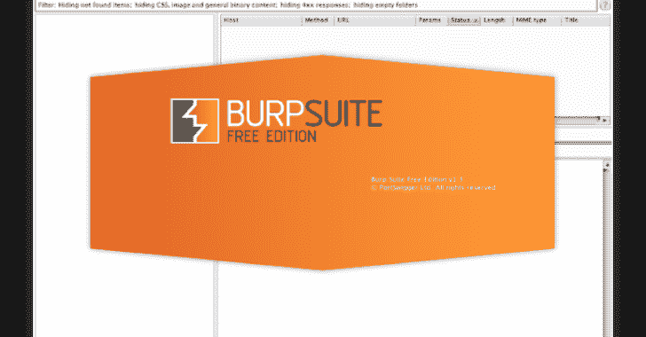

# Admin-Panel_Finder:一个枚举基础设施和应用程序管理界面的 Burp 套件扩展

> 原文：<https://kalilinuxtutorials.com/admin-panel_finder/>

.png)

**Admin-Panel_Finder** 是一个 burp 套件扩展，它列举了基础设施和应用管理接口。

**OWASP 引用:**

*   **分类** : Web 应用安全测试>02-配置和部署管理测试
*   **OTG v4**:OWASP OTG-CONFIG-005
*   **WSTG** : WSTG-CONF-05

# 为什么我应该使用这个扩展？

*   多线程
*   不同的和可配置的测试级别。
*   可包括的状态代码
*   可排除的状态代码
*   超过 1000 个内置有效载荷。
*   你可以加载你的字典。
*   可编辑的根目录
*   自动检测使用的技术，以生成定制的有效载荷。
*   被动监听查找登录页面。

# 安装

最快的方法是在 Burpsuite 的 extender 选项卡中加载 jar 文件(adminPanelFinder.jar)。
扩展器- >扩展- >添加
一个新标签将被添加到 burp 套件中。

# 快速启动

*   从 burp suite 的任何选项卡中选择一个目标主机的请求(它必须有一个带有任何状态代码的响应)
*   在“管理面板查找->选项”标签，应用您的配置。
*   进入“管理面板 Finder -> Finder -> Finder”标签，点击“开始”按钮。

# 一些选项

这些选项可用于自定义检测:

*   级别:要执行的测试级别(1-5，默认为 3)
*   线程:线程数量(1-50，默认为 10)
*   内置字典:有一个内置字典，包含最常用的目录和文件名，用于静态负载生成。
*   可加载字典:您可以使用字典文件来生成静态负载。
*   HTTP 方法:在请求中使用的 HTTP 方法(Head，GET)(缺省值:HEAD)
*   扩展:应用程序页面中使用的扩展。[示例:php、asp、aspx、jsp、…]
*   根目录:web 应用程序根目录的路径。(默认值:/)
*   可包括的状态代码
*   可排除的状态代码

# 从源代码构建

*   要构建该项目，您需要安装 Gradle。
*   克隆存储库
    `**git clone https://github.com/moeinfatehi/Admin-Panel_Finder**`
*   打开项目的主目录(build.gradle 文件所在的目录)并运行:`**gradle makeJar**`
*   Jar 文件将在“build/libs/Admin-Panel _ finder . Jar”中生成

[**Download**](https://github.com/moeinfatehi/Admin-Panel_Finder)