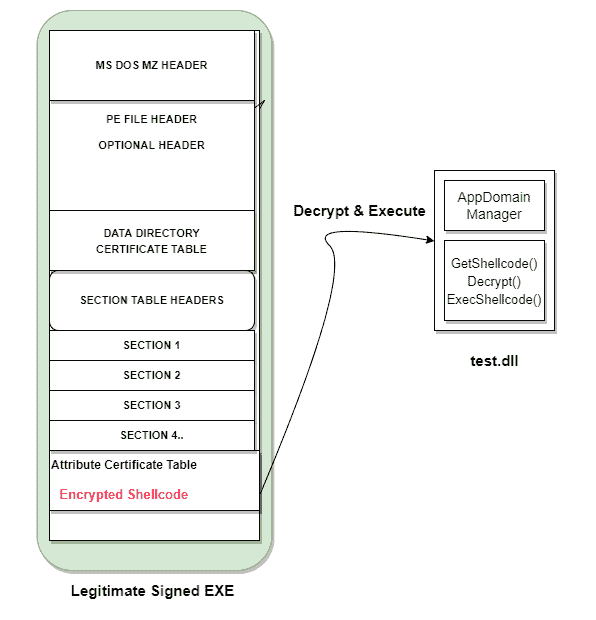

# Frostbyte : FrostByte 是一个 POC 项目，它结合了不同的防御规避技术

> 原文：<https://kalilinuxtutorials.com/frostbyte/>

.png)

**FrostByte** 是一个结合了不同防御规避技术的 POC 项目。在过去的几天里，我一直在试验 AppDomain manager 注入技术，在我以前与某些 edr 的红队合作中，它取得了相当大的成功。虽然，这对于初始访问向量来说真的很好，但是我想发布一个 POC 来帮助隐藏你的外壳代码。没有更多的外壳代码嵌入 DLL 文件！

## 问题！

虽然它在单独使用时是一种优秀的技术，但是当它与像在 ISO/ZIP/VHD/VHDX 文件中发送 C# ClickOnce 这样的交付技术结合使用时。真正的问题是 1/10 的 appdomain 的 DLL 被 AV/EDR 的 AI/ML heurestics 检测到。这是因为在初始化 appdomain 之前，需要将 DLL 文件放到磁盘上。暂时忽略远程 DLL 加载(中的 UNC 路径。config)，appdomain 的 DLL 将包含外壳代码，我强烈认为这是可能进行静态检测的原因，因为 WINAPI 调用的其余代码可以被动态解析并很好地混淆。

我想在最小化 DLL 最初包含的内容方面增强这项技术。我开始将加密的外壳代码和注入器 DLL 一起放在磁盘上的一个单独的文件中，但是后来我在 Zloader 的活动的 Checkpoint 上看到了这个惊人的博客

TLDR 版本:我们可以在 PE 中的某些字段中嵌入任意数据，而不会破坏文件的签名。因此，我们的数据将被嵌入，而 exe 仍将保持数字签名。

更多相关信息–https://www . black hat . com/docs/us-16/materials/us-16-Nipravsky-Certificate-Bypass-Hiding-And-Executing-Malware-From-A-digital-Signed-Executable-WP . pdf

因此，这个想法是将加密的外壳代码存根嵌入到一个已知的已签名的可执行文件中，并像 Zloader 恶意软件那样设法保持它的签名状态。通过这样做，AppDomain Manager DLL 本身将不再包含外壳代码，而只是具有从 PE 二进制文件中解析外壳代码的逻辑，PE 二进制文件加载外壳代码以解密并作为单独的线程执行。这样做可能会降低 DLL 的静态检测率，同时您的外壳代码被很好地放置在一个签名的二进制文件中。

我试图通过手动篡改从 VirusTotal 获得的 ZLoader 示例来实现这一点，但后来发现一个项目已经很好地实现了所有这些技术——SIG flip。在这个 POC 中，我利用 Sigflip 的加载器代码来构建 AppDomain DLL 和 SigFlip 注入器，以将加密的外壳代码嵌入到我们的 C# exe 中。

## 优势

像 Cobalt Strike 的无级外壳代码这样的大块外壳代码将不再驻留在磁盘上未签名的 DLL 中，不管使用什么模糊/编码技术。DLL 更干净，更小，更隐蔽，代码更少，从而减少了检测的变化。

## 工作

## 构建签名外壳代码可执行文件的步骤

*   选择任何 x64 签名的 C#二进制文件，一个你希望 cobalt strike beacon 驻留并执行的二进制文件:例如:CasPol.exe 等。
*   生成您的 Cobalt Strike Stageless 外壳代码-x64-stage less . bin
*   将它们放入 SigFlip 所在的文件夹中，并运行下面的命令:
    `**SigFlip.exe -i "Z:\ZLoader\CasPol.exe" "Z:\ZLoader\x64-stageless.bin" "Z:\ZLoader\update.exe" "S3cretK3y"**`
*   由于 SigFlip，现在您有一个(windows 签名？)名为`**update.exe**`的二进制文件，它将是一个嵌入了加密外壳代码的数字签名 PE。

## 构建 AppDomain 加载程序 DLL 的步骤

*   从这里获取 C#模板代码
*   用您在第 163 行运行 SigFlip 时选择的密钥替换您的加密密钥(您可能需要调整几个字节来确认您的 CS 外壳代码是否被正确解密)
*   替换为第 146 行的二进制路径
*   在行中更改日志文件路径:158，165
*   使用下面的命令将代码编译成 DLL-`**csc /target:library /out:test.dll test.cs**`
*   将编译后的 DLL 和 update.exe.config 文件放在您签名的外壳代码 exe 所在的文件夹中。
*   处决 update.exe。

[**Download**](https://github.com/pwn1sher/frostbyte)