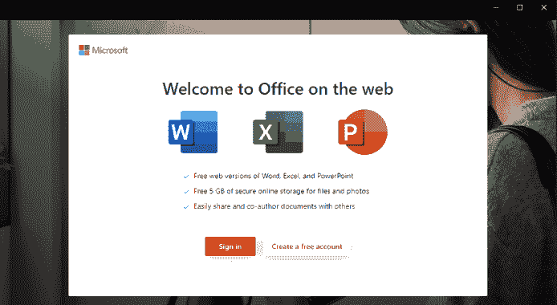

# WebView2-Cookie 窃取者:利用 WebView2 应用程序进行攻击

> 原文：<https://kalilinuxtutorials.com/webview2-cookie-stealer/>

.png)

**webview 2-Cookie-stealter**据微软称，“Microsoft Edge WebView2 control 允许你在你的原生应用中嵌入 web 技术(HTML、CSS 和 JavaScript)”。本质上，WebView2 技术可用于创建可执行文件，该文件可以像浏览器一样与 web 应用程序进行通信。这意味着改进桌面应用程序，并为它们提供与 web 应用程序交互的附加功能。下图是在合法的 Microsoft Office 应用程序中使用 WebView2 的示例。

对攻击者来说，使用 WebView2 的主要优势在于它在针对凭据和会话的网络钓鱼时提供了丰富的功能。在这篇文章中，我将讨论并展示攻击者如何创建 WebView2 应用程序并将其用于多种目的。我的代码使用了微软的 WebView2 示例库的修改版本。这项研究既困难又耗时，因为我必须阅读大量文档并进行大量调试，以了解 WebView2 的内部工作方式。

# 注入 JavaScript

使用内置的 WebView2 函数，JavaScript 可以轻松注入到任何网站中。这意味着你可以加载一个目标网站，并注入恶意的 JavaScript(如键盘记录器)。

## JavaScript 键盘记录器示例

在下面的例子中，我使用了一个定制的 WebView2 应用程序，它通过一个注入的 JavaScript 键盘记录器来加载`**login.microsoftonline.com**`。

# 旁路 2FA

WebView2 还提供了提取 cookies 的内置功能。这使得攻击者能够在用户认证进入**合法网站**后提取 cookies。这种技术不需要启动 Evilginx2 或 Modlishka，但明显的代价是用户必须执行二进制文件并进行身份验证。

## 渗出 Cookies 示例

下图显示了用户遍历到`**https://mrd0x.com**`后，如何以 base64 格式提取 cookies。

# 偷铬饼干

WebView2 可用于窃取当前用户的所有可用 cookies。这在 Chrome 上测试成功。

WebView2 允许您使用现有的用户数据文件夹(UDF)启动，而不是创建新的文件夹。UDF 包含所有的密码，会话，书签等。Chrome 的 UDF 位于`**C:\Users\<username>\AppData\Local\Google\Chrome\User Data**`。我们可以简单地告诉 WebView2 使用这个配置文件启动实例，并在启动时提取所有 cookies，并将它们传输到攻击者的服务器。

## 小捕获量

唯一的问题是 WebView2 寻找一个名为`**EBWebView**`的文件夹，而不是`**User Data**`(不确定为什么)。复制一个`**User Data**`文件夹，重命名为 **`EBWebView`。**

## 提取所有 Cookies

下图显示了我是如何加载我的 Chrome UDF 并提取所有 cookies 的。上传到我的 GitHub repo 的代码中没有实现这个功能，但是实现起来很简单，GitHub README 解释了为了让这个功能工作需要修改什么。

# 应用程序演示

我上传了 O365 WebView2 应用程序的代码，该应用程序在执行时加载`**www.office.com/login**`，当用户成功通过身份验证时，`**www.office.com**`的 base64 编码 cookies 通过 HTTP GET 请求发送给攻击者。

# Github 回购

代码已经上传到我的 Github 上了。您可以在未来的项目中随意使用它，也可以根据需要进行修改。自述文件解释了一切，以防您想要修改它以用于不同的用例。

# 最后的想法

这种技术有它的优点和缺点。明确的权衡是必须在主机上执行二进制文件，并且用户必须将凭证输入到应用程序中。有人可能会问，如果需要执行应用程序，为什么不简单地执行外壳代码并获得远程访问呢？你当然可以。但是根据某些人的需要，他们可能需要远程访问之外的东西，例如在目标网站上执行 JavaScript。

您可以将该功能扩展到现有的 WebView2 应用程序，也可以获得远程访问。但是目前该二进制文件只使用微软提供的合法功能。这可能会使它更难被安全解决方案标记。

[**Download**](https://github.com/mrd0x/WebView2-Cookie-Stealer)