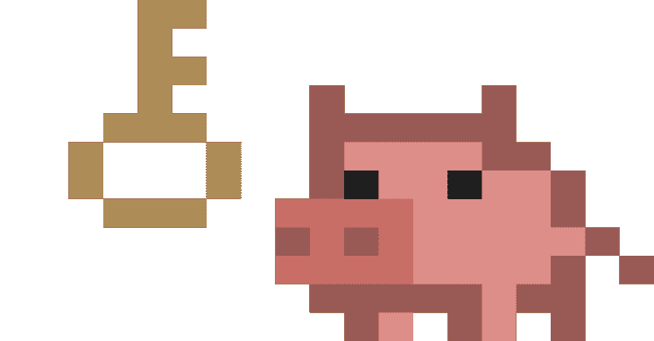

# 松露猪:到处找凭证

> 原文：<https://kalilinuxtutorials.com/trufflehog-2/>

.png)

v3 是对 Go 的彻底改写，增加了许多强大的新功能。

*   我们已经**添加了 700 多个凭证检测器，支持根据各自的 API**进行主动验证。
*   我们还增加了对扫描 GitHub、GitLab、文件系统和 S3 的原生支持。
*   **使用我们的浮木技术，针对数百万 github 用户和**数十亿张**TLS 证书，即时验证私钥**。

## 什么是凭证验证？

对于每一个被检测到的潜在凭证，我们都煞费苦心地针对我们认为它所属的 API 实现了程序验证。验证消除了误报。例如，AWS 凭证检测器对 AWS API 执行`**GetCallerIdentity**` API 调用，以验证 AWS 凭证是否有效。

## 安装

几个选项:

### 1。去

**git 克隆 https://github.com/trufflesecurity/trufflehog.git
CD 松露猪；去安装**

### 2.发布二进制文件

### 3。码头工人

注意:苹果 M1 硬件用户应该运行`**docker run --platform linux/arm64**`以获得更好的性能。

#### **最多用户**

**docker run-it-v " $ PWD:/pwd " truffle security/truffle hog:最新 github–回购 https://github.com/trufflesecurity/test_keys**

#### **苹果 M1 用户**

与 amd64 映像相比，`**linux/arm64**`映像更适合在 M1 上运行。更好的是运行原生的 darwin 二进制文件，但是没有容器映像。

d**ocker run–平台 Linux/arm 64-it-v " $ PWD:/pwd " truffle security/truffle hog:最新 github–回购 https://github.com/trufflesecurity/test_keys**

### 4.Pip(寻求帮助)

在 pip 轮中分发二进制文件是可能的。

这是一个这样做的项目的例子。

帮助设置这个包装将不胜感激！

### 5。啤酒

brew tap truffle security/truffle hog
brew install truffle hog

## 使用

对于您可能想要扫描的每个数据源，TruffleHog 都有一个子命令:

*   饭桶
*   开源代码库
*   gitlab
*   S3
*   文件系统
*   系统记录
*   文件和标准输入(即将推出)

每个子命令都可以有选项，您可以通过提供给子命令的`**-h**`标志看到这些选项:

**$ truffhog git–help
用法:truffhog git[]
在 git 存储库中查找凭证。
标志:
–帮助显示上下文相关的帮助(也可以尝试–help-long 和–help-man)。
–调试模式下的调试运行
–版本打印 trufflehog 版本。
-j，–json 格式的 JSON 输出。
–json-legacy 使用 v3.0 之前的 JSON 格式。仅适用于 git、gitlab 和 github 源代码。
–并发=1 个并发工作人员。
–否-验证不验证结果。
–Only-verified 仅输出验证的结果。
–Print-avg-detector-time 打印每个探测器花费的平均时间。
–无更新不检查更新。
-i，–INCLUDE-PATHS = INCLUDE-PATHS
文件的路径，带有换行分隔的正则表达式，用于扫描要包含的文件。
-x，–EXCLUDE-PATHS = EXCLUDE-PATHS
文件的路径，其中包含要在扫描中排除的文件的换行符。
–自提交=自提交
提交从开始扫描。
–BRANCH =要扫描的分支分支。
–MAX-DEPTH = MAX-DEPTH 要扫描的最大提交深度。
–允许反向兼容的无操作标志。
–向后兼容的熵无操作标志。
–向后兼容的正则表达式无操作标志。
参数:
Git 存储库 URL。应为 https://或 file://架构。**

例如，要扫描一个`**git**`存储库，从

**$松露猪饭桶 https://github.com/trufflesecurity/trufflehog.git**

退出代码:

*   0:未找到错误和结果。
*   1:遇到错误。源可能没有完成扫描。
*   183:没有遇到错误，但找到了结果。仅当使用了`**--fail**`标志时才会返回。

#### 扫描组织

尝试使用以下命令扫描整个 GitHub 组织

**docker run-it-v " $ PWD:/pwd " truffle security/truffle hog:最新 github–org = truffle security**

## 松露猪 OSS Github 动作

**名称:TruffleHog OSS
用途:truffle security/truffle hog @ main
with:
#仓库路径
路径:
#从这里开始扫描(一般是主分支)。
base:
# Scan 提交到这里(通常是 dev 分支)。
头:#可选**

TruffleHog OSS Github 操作可用于扫描一系列提交以查找泄漏的凭据。如果发现任何结果，该操作将失败。

例如，要扫描拉请求的内容，您可以使用以下工作流:

**名称:泄密扫描
on:[pull _ request]
jobs:
truffle hog:
run-on:Ubuntu-latest
步骤:
–名称:Checkout code
用途:actions/check out @ v3
with:
fetch-depth:0
–名称:TruffleHog OSS
用途:truffle security/truffle hog @ v 3 . 4 . 3
with:
path:。/
base:$ { { github . event . repository . default _ branch } }
HEAD:HEAD**

[**Download**](https://github.com/trufflesecurity/trufflehog)