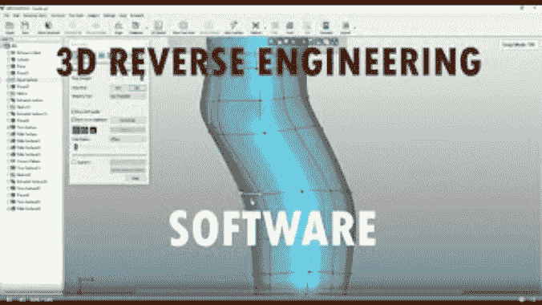

# RESim:使用全系统模拟器的逆向工程软件

> -= the last fantasy =-荣誉出品本字幕仅供学习交流，严禁用于商业途径

RESim 是一个动态系统分析工具，可以提供对网络计算机中的进程、程序和数据流的详细分析。RESim 通过使用 Simics[1]平台的处理器、外围设备(如网络接口卡)和磁盘的高保真模型来模拟计算机网络。联网的模拟计算机加载并运行从被建模的物理系统中提取的图像中复制的目标软件。

从广义上讲，RESim 通过根据进程执行的程序和消耗的数据对进程进行编目，来帮助对基于 Linux 系统的网络进行逆向工程和漏洞分析。数据源包括文件、设备接口和进程间通信机制。通过对运行的模拟系统的动态分析来记录进程执行和数据消耗，而无需在模拟系统中安装或注入软件，也无需详细了解托管进程的内核。

RESim 还通过使用 IDA Pro 反汇编程序/调试器的自定义插件，提供了对单个执行程序的交互式可视性。Ghidra 调试器的插件也是可用的。反汇编器/调试器允许设置断点，以便在未来时间或过去时间的选定事件处暂停模拟。例如，RESim 可以指示模拟状态反转，直到最近一次修改选定的存储器地址。可重载检查点可以在系统执行过程中的任何时候生成。
RESim 仿真可以被暂停以进行检查，例如，当指定的过程被调度用于执行时，并且随后继续，潜在地具有改变的存储器或寄存器状态。分析师可以显式修改内存或寄存器内容，也可以基于系统事件动态增加内存，例如， *su* 程序读取时更改密码文件条目。

分析完全通过观察模拟目标系统的内存和处理器状态来执行，不需要外壳、软件注入或内核符号表。分析被称为*外部*，因为分析观察功能对模拟系统的状态没有影响。

RESim 已经与*美国 Fuzzing Lop* (AFL) fuzzer 集成。这种模糊化系统将模糊化的数据直接注入应用程序读取缓冲区，简化了模糊化设置和工作流程。RESim 自动重放和分析任何检测到的崩溃，识别崩溃的原因，例如，执行控制的损坏。

有关更多信息，请参考 RESim 用户指南。这里可以看到 RESim 的简要演示:(https://nps.box.com/s/rf3n104ualg38pon6b7fm6m6wqk9zz50)

RESim 基于为 DARPA 网络大挑战创建的软件审查和取证分析平台。这份报告在这里:https://github.com/mfthomps/cgc-monitor.一篇描述这项工作的论文在 https://www . science direct . com/science/article/pii/s 1742287618301920，关于在 CGC 监测中使用 Simics 的详细摘要在 https://software . Intel . com/content/www/us/en/develop/blogs/Simics-software-automates-cyber-grand-challenge-validation . html

[1]Simics 是由 Wind River 出售的全系统模拟器，拥有所有相关商标。

[**Download**](https://github.com/mfthomps/RESim)