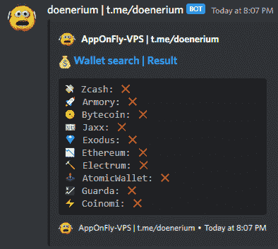
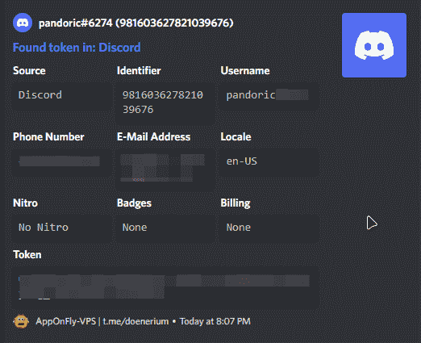

# Doenerium:完全不被发现的抓取程序(抓取钱包、密码、Cookies、修改不和谐的客户端等)。)

> 原文：<https://kalilinuxtutorials.com/doenerium/>

.png)

Doenerium 是一个完全不被发现的抓取程序(抓取钱包、密码、Cookies、修改不和谐的客户端等)。)

### 特征

#### 偷窃者

不和谐令牌

不和谐信息-用户名，电话号码，电子邮件，帐单，硝基状态和备份代码

拥有稀有徽章的不和朋友

抓取加密钱包——Zcash 军械库字节币 Jaxx Exodus ether eum Electrum AtomicWallet Guarda Coinomi

浏览器(Chrome、Opera、Firefox、OperaGX、Edge、Brave、Yandex)——密码、Cookies、自动填充和历史(搜索特定关键字，如 PayPal、比特币基地等。在他们身上)

截图

将自身注入到 discord 中，以便在发生变化时获取令牌

#### 附加

Clipper 加密–BTC、LTC、XMR、ETH、XRP、NEO、BCH、doge、DASH、XLM

超模糊处理(使用 https://obfuscator.io)

反调试

反 VM

验证找到的不和谐令牌，然后将其发送到您的不和谐网络挂钩

发送所有文件到你的不和谐的网络钩子在美丽的嵌入和一个结构化的压缩文件

## 截屏

[**Download**](https://github.com/doener2323/doenerium)