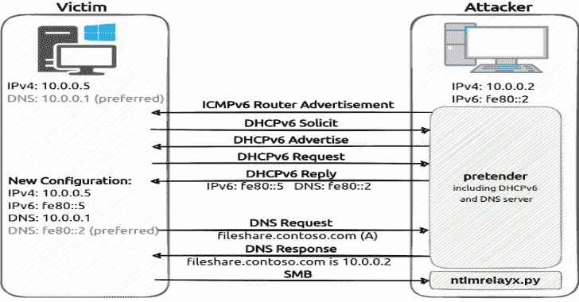

# 伪装者:你的 MitM 跟班中继攻击功能 DHCPv6 DNS 接管以及 mDNS

> 原文：<https://kalilinuxtutorials.com/pretender/>

`**pretender**`是由 RedTeam Pentesting 开发的工具，用于通过伪造的本地名称解析和 DHCPv6 DNS 接管攻击来获取中间人位置。`**pretender**`主要针对 Windows 主机，因为它旨在用于中继攻击，但也可以部署在 Linux、Windows 和 Go 支持的所有其他平台上。对于中继工具运行在与`**pretender**`不同的主机上的情况，可以用任意 IP 来回答名称解析查询。它旨在与 Impacket 的`**ntlmrelayx.py**`和 krbrelayx 等工具一起工作，这些工具处理中继攻击或哈希转储的传入连接。

阅读我们的博客文章，了解有关 DHCPv6 DNS 接管、本地名称解析欺骗和中继攻击的更多信息。

## 用法

为了了解本地网络的情况，`**pretender**`可以在`**--dry**`模式下启动，在这种模式下，它只记录传入的查询，而不回答任何查询:

**pretender-I eth 0–dry
pretender-I eth 0–dry–no-ra #无路由器广告**

要通过 mDNS、LLMNR 和 NetBIOS-NS 执行本地名称解析欺骗，以及通过路由器广告执行 DHCPv6 DNS 接管，只需像这样运行`**pretender**`:

**伪装者-i eth0**

您可以使用`**--no-dhcp-dns**`(禁用 DHCPv6、DNS 和路由器广告)、`**--no-lnr**`(禁用 mDNS、LLMNR 和 NetBIOS-NS)、**、`--no-llmnr`、`--no-netbios`、**和`**--no-ra**`来禁用某些攻击。

如果`n**tlmrelayx.py**`在不同的主机上运行(比如说 **`10.0.0.10` / `fe80::5`** )，运行`**pretender**`如下:

**伪装者-i eth0 -4 10.0.0.10 -6 fe80::5**

伪装者可以被设置为只响应特定域(或所有*但*特定域)的查询，并且它可以只对特定主机(或所有*但*特定主机)执行欺骗攻击。通过主机名引用主机依赖于运行`**pretender**`的主机的名称解析。请参见以下示例:

**伪装者-I eth 0–恶搞 example.com–不要恶搞-for 10.0.0.3，host1.corp，fe80::f–ignore-nof qdn**

有关更多信息，请运行`**pretender --help**`。

## 技巧

*   确保使用`**-6**`标志在`**ntlmrelayx.py**`中启用 IPv6 支持
*   在无法手动中止的情况下(`**--stop-after**`和`**main.vendorStopAfter**`)，可以将预装器配置为在一定时间后停止
*   可以使用`**--no-host-info**`或`**main.vendorNoHostInfo**`禁用主机信息查找(依赖于 ARP 表、IP 邻居和反向查找)
*   如果您不确定选择哪个接口(尤其是在 Windows 上)，请使用`-**-interfaces**`列出所有带有名称和地址的接口
*   如果要从本地名称解析欺骗中排除主机，请确保也排除其 IPv6 地址或使用`**--no-ipv6-**` **`lnr` / `main.vendorNoIPv6LNR`**
*   DHCPv6 消息通常包含 FQDN 选项(有时也包含不是 FQDN 的主机名)。该选项用于按主机名( **`--spoof-for` / `--dont-spoof-for`** )过滤消息。您可以通过设置或省略`**--ignore-nofqdn**`来决定如何处理没有 FQDN 选项的 DHCPv6 消息
*   根据构建配置，使用操作系统解析器(`**CGO_ENABLED=1**`)或 Go 实现(`**CGO_ENABLED=0**`)。这对于主机信息收集很重要，因为 OS 解析器可能支持本地名称解析，而 Go 实现不支持，除非使用存根解析器。
*   主机信息功能目前仅适用于 Windows 和 Linux。
*   通过替换默认列表`**hostinfo/mac-vendors.txt**`，可以将定制的 MAC 地址供应商列表编译成二进制文件。仅识别具有以下格式的 MAC 前缀的行:`**FF:FF:FF<tab>VendorID<tab>Vendor**`(MAC 前缀长度可以是任意的)。
*   如果您只想执行 Kerberos 中继，您可以指定`**--no-lnr**`和`**--spoof-types SOA**`来忽略任何与攻击无关的查询。
*   当进行 Kerberos 中继攻击时，其中`**krbrelayx.py**`运行在与伪装者不同的主机上(中继 IPv4 地址指向运行`**krbrelayx.py**`的不同主机)，运行`**krbrelayx.py**`的主机也需要运行伪装者，以便接收和拒绝发送到中继 IPv4 地址的动态更新查询。

## 建筑和售货

伪装者可以按如下方式制造:

**去建造**

伪装者也可以用预先配置的设置来编译。为此，`**ldflags**`必须修改如下:

**-ldflags '-x main . vendorface = eth 1‘**

例如，可以为 Windows 构建具有特定默认接口的伪装者，没有彩色输出，并且配置了中继 IPv4 地址:

**GOOS = windows go build-trim path-LD flags '-X " main . vendor interface = Ethernet 2 "-X main . vendornocolor = true-X main . vendorrelayipv 4 = 10 . 0 . 0 . 10 '**

售货选项的完整列表(详见 **`defaults.go`** 或`**pretender --help**`):

**卖方面
卖方面
卖方面
卖方面
卖方面
卖方面
卖方面
卖方面
卖方面
卖方面
卖方面
卖方面** 

[**Download**](https://github.com/RedTeamPentesting/pretender)