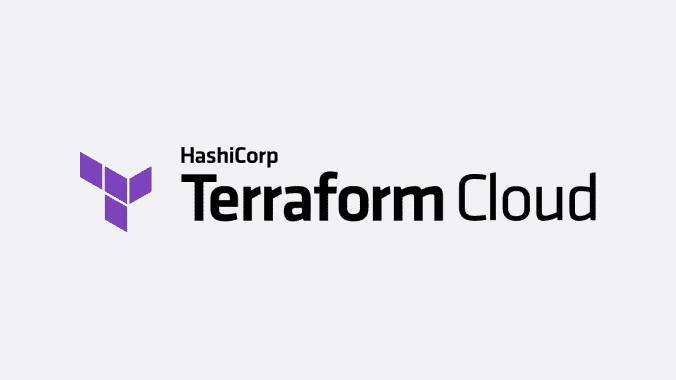
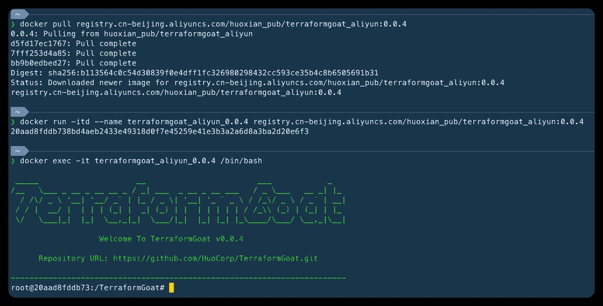

# TerraformGoat:“设计易受攻击”多云部署工具

> 原文：<https://kalilinuxtutorials.com/terraformgoat/>

**TerraformGoat** 是 selefra 研究实验室的“设计易受攻击”多云部署工具。

目前支持的云厂商包括阿里云、腾讯云、华为云、亚马逊 Web 服务、谷歌云平台、微软 Azure。

## 情节

| 身份证明 | 云服务公司 | 云服务的类型 | 脆弱的环境 |
| --- | --- | --- | --- |
| one | 阿里云 | 建立工作关系网 | VPC 安全集团开放所有港口 |
| Two | 阿里云 | 建立工作关系网 | VPC 安全集团开放公共口岸 |
| three | 阿里云 | 对象存储 | 桶 HTTP 启用 |
| four | 阿里云 | 对象存储 | 对象 ACL 可写 |
| five | 阿里云 | 对象存储 | 对象 ACL 可读 |
| six | 阿里云 | 对象存储 | 特殊桶策略 |
| seven | 阿里云 | 对象存储 | 桶公共访问 |
| eight | 阿里云 | 对象存储 | 对象公共访问 |
| nine | 阿里云 | 对象存储 | 禁用存储桶日志记录 |
| Ten | 阿里云 | 对象存储 | 存储桶策略可读 |
| Eleven | 阿里云 | 对象存储 | 桶对象遍历 |
| Twelve | 阿里云 | 对象存储 | 无限制文件上传 |
| Thirteen | 阿里云 | 对象存储 | 服务器端加密无 KMS 集 |
| Fourteen | 阿里云 | 对象存储 | 不使用 BYOK 的服务器端加密 |
| Fifteen | 阿里云 | 弹性计算服务 | ECS SSRF |
| Sixteen | 阿里云 | 弹性计算服务 | ECS 未连接的磁盘是未加密的 |
| Seventeen | 阿里云 | 弹性计算服务 | ECS 虚拟机磁盘未加密 |
| Eighteen | 腾讯云 | 建立工作关系网 | VPC 安全集团开放所有港口 |
| Nineteen | 腾讯云 | 建立工作关系网 | VPC 安全集团开放公共口岸 |
| Twenty | 腾讯云 | 对象存储 | 桶 ACL 可写 |
| Twenty-one | 腾讯云 | 对象存储 | 桶 ACL 可读 |
| Twenty-two | 腾讯云 | 对象存储 | 桶公共访问 |
| Twenty-three | 腾讯云 | 对象存储 | 对象公共访问 |
| Twenty-four | 腾讯云 | 对象存储 | 无限制文件上传 |
| Twenty-five | 腾讯云 | 对象存储 | 桶对象遍历 |
| Twenty-six | 腾讯云 | 对象存储 | 禁用存储桶日志记录 |
| Twenty-seven | 腾讯云 | 对象存储 | 服务器端加密禁用 |
| Twenty-eight | 腾讯云 | 弹性计算服务 | CVM SSRF |
| Twenty-nine | 腾讯云 | 弹性计算服务 | 不使用 CBS 存储 |
| Thirty | 腾讯云 | 弹性计算服务 | CVM 虚拟机磁盘未加密 |
| Thirty-one | 华为云 | 建立工作关系网 | ECS 不安全安全组 |
| Thirty-two | 华为云 | 对象存储 | 对象 ACL 可写 |
| Thirty-three | 华为云 | 对象存储 | 特殊桶策略 |
| Thirty-four | 华为云 | 对象存储 | 无限制文件上传 |
| Thirty-five | 华为云 | 对象存储 | 桶对象遍历 |
| Thirty-six | 华为云 | 对象存储 | 错误的策略导致任意文件上传 |
| Thirty-seven | 华为云 | 弹性计算服务 | ECS SSRF |
| Thirty-eight | 华为云 | 关系数据库服务 | RDS Mysql 基线检查环境 |
| Thirty-nine | 亚马逊网络服务 | 建立工作关系网 | VPC 安全集团开放所有港口 |
| Forty | 亚马逊网络服务 | 建立工作关系网 | VPC 安全集团开放公共口岸 |
| Forty-one | 亚马逊网络服务 | 对象存储 | 对象 ACL 可写 |
| forty-two | 亚马逊网络服务 | 对象存储 | 桶 ACL 可写 |
| Forty-three | 亚马逊网络服务 | 对象存储 | 桶 ACL 可读 |
| forty-four | 亚马逊网络服务 | 对象存储 | MFA 删除被禁用 |
| Forty-five | 亚马逊网络服务 | 对象存储 | 特殊桶策略 |
| Forty-six | 亚马逊网络服务 | 对象存储 | 桶对象遍历 |
| Forty-seven | 亚马逊网络服务 | 对象存储 | 无限制文件上传 |
| Forty-eight | 亚马逊网络服务 | 对象存储 | 禁用存储桶日志记录 |
| forty-nine | 亚马逊网络服务 | 对象存储 | 桶允许 HTTP 访问 |
| Fifty | 亚马逊网络服务 | 对象存储 | 桶默认加密禁用 |
| Fifty-one | 亚马逊网络服务 | 弹性计算服务 | EC2 SSRF |
| fifty-two | 亚马逊网络服务 | 弹性计算服务 | 控制台接管 |
| Fifty-three | 亚马逊网络服务 | 弹性计算服务 | 不使用 EBS 卷 |
| Fifty-four | 亚马逊网络服务 | 弹性计算服务 | EBS 卷加密被禁用 |
| Fifty-five | 亚马逊网络服务 | 弹性计算服务 | EBS 卷的快照是不加密的 |
| fifty-six | 亚马逊网络服务 | 身份和访问管理 | IAM 权限提升 |
| Fifty-seven | 谷歌云平台 | 对象存储 | 对象 ACL 可写 |
| Fifty-eight | 谷歌云平台 | 对象存储 | 桶 ACL 可写 |
| Fifty-nine | 谷歌云平台 | 对象存储 | 桶对象遍历 |
| Sixty | 谷歌云平台 | 对象存储 | 无限制文件上传 |
| Sixty-one | 谷歌云平台 | 弹性计算服务 | 虚拟机命令执行 |
| Sixty-two | 微软 Azure | 对象存储 | Blob 公共访问 |
| Sixty-three | 微软 Azure | 对象存储 | 容器 Blob 遍历 |
| Sixty-four | 微软 Azure | 弹性计算服务 | 虚拟机命令执行 |

## 安装

TerraformGoat 是使用 Docker 映像部署的，因此需要 Docker 引擎环境支持，可以在 https://docs.docker.com/engine/install/找到 Docker 引擎安装

根据您使用的云服务提供商，选择相应的安装命令。

阿里云

**码头牵引注册处. cn-北京。aliyucs . com/Hu xian _ pub/terrformgoat _ aliyun:0 . 0 . 4
码头运行-itd–名称 terrformgoat _ aliyun _ 0 . 4 注册处. cn-北京。aliyucs . com/Hu xian _ pub/terrformgoat _ aliyun:0 . 0 . 4
码头执行-it terrformgoat _ aliyun _ 0.0**

腾讯云

d〖t0〗〗〗〗〗，北京。aliyucs . com/霍贤 _ pub/terrformgoat _ tencentcloud:0 . 0 . 4〖t1〗码头运行-itd–名称 terrformgoat _ tencentcloud _ 0 . 0 . 4 注册表. cn-北京。aliyucs . com/霍贤 _ pub/terrformgoat _ tencentcloud:0 . 0 . 4〖T2〖码头执行-it terrformgoat _ tenten

华为云

**码头牵引登记处. cn-北京。aliyucs . com/霍贤 _ pub/terrformgoat _ huaweicloud:0 . 0 . 4
码头运行-itd–名称 terrformgoat _ huaweicloud _ 0 . 4 registry . cn-北京。aliyucs . com/霍贤 _ pub/terrformgoat _ huaweicloud:0 . 0 . 4
码头执行-it terrformgoat _ huaweicloud**

亚马逊网络服务

**码头牵引注册处. cn-北京。aliyucs . com/霍贤 _ pub/terrformgoat _ AWS:0 . 0 . 4
码头运行-itd–名称 terrformgoat _ AWS _ 0 . 0 . 4 注册处. cn-北京。aliyucs . com/霍贤 _ pub/terrformgoat _ AWS:0 . 0 . 4
码头执行-it terrformgoat _ AWS _ 0.0**

## （通常是短暂的）伤感

进入容器后，cd 到相应的场景目录，您可以开始部署场景。

下面是阿里云桶对象遍历场景构建的演示

**码头牵引登记处. cn-北京。aliyucs . com/Hu xian _ pub/terrformgoat _ aliyun:0 . 0 . 4
码头运行-itd–名称 terrformgoat _ aliyun _ 0 . 4 注册表. cn-北京。aliyucs . com/Hu xian _ pub/terrformgoat _ aliyun:0 . 0 . 4
码头执行-it terrformgoat _ aliyun _ 0.0**

## 从计算机上卸载

如果在容器中，首先执行`**exit**`命令退出容器，然后在主机下执行下面的命令。

**停靠站$(PS-a -q -f 停靠站“名称= terrformgoat”*停靠站 RM $(PS-a-q-f 停靠站“名称= terrformgoat”*)
RMI 停靠站$(影像-a-q-f 停靠站“reference = registry . cn-京. aliyucs . com/Hu 贤 _ pub/terrformgoat *)】**

[**Download**](https://github.com/selefra/TerraformGoat)