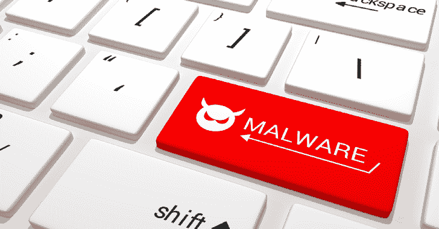

# Maldev-For-Dummies:关于恶意软件开发的研讨会

> 原文：<https://kalilinuxtutorials.com/maldev-for-dummies/>

Maldev-For-Dummies 是一个关于恶意软件开发的研讨会。

随着反病毒(AV)和企业检测和响应(EDR)工具日益成熟，红队被迫保持领先。将未修改的有效载荷放在磁盘上的时代已经一去不复返了——如果你想让你的约定持续一周以上，你就必须加快有效载荷的创建和恶意软件开发的步伐。然而，在这个领域起步可能会令人望而生畏，找到合适的资源并不总是容易的。

这个研讨会是针对这个领域的初学者的，它将引导你完成作为一个恶意软件开发者的第一步。它主要面向进攻型从业者，但是也非常欢迎防守型从业者参加并扩展他们的技能。

在研讨会期间，我们将复习一些理论，之后我们将为您设置一个实验室环境。根据你目前的技能和对主题的熟悉程度，你可以完成不同的练习。然而，研讨会的目的是学习，并明确地*而不是*完成所有练习。您可以自由选择恶意软件开发的首选编程语言，但研讨会期间提供的支持主要针对 C#和 Nim 编程语言。

在研讨会期间，我们将讨论开始构建您自己的恶意软件所需的关键主题。这包括(但不限于):

*   Windows API
*   文件类型和执行方法
*   外壳代码执行和注入
*   反病毒和 EDR 规避方法

## 开始使用

要开始恶意软件开发，您需要一台开发机器，这样您就不会被可能在您的主机上运行的任何防御工具所困扰。我更喜欢使用 Windows 进行开发，但是 Linux 或者 MacOS 也可以。安装您选择的 IDE(除了 C#，我几乎对所有的东西都使用 VS 代码，对于 c#，我使用 Visual Studio，然后安装您选择的 MalDev 语言所需的工具链:

*   **C#** : Visual Studio 将为您提供包含。NET 包，你将需要开发 C#。如果您想在没有 Visual Studio 的情况下进行开发，可以下载。NET 框架。
*   **Nim lang** :按照下载说明操作。Choosenim 是一个方便的实用程序，可用于自动化安装过程。
*   **Golang** (感谢@nodauf 的公关):按照下载说明操作。
*   **Rust** (车间期间不支持):Rustup 可用于安装 Rust 以及所需的工具链。

不要忘记禁用 Windows Defender 或添加适当的排除，这样您的辛勤工作不会被隔离！

ℹ **注意:**通常，诸如 apt 之类的包管理器或诸如 Chocolatey 之类的软件管理工具可以用来以一种方便且可重复的方式自动化依赖项的安装和管理。但是要注意的是，软件包管理器中的版本经常落后于真实的版本！下面是一个 Chocolatey 命令示例，用于一次性安装上述工具。

**choco install-y nim choose nim go rust vs code visual studio 2019 community dotnetfx**

## 编译程序

C#和 Nim 都是*编译的*语言，这意味着编译器被用来将你的源代码翻译成你选择的格式的二进制可执行文件。每种语言的编译过程都不同。

### C#

C#代码(`**.cs**`文件)既可以直接编译(使用`**csc**`实用程序)，也可以通过 Visual Studio 本身编译。此回购中的大多数源代码(除了奖金练习 3 的解决方案)可以编译如下。

ℹ **注意:**确保在“Visual Studio 开发人员命令提示符”下运行下面的命令，这样它就知道在哪里可以找到`**csc**`，建议使用适用于您的 Visual Studio 版本的“x64 原生工具命令提示符”。

**CSC filename.exe/不安全**

您可以使用`**/optimize**`标志启用编译时优化。你也可以通过添加`**/target:winexe**`来隐藏控制台窗口，或者用`**/target:library**`编译成 DLL(但是要确保你的代码结构适合这个)。

### 的名称

Nim 代码(`**.nim**`文件)用`**nim c**`命令编译。这个 repo 中的源代码可以编译如下。

**名为 c filename.nim**

如果你想优化你的版本大小和去除调试信息(对 opsec 来说更好！)，可以添加以下标志。

**nim c-d:release-d:strip–opt:size filename . nim**

你也可以通过添加`**--app:gui**`来隐藏控制台窗口。

### Golang

Golang 代码(`**.go**`文件)用`**go build**`命令编译。这个 repo 中的源代码可以编译如下。

**GOOS=windows go build**

如果你想优化你的版本大小和去除调试信息(对 opsec 来说更好！)，可以添加以下标志。

**GOOS = windows go build-LD flags "-s-w "**

## 属国

### 的名称

大多数 Nim 程序依赖一个名为“Winim”的库来与 Windows API 接口。您可以使用`**Nimble**`包管理器安装这个库，如下所示(在安装 Nim 之后):

**nimble 安装 winim**

### Golang

此回购的源代码中使用了一些依赖项。您可以按如下方式安装它们(在安装 Go 之后):

**go mod 整理**

## 资源

研讨会幻灯片引用了一些可用于入门的资源。每个练习的附加资源都列在`**README.md**`文件中！

[**Download**](https://github.com/chvancooten/maldev-for-dummies)