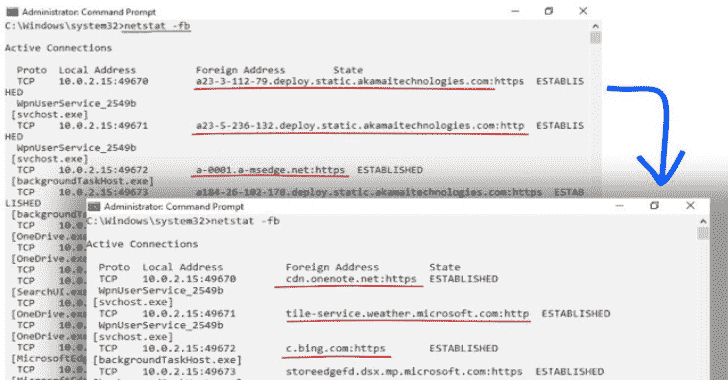

# PR-DNSd:被动递归 DNS 守护进程

> 原文：<https://kalilinuxtutorials.com/pr-dnsd/>

PR-DNSd 是一个被动递归 DNS 守护进程。

## 快速启动

**去找 github.com/korc/PR-DNSd
sudo setcap cap cap _ net _ bind _ service，cap _ sys _ ch root = EP go/bin/PR-DNSd
go/bin/PR-DNSd-上游 9.9.9.9:53-listen 127 . 0 . 0 . 1:53
echo name server 127 . 0 . 0 . 1 | sudo tee/etc/resolv . conf
dig google.com
dig-x $(dig+short google.com)**

## 用例

*   运行本地主机 DNS 服务，修复您的**`netstat`/`tcpview`/`lsof`/**等。输出
*   作为企业内部 DNS 服务器，还能够进行有意义的 EDR/红外和日志分析
*   作为云服务，还从非企业(家庭、BYOD 等)收集被动 DNS 数据。)设备
    *   *提示:您可能想要配置 DDoS 保护选项*
*   在云中作为 DNS-over-TLS 服务器，为支持设备额外提供私有 DNS(例如:Android 9 的私有 DNS 设置)
    *   例如:基于域模式的移动设备防火墙/代理配置

### 作为 Android9 的私有 DNS 设置的私有服务器运行

在适当的`**setcap**`之后，运行:

**PR-DNSd-TLS listen:853-cert YOUR _ SERVER _ CRT _ KEY _ PEM-上游 1.1.1.1:53-store PR-DNSd**

## 选择

–**cert string
TCP-TLS 侦听器证书(TLS 侦听器需要)
-ch root string
ch root to directory after start(默认)/var/tmp】
-Count int
在应用去抖动延迟之前允许的回复计数(默认为 100)
-ctmout string
客户端上行查询超时
-去抖动 string
UDP 回复单个 IP 以防止 DoS 所需的持续时间(默认为“200 毫秒”)【t 10
-监听字符串
监听地址(默认值):53】
-静默
不上报正常数据
-存储字符串
将 PTR 数据存储到指定文件
-TLS 监听字符串
TCP-TLS 监听地址(默认值):853】
-上游字符串
上游 DNS 服务器(tcp-tls://前缀为点)(默认值“1 . 1 . 1 . 1:53”)
(带)**

[**Download**](https://github.com/korc/PR-DNSd)