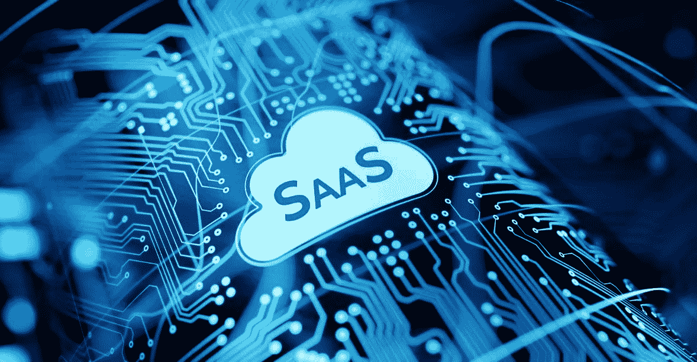

# SaaS 安全:实现一个干净的 IAM 系统审计

> 原文：<https://kalilinuxtutorials.com/saas-security-achieving-a-clean-iam-system-audit/>

身份和访问管理(IAM)是一套法规，它使监督电子或数字身份变得更加容易。它本质上是 SaaS 和 IaaS 环境的云身份治理的基础

为了确保这些在线身份得到有效管理，现代自动化云身份治理解决方案作为[云基础架构授权管理](https://ermetic.com/solution/cloud-infrastructure-entitlements-management/)解决方案的一部分而存在。

这些解决方案实时监控 IAM 身份，并向组织报告其存在以及权限和访问指标。风险会在中央控制面板上突出显示并报告给组织，使组织的安全专家能够全面了解其 IAM 身份的健康和安全状况。

SaaS 环境的可审核性在很大程度上依赖于与组织的 SaaS 环境相关的政策和程序的制定和严格执行。我们已经编制了一个通用的最佳实践简明列表，可以遵循，以提高一个组织的能力，实现一个干净的 SaaS IAM 审计。

## ***制定全面的安全政策***

对于复杂的 SaaS 实施，必须在批准的政策中正确定义所有角色。组织将从定义需要参与组织的 SaaS 环境的每种类型的员工和服务的角色中受益。

程序和政策文件中应明确列出员工及其角色和职责。它还应规定利用 IAM 执行预定义 SaaS 任务的预计时间范围。最后，政策必须量化网络威胁，同时也要找到相关的依赖性和任何补救流程。

## ***实时账户监管***

员工流动是任何组织不可避免的一个方面。这种员工流动在 [IAM 用户权限](https://aws.amazon.com/iam/features/manage-permissions/)方面造成了问题。如果不及时解决这一问题，更新 IAM 上的角色和权限将会成为问题。

实时监控用户访问是保证员工拥有适当权限的一种极佳方式。这些审计的目标是决定谁仍然需要访问 SaaS 服务，哪些帐户需要被截断。

## ***应用最小特权范式***

这看起来很清楚，但是只给用户他们需要的权利是 IAM 的核心。最小特权概念是 IAM 的特征，因为云环境是作为“拒绝所有”环境启动的。应该授予用户对特定资源的显式访问权限。应该不惜一切代价避免让用户访问所有内容的诱惑，这意味着应该只允许用户执行他们的任务。

当用户被授予不被删除的临时特殊权限时，就会出现问题。因此，网络上的多个个人可能拥有利益相关者不知道的独特权限，从而扩大了整个 SaaS 攻击面。

## ***行政隔离***

组织有时可能需要更多 IAM 帐户。这些帐户通常由添加到云环境中的新成员或服务使用。当涉及到[权限和角色](https://en.wikipedia.org/wiki/Identity_management)时，这些帐户永远不应该被授予任何不必要的管理权限。应该始终使用强密码来保护这些新帐户，直到它们被预期的员工或服务使用。管理隔离应该成为所有 SaaS 在线身份的标准。

## ***通用且未使用的账户***

最佳做法是通过删除不再使用的旧用户帐户来保持 IAM 系统的整洁。这些非活动帐户、访客帐户或模板帐户给组织带来了巨大的网络安全风险。威胁参与者可能会损害这些非活动帐户中的一个，并使用它来访问 SaaS 平台。

## ***文件和政策维护***

如果没有政策提供的简明指导，云身份治理，尤其是在较大的 IaaS 和 SaaS 生态系统中，将会是静态的，并且可能会过时。云身份治理的一个重要部分是随着治理策略所治理的云环境的发展而更新和发展治理策略。治理政策应始终针对 SaaS 环境的现状。

## ***总之***

虽然 IAM 身份可能有许多影响整体安全风险的因素，但遵循本文中提到的步骤将极大地帮助组织，不仅减少其受攻击面，而且满足法规遵从性标准。此外，拥有业内值得信赖的监控合作伙伴将使组织能够实时有效地管理其 IAM 足迹，进而管理其 SaaS 攻击面。