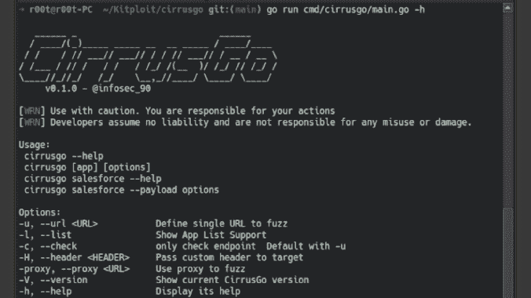

# Cirrusgo:一个扫描 SAAS 的快速工具，用 go 写的 PAAS App

> 原文：<https://kalilinuxtutorials.com/cirrusgo/>

.png)

**Cirrusgo** 是一款快速扫描 SAAS 的工具，用 go 编写的 PAAS App

SAAS 应用支持:

*   销售力量
*   内容丰富(下一版本)

**注意 flag -o 输出不工作**

**安装:**golang 1.18 版本

去安装-v github.com/Ph33rr/cirrusgo/cmd/cirrusgo@latest
或
去安装-v github.com/Ph33rr/CirrusGo/cmd/cirrusgo@latest

**帮助**

**环形-帮助**

***_ _
//(*)**_**/_*///*////*//////*////_*\
////*/////*//(_【T17)///*////*//
_ _ _ _。 *///_*/_ _ _ _/V 0 . 0 . 1
cirrusgo–help
-u，–url 定义单个 URL 到 fuzz
-l，–List Show App List
-c，–check only check endpoint
-V，–version Show current version
-h，–help 显示其帮助
[cirrusgo [app] [options] ..]
cirrusgo sales force–help
-u，–URL 定义单个 URL
-c，–check only 检查端点
-lobj，–list obj 拉对象列表。
-gobj–get obj 拉对象。
-obj–objects 设置对象名称。默认值是“用户”对象。
Juicy Objects: Case，Account，User，Contact，Document，Cont
entDocument，ContentVersion，ContentBody，CaseComment，Not
e，Employee，Attachment，EmailMessage，caseexternal Document
t，Attachment，Lead，Name，EmailTemplate，email message relation
-GRE–get Record 拉记录 id。
-re-recordid 设置记录 id 以转储记录
-CW-chk Writable 检查所有可写对象
-f，–完全转储对象的所有页面。
–dump
-H，–header 将自定义头传递给目标
-proxy，–proxy 使用代理来模糊
-o，–输出文件以保存结果
【flags payload】
【command:cirrusgo sales force–payload options】
-payload， –有效负载生成器测试手册的有效负载默认“object list”
GetItems-obj set object
-page set page
-pageSize
get record-re set recorder id
writable obj-obj set object
search obj-obj set object
-page set page
-pageSize
aura context-fwuid set UID
-App set AppName
-markup set markup***

**例子**

**cirrusgo sales force-u https://loclhost-gobj**

**转储**

**cirrusgo sales force-u https://localhost/-f**

**检查可写对象**

**cirusgo sales force-u https://localhost/-CW**

[**Download**](https://github.com/Ph33rr/cirrusgo)