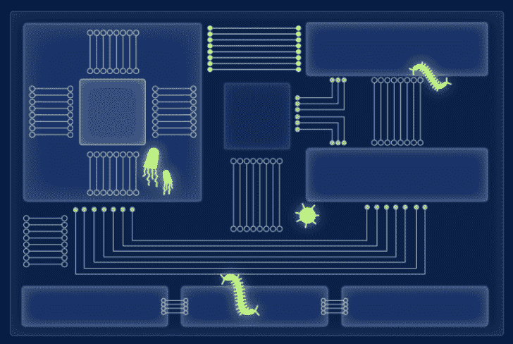

# Pict:感染后收集工具包

> 原文：<https://kalilinuxtutorials.com/pict/>

.png)

**Pict** ，这组脚本旨在从被认为受感染的端点收集各种数据，以促进事件响应流程。这些数据不应被视为完整的法医数据收集，但确实捕捉到了大量*有用的法医信息。*

如果您想要真正的取证数据，您应该真正捕获一个完整的内存转储，并对整个驱动器进行映像。这不在这个工具包的范围之内。

## 如何使用

该脚本必须在实时系统上运行，而不是在映像或其他取证数据存储上运行。严格来说,*并不要求* root 权限才能运行，但是如果没有 root 权限，它将无法收集很多预期的数据。

数据将以两种形式收集。第一种是摘要文件的形式，包含 shell 命令的输出、从数据库提取的数据等等。例如，`**browser**`模块将输出一个`**browser_extensions.txt**`文件，其中包含为 Safari、Chrome 和 Firefox 安装的所有浏览器扩展的摘要。

第二个是从文件系统收集的完整文件。这些文件存储在收藏文件夹内的`artifacts`子文件夹中。

### 语法

该脚本运行起来非常简单。以 JSON 格式传入配置脚本只需要一个必需的参数:

`**./pict.py -c /path/to/config.json**`

配置脚本描述脚本将收集什么，以及如何收集。它应该是这样的:

**{
" collection _ dest ":" ~/Desktop/"，
"all_users" : true，
" collectors ":{
" BrowserExtCollector "，
" persist ":" persistence collector "，
" SuspiciousBehaviorCollector "，
" browser hist ":" BrowserHistoryCollector "，
" bash _ config ":" BashConfigCollector "，
"bash_hist ":"**

#### 收藏 _ 目的地

这指定了存储收集的数据的路径。它可以是绝对路径，也可以是相对于用户个人文件夹的路径(以波浪号开头)。如果没有指定，默认路径是`**/Users/Shared**`。

数据将被收集到在此位置创建的文件夹中。该文件夹将具有形式为`**PICT-computername-YYYY-MM-DD**`的名称，其中计算机名称是在*系统偏好设置* > *共享*中指定的机器名称，日期是收集日期。

#### 所有 _ 用户

如果为 true，则尽可能从机器上的所有用户收集数据。如果为 false，则仅收集运行脚本的用户的数据。如果未指定，该值默认为 true。

#### 收藏家

PICT 是模块化的，可以很容易地扩展或缩小范围，只需改变所使用的收集器模块。

`**collectors**`数据是一个字典，其中的键是要加载的模块的名称(不带`**.py**`扩展名的 Python 文件的名称)，值是在该模块中找到的 Collector 子类的名称。您可以为自定义模块添加额外的条目(请参见编写您自己的模块)，或者可以删除条目以阻止这些模块运行。删除模块的一个简单方法是将它们移动到名为`**unused**`的顶级字典中，如果以后想再次添加它们，不必查找确切的名称。

#### 设置

本词典提供全局设置。

`**keepLSData**`指定是否应该保留`**lsregister.txt**`文件——该文件可能非常大。(这个文件是自动生成的，用于构建其他一些模块的输出。它包含大量有用的信息，但大小可能超过 100 MB。如果你不需要所有的数据，或者不想处理那么多的数据，将这个设置为 false，当收集完成时它将被删除。)

`**zipIt**`指定是否自动生成包含收藏文件夹内容的 zip 文件。注意，压缩和解压缩数据的过程会改变一些属性，比如文件所有权。

#### 模块设置

该字典指定特定于模块的设置。并非所有模块都有自己的设置，但是如果模块允许自己的设置，您可以在这里提供。在上面的例子中，您可以看到一个名为`**collectArtifacts**`的布尔设置被用于`**browser**`模块。

还有由收集器类维护的全局模块设置，可以为每个模块单独设置。

`**collectArtifacts**`指定是否收集通常由模块收集的文件工件。如果为 false，将忽略该模块的所有工件。在存储空间是一个考虑因素，并且所收集的工件很大的情况下，或者在所收集的工件对于正在分析其系统的用户来说可能代表隐私问题的情况下，这可能是需要的。

## 编写自己的模块

模块必须由一个包含从 Collector(在`**collectors/collector.py**`中定义)子类化的类的文件组成，并且它们必须放在`**collectors**`文件夹中。通过复制`**collectors/template.py**`文件并为自己定制，可以很容易地创建一个新的收集器模块。

### `def __init__(self, collectionPath, allUsers)`

如有必要，可以重写此方法，但超级收集器。在这种情况下，必须调用 init()**，最好是在您的自定义代码执行之前。这使对象有机会在您的代码尝试使用它们之前设置其属性。**

 **### `def printStartInfo(self)`

这是一个非常简单的方法，将在该模块的收集开始时调用。它的目的是将一条消息打印到 stdout，通过提供关于正在发生的事情的反馈，给用户一种进度感。

### `def applySettings(self, settingsDict)`

这使模块有机会应用任何自定义设置。每个模块都可以有自己的自定义设置，但是 settingsDict 也应该传递给 super，以便集合类可以处理它定义的任何设置。

### `def collect(self)`

这个方法是模块的核心。当模块开始收集时，调用这个函数。它可以写尽可能多的文件，但是应该将这个活动限制在路径`**self.collectionPath**`中的文件，并且应该使用其他模块没有使用的文件名。

如果你希望收集艺术品，不要试图自己去做。只需将路径添加到`**self.pathsToCollect**`数组，收集器类会将这些路径复制到`**artifacts**`文件夹中适当的子路径，并维护工件上的元数据(权限、扩展属性、标志等)。

当该方法完成时，一定要调用 super ( `**Collector.collect(self)**`)来给 Collector 类处理其职责的机会，比如收集工件。

您的`**collect**`方法可以使用在`**self.collectionPath**`找到的`**basic_info.txt**`或`**lsregister.txt**`文件中收集的任何数据。这些是在开始时由`**pict.py**`脚本收集的，并且可以被认为可供任何其他模块使用。但是，您不应该依赖任何其他模块的输出，因为不能保证这些文件在您的模块运行时可用。模块可能不会按照它们在配置 JSON 中出现的顺序运行，因为 Python 字典是无序的。

[**Download**](https://github.com/thomasareed/pict)**