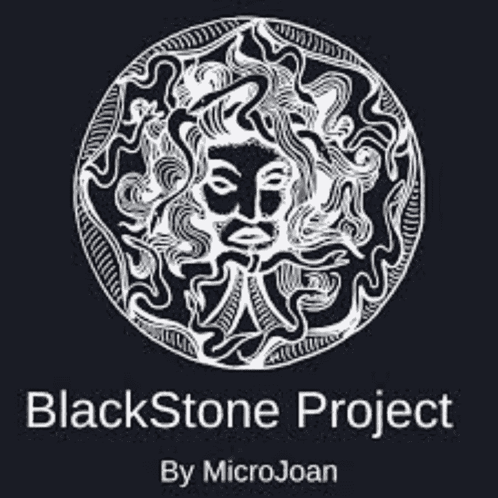
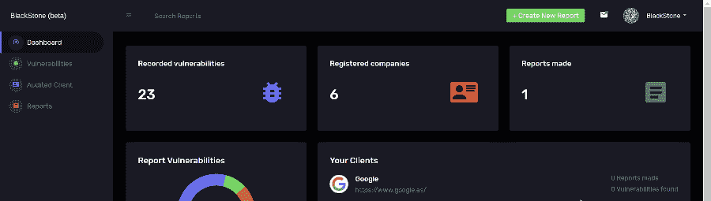
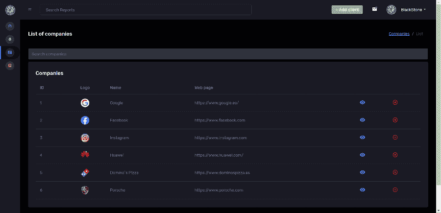

# 黑石:测试报告工具

> 原文：<https://kalilinuxtutorials.com/blackstone/>

.png)

**黑石**项目或“黑石项目”是一种工具，用于自动起草和提交道德黑客或 pentesting 审计报告。

在这个工具中，我们可以在数据库中注册我们在审计中发现的漏洞，按照内部、外部审计或 wifi 对它们进行分类，此外，我们可以提供您的描述和建议，以及严重性级别和纠正工作。这些信息将帮助我们在报告中生成一个重要程度表，作为发现的漏洞的全局摘要。

我们还可以注册一家公司，只需添加其网页，该工具就能够找到子域名、电话号码、社交网络、员工电子邮件…

# Docker 安装

**安装对接器**

**/bin/bash-c " $(curl-fsSL https://get . docker . com)"
system CTL enable docker
system CTL start docker**

**安装坞站-复合**

sudo curl-l " https://github . com/docker/compose/releases/download/1 . 29 . 2/docker-compose-(uname-s)-(uname-m)─o/usr/local/bin/docker-compose
chmod+x/usr/local/bin/docker-compose

## 安装黑石

**git 克隆 https://github.com/micro-joan/BlackStone
CD 黑石
docker-compose up -d**

# 手动安装

*   首先，我们必须下载一个 Apache 服务器来托管该工具，在我的例子中，我使用 Mamp(我建议遵循以下步骤):https://www.mamp.info/en/downloads/
*   我们将下载这个库的内容，我们将有 2 个文件夹(黑石和 BBDD)
*   一旦服务器启动，我们将转到 c://MAMP/htdocs 并粘贴所有下载文件夹“黑石”的内容
*   为了让应用程序工作，我们必须导入数据库，我们将进入浏览器并编写“localhost/phpMyAdmin/”，在 BlackStone/conexion.php 文件夹中有数据库连接文件
*   我们将创建一个名为 blackstone 的数据库，并从下载的 BBDD 文件夹中导入数据
*   使用用户名和密码“BlackStone”登录 blackstone

# 使用

首先，您需要转到个人资料设置并添加 Hunter.io 和 haveibeenpwned.com 令牌:

在数据库中出现漏洞后，我们将转到被审核的客户端，我们将注册一个客户端及其网页，注册后，我们可以转到客户详细信息，我们可以看到以下信息:

此应用程序的使用是为专业使用，作者是不负责的误用雇用

*   企业所有者姓名
*   公司所有者的社交网络
*   公司所有者的电子邮件和电话号码
*   公司所有者的 deep web 上暴露的密码检查
*   网站的子域名以及在谷歌中找到的感兴趣的信息
*   公司员工的电子邮件

一旦我们在数据库中注册了要审计的公司，我们将创建一个报告，添加日期、报告名称和要审计的公司。当我们注册报告时，我们将对其进行编辑，然后选择我们希望在报告中出现的漏洞:

最后，我们将通过单击“overview report”按钮来生成报告，稍后我们将把生成的页面保存为。mht”，然后我们将使用 Word 打开它，以便能够处理生成的报告:

[**Download**](https://github.com/micro-joan/BlackStone)