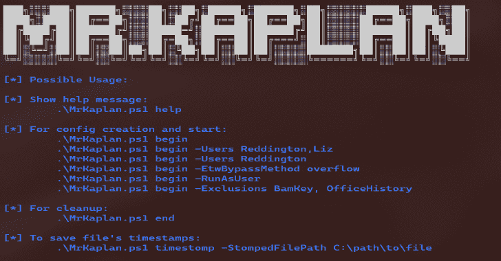
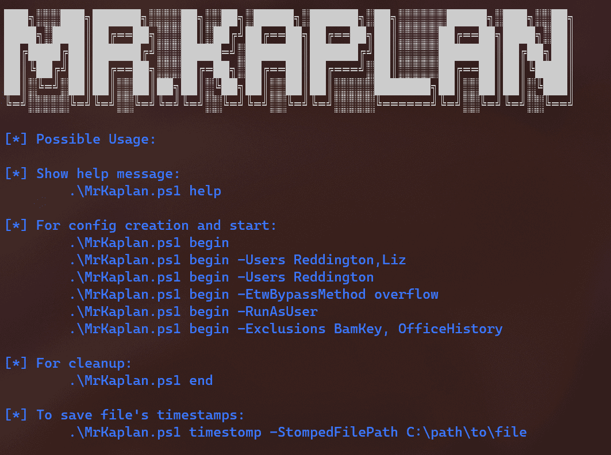

# MrKaplan:该工具旨在通过清除处决证据来帮助红队队员隐藏起来

> 原文：<https://kalilinuxtutorials.com/mrkaplan/>

.png)

MrKaplan 是一个工具，旨在通过清除执行证据来帮助红队队员保持隐蔽。它的工作原理是保存诸如运行时间、文件快照等信息，并将每个证据与相关用户相关联。

这个工具的灵感来自 MoonWalk，一个用于 Unix 机器的类似工具。

你可以在维基页面上了解更多。

## 特性

*   停止事件记录。
*   清除文件工件。
*   清除注册表项目。
*   可以为多个用户运行。
*   可以以用户和管理员身份运行(强烈建议以管理员身份运行)。
*   可以保存文件的时间戳。
*   可以排除某些操作，把工件留给蓝队。

## 用法

*   在计算机上开始操作之前，用 begin 标志运行 MrKaplan，每当完成操作时，用 end 标志再次运行 MrKaplan。
*   ***不要删除 MrKaplan 的注册表项*** ，否则 MrKaplan 将无法使用这些信息。

## IOCs

*   Powershell 处理对 wiki 页面中提到工件的访问。
*   Powershell 正在导入奇怪的 base64 blob。
*   执行令牌操作的 Powershell 进程。
*   MrKaplan 的注册表项:HKCU:\Software\MrKaplan。

[**Download**](https://github.com/Idov31/MrKaplan)