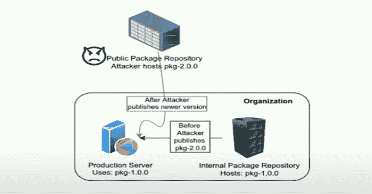

# Packj:大规模安全分析平台，用于检测恶意/有风险的开源软件包

> 原文：<https://kalilinuxtutorials.com/packj/>

***Packj*** (发音为 package)是一个命令行(CLI)工具，用于检查开源软件包的“危险”属性，这些属性使它们容易受到供应链攻击。这是我们大规模安全分析平台 Packj.dev 背后的工具，该平台持续审查软件包并提供免费报告。

# 如何使用

Packj 接受两个输入参数:

*   注册表或包管理器、pypi、npm 或 rubygems 的名称。
*   要检查的包的名称

Packj 支持审查 PyPI、NPM 和 RubyGems 包。它执行静态代码分析，并检查几个元数据属性，如发布时间戳、作者电子邮件、下载量、依赖性。电子邮件域名过期、发布时间差大、敏感 API 等的包。出于安全原因被标记为有风险。

Packj 还分析公共回购代码以及元数据(如星号、叉号)。通过比较回购描述和包标题，您可以确定该包是否确实是从回购创建的，以减轻任何`**starjacking**`攻击。

## 集装箱化

使用 Packj 的最佳方式是在 Docker(或 Podman)容器中运行它。你可以从 DockerHub 下载我们最新的图片来开始。

`**docker pull ossillate/packj:latest**`

**$ docker run–mount type = bind，source=/tmp，target =/tmp ossi late/packj:最新的 npm browserify
[+]从 npm 获取“browser ify”…OK [ver 17 . 0 . 0]
[+]检查版本…ALERT [598 天]
[+]检查发布历史…OK [484 版本]
[+]检查发布时间间隔…OK[自上次发布以来 68 天]
[+] 正在检查 repo _ URL URL…OK [https://github.com/browserify/browserify]
[+]正在检查回购数据…OK [stars: 14077，forks: 1236]
[+]正在检查回购活动…OK[提交:2290，贡献者:207，标签:413]
[+]正在检查 CVEs…OK[未找到]
[+]正在检查依赖项…ALERT [找到 48]
[+]正在下载包' browser ify '(17.0 版。 js)，744 funcs，LoC: 9.7K]
[+]发现 5 个风险，软件包不合要求！
= >完整报告:/tmp/NPM-browser ify-17 . 0 . 0 . JSON
{
"不合需要":【
"旧包:598 天之久】，
"无效或无作者电子邮件:过期的作者电子邮件域"，
"运行时生成新代码"，
"读取文件和目录"，
"分叉或退出 OS 进程"，
]
}**

要检查的特定包版本可以使用`**==**`指定。请参考下面的例子

**$ docker run–mount type = bind，source=/tmp，target =/tmp ossi late/packj:最新的 pypi 请求==2.18.4
[+]从 pypi 获取“请求”…OK [ver 2.18.4]
[+]检查版本…ALERT [1750 天之前]
[+]检查发布历史…OK [142 个版本]【T4[+]检查发布时间差…OK [自上次发布后 14 天]】 正在检查 repo _ URL URL…OK [https://github.com/psf/requests]
[+]正在检查回购数据…OK [stars: 47547，forks: 8758]
[+]正在检查回购活动…OK[提交:6112，贡献者:725，标签:144]
[+]正在检查 CVEs…ALERT [2 found]
[+]正在检查依赖项…OK [9 direct]
[+]正在从 py)，578 funcs，LoC: 13.9K]
[+]发现 6 个风险，软件包不受欢迎，易受攻击！
{
【不合需要】:【
【旧包:1744 天】，
【无效或没有主页:不安全的网页】，
【运行时生成新代码】，
【通过网络获取数据】，
【读取文件和目录】，
，
【易受攻击】:
“包含 CVE-2018-18074，CVE-2018-18074”**

## 非集装箱化的

或者，您可以在本地安装 Python/Ruby 依赖项并进行测试。

**注**

*   Packj 只在 Linux 上测试过。
*   需要 Python3 和 Ruby。如果与 Python2 一起使用，API 分析将会失败。
*   在使用该工具之前，您必须安装 Python 和 Ruby 依赖项:
    *   `**pip install -r requirements.txt**`
    *   `**gem install google-protobuf:3.21.2 rubocop:1.31.1**`

**$ python 3 main . py npm eslint
[+]从 NPM 获取‘eslint’…OK [ver 8 . 16 . 0]
[+]检查版本…OK [10 天之久]
[+]检查发布历史…OK [305 版本]
[+]检查发布时间差…OK[自上次发布后 15 天]
[+]检查作者…OK [nicholas+npm@nczconsulting.com]
[+]检查电子邮件/域有效性…OK [nicholas+npm@nczconsulting.com]
[+] 正在检查回购数据…OK [stars: 20669，forks: 3689]
[+]正在检查回购活动…OK [commits: 8447，contributors: 1013，tags: 302]
[+]正在检查 CVEs…OK [none found]
[+]正在检查依赖项…ALERT [35 found]
[+]正在从 npm 下载包“eslint”(8 . 16 . 0 版)…OK[490.14 KB]【T15 js)，1022 funcs，LoC: 76.3K]
[+]发现 2 个风险，包不合要求！
{
"不合需要":[
"运行时生成新代码"，
"读取文件和目录:[' package/lib/CLI-engine/load-rules . js:37 '，' package/lib/CLI-engine/file-enumerator . js:142 ']"
]
}
=>完整报告:/tmp/NPM-eslint-8 . 16 . 0 . JSON**

# 它是如何工作的

*   它首先使用 API 从注册表中下载元数据，并分析“有风险”的属性。
*   为了执行 API 分析，使用 API 将包从注册表下载到一个临时目录中。然后，packj 执行静态代码分析来检测 API 的使用情况。API 分析基于 MalOSS，这是我们在乔治亚理工学院的团队的一个研究项目。
*   通过从 OSV 的 OSV 数据库提取信息来检查漏洞
*   Python PyPI 和 NPM 包下载是从 pypistats 和 npmjs 中获取的
*   汇总并报告所有检测到的风险

# 风险属性

Packj 的设计是由我们对 651 个记录在案的开源软件供应链攻击的恶意软件样本的研究指导的。具体来说，我们已经根据经验确定了许多有风险的代码和元数据属性，这些属性使包容易受到供应链攻击。

例如，我们标记不再接收安全修复的非活动或未维护的包。受 Android 应用运行时权限的启发，Packj 使用基于权限的安全模型为开发人员提供控制和代码透明性。调用敏感操作系统功能(如文件访问和远程网络通信)的软件包被标记为有风险，因为此功能可能会泄漏敏感数据。

我们审查的一些属性包括

| 属性 | 类型 | 描述 | 理由 |
| --- | --- | --- | --- |
| 发布日期 | [计]元数据 | 版本发布日期，用于标记旧的或放弃的包 | 旧的或未维护的软件包不会收到安全修补程序 |
| 操作系统或语言 API | 密码 | 敏感 API 的使用，如`**exec**`和`**eval**` | 恶意软件使用来自操作系统或语言运行时的 API 来执行敏感操作(例如，读取 SSH 密钥) |
| 贡献者的电子邮件 | [计]元数据 | 贡献者的电子邮件地址 | 电子邮件地址不正确或无效表明缺少 2FA |
| 源回购 | [计]元数据 | 公共资源回购的存在和有效性 | 缺少公共回购意味着没有公开审计或审查源代码的简单方法 |

我们跟踪的属性的完整列表可在 threats.csv 查看

其他一些研究人员也认为这些属性是有风险的[1，2，3]。

# 如何定制

开发 Packj 的目的是帮助开发人员识别和审查包装中的潜在供应链风险。

但是，由于不可信软件包的安全风险程度取决于特定的安全要求，因此可以根据您的威胁模型定制 Packj。例如，没有 2FA 的包可能会给一些开发人员带来更大的安全风险，相比之下，其他人可能更愿意使用这样的包来实现所提供的功能。考虑到问题的不确定性，提供定制的粒度风险度量是我们的目标之一。

只需在 threats.csv 中注释掉不需要的属性，就可以对 Packj 进行定制，以最大限度地减少噪音并减少警报疲劳

# 发现恶意软件

我们使用这个工具在 PyPI 上发现了超过 40 个恶意软件包。很多都被拿下了。参考下面的例子:

**$ python 3 main . py pypi Kris Qian
[+]从 pypi 获取“Kris Qian”…OK [ver 0 . 0 . 7]
[+]检查版本…OK [256 天]
[+]检查发布历史…OK [7 个版本]
[+]检查发布时间差…OK[距上次发布 1 天]
[+]检查作者…OK [KrisWuQian@baidu.com】【T6[+]检查电子邮件/域名有效性…OK [KrisWuQian@baidu.com]
[+]检查自述文件 正在检查 CVEs…OK [未找到]
[+]正在检查依赖项…OK[未找到]
[+]正在从 pypi 下载包“Kris Qian”(0 . 0 . 7 版)…OK [1.94 KB]
[+]正在分析代码…ALERT[需要 3 个 perms:进程、网络、文件]
[+]正在检查文件/函数…OK [9 个文件(2。 py)，6 funcs，LoC: 184]
[+]发现 6 个风险，包不合要求！
{
“不合需要的”:[
“没有自述文件”，
“每周仅下载 45 次”，
，“找不到源回购”，
“在运行时生成新代码”，
“通过网络获取数据:['KrisQian-0.0.7/setup.py:40 '，' KrisQian-0.0.7/setup.py:50']”，
“读取文件和目录:['KrisQian-0.0 .**

Packj 将 KrisQian (v0.0.7)标记为可疑，因为在软件包安装期间(在 setup.py 中)缺少源代码报告和使用敏感 API(网络、代码生成)。我们决定深入调查，发现这个包是恶意的。请在 https://packj.dev/malware/krisqian.找到我们的详细分析

我们发现的更多恶意软件的例子在 https://packj.dev/malware 列出，请联系我们在 oss@ossillate.com 的完整列表。

# 资源

要了解有关 Packj 工具或开源软件供应链攻击的更多信息，请参考我们的

*   py conus 22 演讲和幻灯片。
*   黑帽亚洲 22 阿森纳展示
*   packaging con’21 演讲和幻灯片
*   关于开源软件安全性的学术论文，以及我们佐治亚理工学院小组开始这项研究的论文。

### 即将到来的会谈

*   black hat USA 22 Arsenal talk 使用 Packj 检测域名抢注、后门、废弃和其他“危险”开源包
*   开放源码峰会，欧洲 22 个谈话评分依赖检测“薄弱环节”在您的开放源码软件供应链

# 功能路线图

*   添加对其他语言生态系统的支持。Rust 正在开发中，将于 7 月 22 日(上周)上市。
*   添加检测其他几个“危险”代码以及元数据属性的功能。
*   Packj 目前只执行静态代码分析，我们正在努力增加对动态分析的支持(WIP，ETA:夏末)

[**Download**](https://github.com/ossillate-inc/packj)