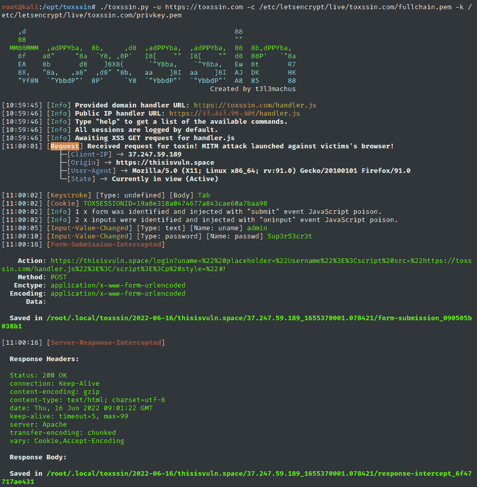

# Toxssin:一个 XSS 开发命令行界面和有效负载生成器

> 原文：<https://kalilinuxtutorials.com/toxssin/>

.png)

Toxssin 是一款开源渗透测试工具，可以自动处理利用跨站点脚本(XSS)漏洞的过程。它包含一个 https 服务器，作为驱动该工具(toxin.js)的恶意 JavaScript 有效负载生成的流量的解释器。

该项目最初是(现在仍然是)一项基于研究的创造性工作，旨在探索 XSS 漏洞可能通过使用普通 JavaScript、可信证书和廉价技巧引入的可利用深度。

## 截屏

## 能力

默认情况下，toxssin 会拦截:

*   cookies(如果 HttpOnly 不存在)，
*   击键，
*   粘贴事件，
*   输入变化事件，
*   文件选择，
*   表格提交，
*   服务器响应，
*   表格数据(静态以及更新)，

最重要的是，toxssin:

*   试图在用户浏览网站时通过拦截 http 请求和响应并重写文档来维护 XSS 持久性，
*   支持会话管理，这意味着您可以使用它来利用反射的和存储的 XSS，
*   支持针对会话的定制 JS 脚本执行，
*   自动记录每个会话。

## 安装&用途

git 克隆 https://github.com/t3l3machus/toxssin
CD。/tox ssin
pip 3 install-r requirements . txt

要启动 to xsin . py，您需要提供 ssl 证书和私钥文件。

如果您不拥有具有可信证书的域，您可以使用以下命令发布和使用自签名证书(尽管这不会占用您太多时间):

**OpenSSL req-x509-new key RSA:2048-keyut key . PEM-out cert . PEM-days 365**

强烈建议使用可信证书运行 toxssin(参见本文档中的如何获取有效证书)。也就是说，您可以像这样启动 toxssin 服务器:

**python 3 toxs in . py-u https://your.domain.com-c/your/certificate . PEM-k/your/privkey . PEM**

请访问该项目的 wiki 获取更多信息。

## XSS 剥削的障碍

根据我的经验，当涉及到试图包含外部 JS 脚本的跨站点脚本攻击时，有 4 个主要障碍:

1.  “混合内容”错误，可以通过 https(即使使用自签名证书)提供 JavaScript 有效负载来解决。
2.  “NET::ERR _ CERT _ AUTHORITY _ INVALID”错误，表示服务器的证书不受信任/已过期，可以通过使用可信机构颁发的证书来绕过它。
3.  跨源资源共享(CORS)，由 toxssin 服务器适当处理。
4.  将`**script-src**`设置为特定域的`**Content-Security-Policy**`头只会阻止加载带有跨域 src 的脚本。Toxssin 依赖于`**eval()**`函数来传递它的毒药，因此，如果网站有一个 CSP，而`**script-src**`指令中没有指定`**unsafe-eval**`源表达式，攻击很可能会失败(我正在研究第二种毒药传递方法来解决这个问题)。

**注意**:当目标网站通过 http 托管，JavaScript 负载通过 https 托管时，当然会出现“混合内容”错误。这将 toxssin 的范围限制为仅 https webistes，因为(默认情况下)toxssin 仅使用 ssl 启动。

[**Download**](https://github.com/t3l3machus/toxssin)