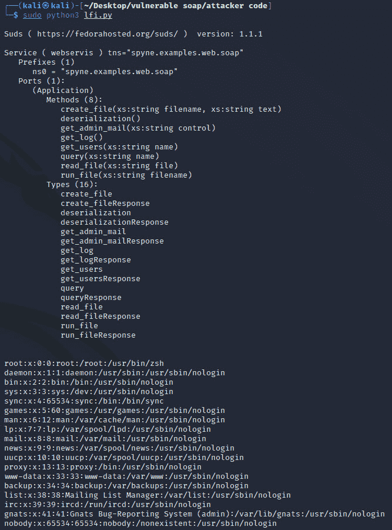
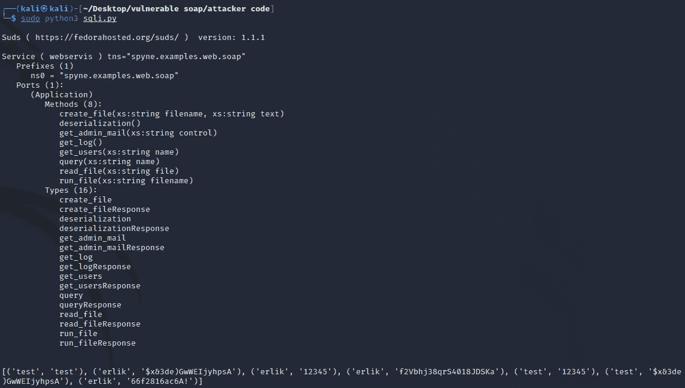

# Erlik:易受攻击的 Soap 服务

> 原文：<https://kalilinuxtutorials.com/erlik/>

Erlik 是一个易受攻击的 SOAP web 服务。这是一个为那些想在 web 渗透测试领域提高自己的人创建的实验室环境。

## 特性

它包含以下漏洞。

LFI

-SQL 注入

-信息披露

-命令输入

蛮力

-反序列化

## 安装

git 克隆 https://github.com/anil-yelken/Vulnerable-Soap-Service

cd 易受攻击-Soap-服务

sudo pip3 安装要求. txt

## 用法

sudo python3 vulnerable_soap.py

利用漏洞

### SQL 注入

代码:https://github . com/Anil-yelken/Vulnerable-Soap-Service/blob/main/sqli . py

[**Download**](https://github.com/anil-yelken/Vulnerable-Soap-Service)