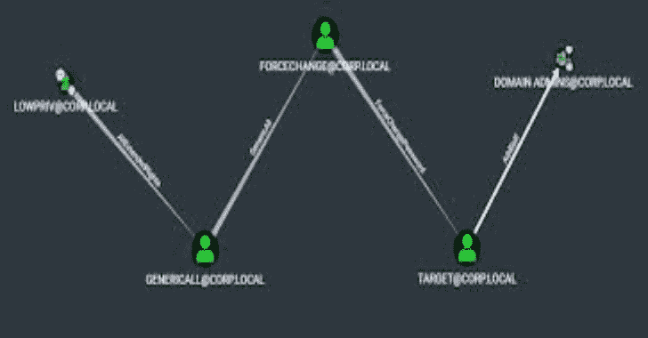
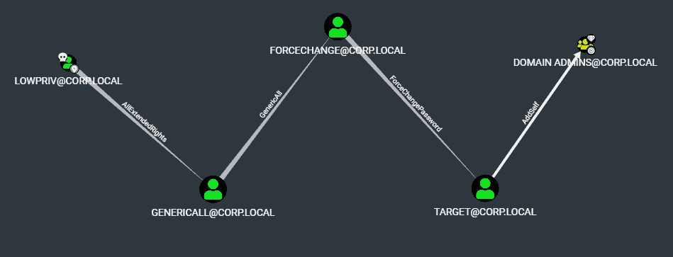

# Aced:解析和解析单个目标 Active Directory 主体的 DACL 的工具

> 原文：<https://kalilinuxtutorials.com/aced/>

**Aced** 是一个解析和解析单个目标活动目录主体的 DACL 的工具。Aced 将针对目标帐户识别感兴趣的允许入站访问的权限，解析入站权限的 sid，并将该数据呈现给操作员。此外，pyldapsearch 的日志记录功能已经与 Aced 集成，可以在本地记录目标主体的 LDAP 属性，然后 pyldapsearch 的配套工具 BOFHound 可以解析这些属性，将收集的数据输入 BloodHound。

# 用例？

我编写 Aced 只是因为我想要一种更有针对性的方法来查询 ACL。猎犬是神奇的，然而，它非常吵闹。Bloodhound 收集所有数据，而 Aced 只收集一项数据，让操作员能够更好地控制数据的收集方式和内容。海豹突击队有一句话:“慢就是平稳，平稳就是快”，这就是我尝试用 Aced 的方法。通过只查询 ldap 想要告诉您的内容，并且不执行被称为“昂贵的 LDAP 查询”的操作，减少了检测的情况。Aced 可以选择放弃 SMB 连接进行主机名解析。您可以选择 LDAPS 而不是 LDAP。通过与 BloodHound 的额外集成，收集的数据可以以熟悉的格式存储，并可以与团队共享。权限提升攻击路径可以通过从目标后退来构建。

## 使用

**└─#蟒 3 ace . py-h
_ | a . |
|/。\ | |一个^ |
|(。)| |/\ | | A | _
| | | \/| |()| | A_ |
|*_ _ _ V | |。| |(*' _)| |(V)|
| _ _ _ _ _ _ _ V | | | | \/|
| _ _ _ _ _ _ _ V ||。|
|____V|
v1.0
解析并记录目标主体的 DACL。
@garrfoster
用法:aced . py[-h][-ldaps][-DC-IP DC _ IP][-no-pass][-hashes lm hash:n hash][-AES 十六进制密钥] [-debug] [-no-smb] target
在 Active Directory 中枚举单个目标的 DACL 的工具
可选参数:
-h，–help 显示此帮助消息并退出
身份验证:
目标[[域/用户名[根据目标参数从 ccache 文件(KRB5CCNAME)中获取凭据。如果找不到有效的
凭证，它将使用命令行中指定的凭证
-不通过不询问密码(对-k 有用)
-哈希 LM hash:n hash
LM 和 NT 哈希，格式为 LM hash:n hash
-aes 十六进制密钥用于 Kerberos 身份验证的 AES 密钥(128 或 256 位)
-调试启用详细日志记录。
-否-smb 不通过 smb 解析 DC 主机名。需要带有-dc-ip 的 FQDN。**

# 演示

在下面的演示中，我们有 corp.local\lowpriv 帐户的凭据。通过在域管理员处开始枚举，通过从高值目标向后走来识别特权提升的潜在路径。

[**Download**](https://github.com/garrettfoster13/aced)