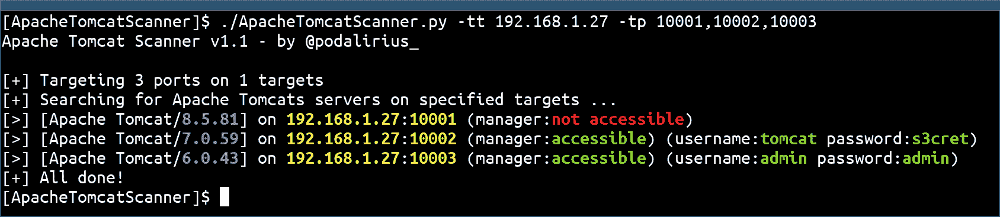

# ApacheTomcatScanner:用于扫描 Apache Tomcat 服务器漏洞的 Python 脚本

> 原文：<https://kalilinuxtutorials.com/apachetomcatscanner/>

.png)

**ApacheTomcatScanner** 是一个 python 脚本，用于扫描 Apache Tomcat 服务器漏洞。

## 特征

*   多线程工作者搜索 Apache tomcat 服务器。
*   可能有多个目标源:
    *   通过 LDAP 查询从 Windows 域中检索计算机列表，以将它们用作目标列表。
    *   从文件中逐行读取目标。
    *   从`**-tt/--target**`选项读取单个目标(IP/DNS/CIDR)。
*   要测试的自定义端口列表。
*   测试`/**manager/html**`访问和默认凭证。
*   用`**--list-cves**`选项列出每个版本的 CVE

## 安装

您现在可以使用以下命令从 pypi(最新版本是)安装它:

**sudo python3 -m pip 安装 apachetomcatscanner**

## 使用

**$。/apachetomcatscanner . py-h
Apache Tomcat Scanner v 2 . 3 . 2–by @ podalirius _
用法:apachetomcatscanner . py[-h][-v][–debug][-C][-T THREADS][-s][–only-http][–only-https][–no-check-certificate][–XLSX XLSX][–JSON JSON][-PI PROXY _ IP][-PP PROXY _ PORT][-rt REQUEST _ time out
可选参数:
-h，–help 显示此帮助消息并退出
-v，–Verbose 模式。(默认值:False)
–Debug 调试模式，用于巨大的冗长。(默认值:False)
-C，–List-cves 列出影响找到的每个版本的 cves。(默认值:False)
-T THREADS，–THREADS THREADS
线程数(默认值:5)
-s，–servers——仅当查询 ActiveDirectory 时，仅获取服务器而非所有计算机对象。(默认值:False)
–only-仅使用 http 方案进行 HTTP 扫描。(默认值:False，同时使用 HTTP 和 https 扫描)
–only-仅使用 HTTPs 方案进行 HTTPs 扫描。(默认值:False，同时使用 HTTP 和 HTTPs 扫描)
–不检查证书
不检查证书。(默认:False)
–XLSX XLSX 导出结果到 XLSX
–JSON JSON 导出结果到 JSON
-PI PROXY_IP，–PROXY-IP PROXY _ IP
代理 IP。
-PP 代理端口，–代理端口代理端口
代理端口
-rt 请求超时，–请求超时请求超时
-tf 目标文件，–目标文件目标文件
包含逐行目标列表的文件路径。
-tt 目标，–目标目标
目标 IP，FQDN 或 CIDR
-tp 目标端口，–目标端口目标端口
目标端口扫描顶部搜索 Apache Tomcat 服务器。
-ad 验证域，–验证域验证域
要验证的 Windows 域。
-ai 认证 _DC_IP，–认证-dc-ip 认证 _DC_IP
域控制器的 IP。
-au 验证用户，–验证用户验证用户
域帐户的用户名。
-ap AUTH_PASSWORD，–AUTH-PASSWORD AUTH _ PASSWORD
域帐户的密码。
-ah AUTH_HASH，–AUTH-HASH AUTH _ HASH
LM:NT 哈希为该用户传递哈希。**

## 例子

您还可以使用`**--list-cves**`选项列出每个版本的 CVE:

[**Download**](https://github.com/p0dalirius/ApacheTomcatScanner)