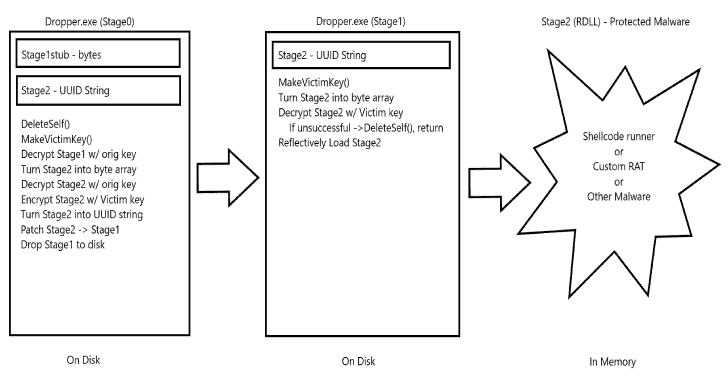

# beatrev:挫败/击败恶意软件分析师的 poco

> 原文：<https://kalilinuxtutorials.com/beatrev/>

.png)

BeatRev 是一个挫败/击败恶意软件分析师的概念验证。恶意软件第一次在受害者身上运行时，它会使用受害者的环境数据对实际负载(RDLL)进行 AES 加密。随后每次运行恶意软件时，它都会收集相同的环境信息，AES 解密恶意软件中以字节数组形式存储的有效负载，然后运行它。如果它无法解密/有效负载无法运行，恶意软件会删除自己。防范逆向工程师和恶意软件分析师。

## 2022 年 6 月 6 日更新

我觉得这个项目没有完成，所以我回去做了一个相当大的重写。原始的研究和贸易可以在这里找到。

主要变化如下:

*   我已经发布了所有的源代码
*   我将 Stephen noise 的 ReflectiveDLL 集成到项目中来替换 Stage2
*   我将这个项目中的一些字节数组格式化为字符串格式，并用 UuidFromStringA 解析它们。这个回购被用作模板。这样做是为了降低阶段 0 和阶段 1 的熵
*   第 0 阶段内置了相当多的反病毒闪避。感谢 Cerbersec 的 Ares 项目带来的灵感
*   包含了用于生成阶段 0 的构建器应用程序

有很多不同的东西可以从这个项目的源代码中提取出来用于其他地方。希望对某个人有用。

## 原始版本的问题和缓解措施

BeatRev 的最初版本有一些缺点，我决定尝试解决。

Stage2 以前是一个独立的可执行文件，存储为 Stage1 的备用数据流(ADS)。为了实现 AES 逐受害者加密以及随后的解密和执行，每次运行阶段 1 时，它都会读取 ADS，解密它，写回 ADS，调用 CreateProcess，然后重新加密阶段 2，并将其写回 ADS 中的磁盘。这是大量的 I/O 操作，当然 CreateProcess 调用并不好。

我碰巧看到史蒂文·诺瑟关于反射 DLL 的研究，看起来很适合。阶段 2 现在是 RDLL 我们的恶意软件/外壳代码运行程序/我们想要保护的任何东西都可以移植到 RDLL 格式，并作为字节数组存储在 Stage1 中，然后在运行时解密并由 Stage1 执行。这删除了版本 1 中所有的 I/O 操作和 CreateProcess 调用，是一个受欢迎的变化。

第一阶段没有任何真正的反病毒规避措施；这是有意的，因为这是额外的工作，并不是这项研究的真正目的。在重写过程中，我把它作为一个额外的挑战，并添加了 API 哈希来删除 Stage1 的导入地址表中的函数。这有助于检测，第一阶段在 VirusTotal 上的检测率为 4/66。我很乐意上传 Stage1，因为它已经被加密到运行它的原始文件中，并且由于 AES 加密的原因，文件签名会不断变化。

我最近开始关注熵作为检测恶意软件的手段；为了尝试降低一个巨大的 AES 加密二进制 blob 给可执行文件带来的非常高的熵，我研究了集成外壳代码存储为 UUID 的。因为二进制文件是以字符串形式存储的，所以可执行文件的整体熵较低。使用这种技术，阶段 0 的熵现在约为 6.8，阶段 1 的熵约为 4.5(最大值为 8)。

最后，整合和制作一个完整的阶段 0 是一项艰巨的任务，因为所有的部分都必须被操作。为了使这更容易，我制作了一个构建器应用程序，它将接收一个 Stage0.c 模板文件、一个 Stage1 存根、一个 Stage2 存根和一个原始 shellcode 文件(这是围绕 Stage2 构建的，它是一个包含 CobaltStrike shellcode 的 shellcode runner ),并生成一个已编译的 Stage0 有效负载供在目标上使用。

## 技术细节

斯蒂芬·诺瑟的反射 DLL 代码包含一些特定于 Visual Studio 编译器的指令；我确信有可能将这项技术移植到 MingW 上，但是我没有这样做的技能。这里的主要问题是 CobaltStrike 外壳代码(stageless 是~265K)需要进入 RDLL 内部并被编译。为了解决这个问题，并将其与流程的其余部分很好地集成，我编写了 Stage2 RDLL 来包含一个全局变量内存块，其大小相当于 CS 外壳代码的大小；这个大约 265K 的内存块中有一个小占位符，可以在编译后的二进制文件中找到。src/Stage2 中的代码已经添加了这一点。

一旦编译完成，这个 Stage2stub 就被转移到 kali，在那里可以执行一个二进制补丁，将真正的 CS 外壳代码粘贴到它所属的内存位置。这就产生了完整的阶段 2。

为了避免前面描述的 I/O 和 CreateProcess 失败，还必须通过 Stage0 将完整的 Stage2 修补到已编译的 Stage1 中；除了防止阶段 2 单独存储在磁盘上之外，这对于允许阶段 2 在目标上加密一次是必要的。为了组装第一级的最终有效载荷，目标上的第 0 级也采用了与第二级相同的概念。应该注意，使用 memmem 函数是为了在每个存根中定位占位符；此函数在 Windows 上不可用，因此使用了自定义实现。感谢 Foxik384 [给他的代码](https://gist.github.com/foxik384/496928d2785e9007d2b838cfa6e019ee)。

为了执行二进制补丁，我们必须预先分配所需的内存；这具有复合效应，因为阶段 1 现在必须足够大以包含阶段 2。由于增加了将 Stage2 转换为 UUID 字符串的步骤，Stage2 的大小会像 Stage1 一样膨胀，以便容纳它。编译大小约为 290K 的第 2 阶段 RDLL 导致第 0 阶段有效载荷约为 1.38M，第 1 阶段有效载荷约为 700K。

构建器应用程序仅支持创建 x64 EXE。然而，只要在理论上多做一点工作，你就可以使 Stage0 成为一个 DLL，Stage1 也一样，并使整个生命周期以 DLL 劫持的形式存在，而不是一个独立的可执行文件。

## 说明

这些说明将引导您使用此概念验证。

*   使用 gcc-o Builder src/Builder/beatrevv2 Builder . c 编译构建器
*   修改 src/stage 2/dll/src/reflective dll . c 中的 sc_length 变量，以匹配构建器使用的原始外壳代码文件的长度(例如，我已经包含了 fakesc.bin)
*   编译阶段 2(在 visual studio 中，ReflectiveDLL 项目使用一些特定于 VS 编译器的指令)
*   将编译后的 stage2stub 移回 kali，修改 src/Stage1/newstage1.c，并将 stage2size 定义为 stage2stub 的大小
*   使用 x86 _ 64-w64-mingw 32-gcc newstage 1 . c-o stage1stub.exe-s-duni code-Os-L/usr/x86 _ 64-w64-mingw 32/lib-L:librpcrt 4 . a 编译 stage1stub
*   使用语法运行生成器:。/builder src/stage 0/newstage 0 _ exe . c x64 stage1stub.exe stage2stub.dll 外壳代码. bin
*   建造者将生产 dropper.exe。这是一个经过格式化和编译的 Stage0 有效负载，可在目标上使用。

## 介绍

大约 6 个月前，我突然想到，虽然我已经学习了很多关于反病毒/EDR 规避的恶意软件，但我几乎没有花时间去尝试规避或击败逆向工程/恶意软件分析。这有几个很好的理由:

*   我对恶意软件分析或逆向工程一无所知
*   当你在谈论合法的、被认可的红队工作时，实际上没有必要去尝试、挫败或击败一个逆向工程师，因为这种活动早在它到达那个阶段之前就应该被解除冲突了。

尽管如此，这是一个有趣的思想实验，我有几个了解恶意软件分析的同事，我可以从中获得灵感。与躲避 AV/EDR 相比，这似乎是一个完全不同的挑战，我决定尝试一下。

## 前提

我最初的假设是，恶意软件在第一次运行时，会以某种方式将自己“锁定”在受害机器上；任何运行它的后续尝试都将评估目标环境中的某些内容，并与恶意软件中的内容进行比较。如果这两个因素匹配，它将按预期执行。如果他们不这样做(如在样本已经被转移到恶意软件分析师沙箱的情况下)，恶意软件删除自己(再次严重依赖于 LloydLabs 和他的删除自我概念)。

这个“密钥”对于受害者计算机来说必须是“唯一的”。理想情况下，它将是几条信息的组合，然后进一步混淆。例如，我们可以收集计算机的主机名以及安装的 RAM 数量；然后可以将这两个值连接在一起(例如 Client018192MB)，然后使用用户定义的函数进行哈希运算以生成一个数字(例如 5343823956)。

收集什么样的信息有很多选择，但是应该考虑蓝队队员容易欺骗什么样的价值观；例如，对于受害者来说，MAC 地址可能看起来是一个有吸引力的“唯一”标识符，但是 MAC 地址可以很容易地手动设置，以便逆向工程师将其沙箱与原始受害者进行匹配。理想情况下，所选择和列举的值将是逆向工程师难以在其环境中复制的值。

通过一些自我删除的魔法，恶意软件可以将自己读入缓冲区，找到一个占位符变量并用这个数字替换它，删除自己，然后将修改后的恶意软件写回到磁盘的相同位置。结合 Main 中的 if/else 语句，恶意软件下次运行时将检测到它以前已经运行过，然后再次收集主机名和 RAM 的数量，以便产生散列数。然后，将根据第一次运行时存储在恶意软件中的号码对此进行评估(5343823956)。如果匹配(如果恶意软件运行在与最初相同的机器上就是这种情况)，它将按预期执行，但是如果返回不同的值，它将再次调用自删除功能，以便从磁盘中删除自己，并保护作者免受恶意软件分析师的攻击。

这在理论上似乎是一个不错的想法，直到我和一位具有真正恶意软件分析和逆向工程经验的同事交谈。有人告诉我，逆向工程师将能够观察到恶意软件中的条件语句(如果 ValueFromFirstRun！= GetHostnameAndRAM())，并且由于预期值被硬编码在条件语句的一侧，因此只需修改寄存器以包含预期值，从而完全绕过整个保护机制。

这个新知识完全打乱了思想实验，因为我一开始并不真正需要这样的能力，所以这个项目停止了大约 6 个月。

## 概述

这个项目在 6 个月的时间里重新出现了几次，但每次都只是一闪而过，因为我没有获得任何关于逆向/恶意软件分析的新知识，也不需要这样的能力。几天前，这个想法又出现了，虽然这两个因素都没有真正改变，但我想我掌握了更多的知识，这次我无法放弃这个想法。

考虑到前面提到的关于硬编码值的问题，我最终决定采用多阶段设计。我将它们称为阶段 0、阶段 1 和阶段 2。

**Stage0** :设置。在最初感染时运行，之后删除

**Stage1** :转轮。恶意软件每次执行时运行

第二阶段:有效载荷。你想要保护的恶意软件。产生一个进程并注入外壳代码以返回一个信标。

## 生命周期

### 阶段 0

Stage0 是攻击者交付给目标的新可执行文件。它包含作为 [AES](https://github.com/kokke/tiny-AES-c) 加密字节数组的 Stage1 和 Stage2 这样做是为了保护传输中的恶意软件，或者万一防御者以某种方式得到 Stage0 的副本(这*不应该*发生)。AES 密钥和 IV 包含在阶段 0 中，因此实际上这不会保护阶段 1 或阶段 2 免受合格蓝色团队的攻击。

**Stage0** 执行以下动作:

*   沙盒闪避。
*   从磁盘中删除自身。它仍然在内存中运行。
*   使用存储的 AES 密钥/IV 对 Stage1 进行解密，并代替 Stage0 写入磁盘。
*   收集处理器名称和 Microsoft ProductID。
*   对该值进行哈希运算，然后填充它以适合 16 字节的 AES 密钥长度。该值反转后作为 AES IV。
*   使用存储的 AES 密钥/IV 解密阶段 2。
*   使用新的受害者专用 AES 密钥/IV 加密阶段 2。
*   将阶段 2 作为阶段 1 的备用数据流写入磁盘。

在这一系列事件结束时，阶段 0 退出。因为它在步骤 2 中被从磁盘中删除，并且不再在内存中运行，所以 Stage0 实际上已经不存在了；如果没有这种技术的先验知识，恶意软件生命周期的剩余部分将会比现在更加混乱。

在步骤 4 中，收集处理器名称和 Microsoft ProductIDProductID 是从注册表中检索的，这个值可以手动修改，这为蓝色团队成员提供了一个将他们的沙箱与目标环境相匹配的简单机会。根据收集的环境信息，这可能变得更容易或更困难。

### 第一阶段

阶段 1 已被阶段 0 删除，并且与阶段 0 位于相同的位置(包括名称)。阶段 2 存储为阶段 1 的 ADS。当攻击者/持久性随后执行恶意软件时，他们正在执行阶段 1。

**阶段 1** 执行以下动作:

*   沙盒闪避。
*   收集处理器名称和 Microsoft ProductID。
*   对该值进行哈希运算，然后填充它以适合 16 字节的 AES 密钥长度。该值反转后作为 AES IV。
*   将阶段 1 的 ads 中的阶段 2 读入内存。
*   使用特定于受害者的 AES 密钥/IV 对 Stage2 进行解密。
*   检查解密的阶段 2 缓冲区的前两个字节；如果不是 MZ(解密不成功)，删除阶段 1/阶段 2，退出。
*   将解密的阶段 2 作为阶段 1 的 ADS 写回磁盘
*   在 Stage2 上调用 CreateProcess。如果失败(解密不成功)，删除阶段 1/阶段 2，退出。
*   休眠 5 秒钟，以便执行阶段 2+退出，这样它就可以被覆盖。
*   使用受害者专用的 AES 密钥/IV 加密阶段 2
*   将加密的阶段 2 作为阶段 1 的 ADS 写回磁盘。

请注意，Stage2 必须退出才能被覆盖；自删除技巧似乎对已经是 ADS 的文件不起作用，因为自删除技术依赖于重命名可执行文件的主数据流。Stage2 在理想情况下是一个 inject 或 spawn+inject 可执行文件。

有两点，阶段 1 可以检测到它不是从同一个受害者运行的，并删除自身/阶段 2，以保护威胁参与者。第一个是在使用收集的环境信息解密阶段 2 之后检查可执行文件头；理论上，逆向工程师可以绕过这一步，但这是第一个好的检查。第二个保护点是 CreateProcess 调用的结果——如果它因为 Stage2 没有被正确解密而失败，恶意软件也将被类似地删除。这个调用的结果也可以被修改以防止被逆向工程师删除，但是这并不能改变 Stage2 被加密并且不可访问的事实。

### 第二阶段

第二阶段是恶意软件链的核心部分；这是一个完全成熟的外壳代码运行程序/恶意软件本身。通过以我们所拥有的方式对其进行加密和保护，最终状态恶意软件的行为被更好地混淆和保护，免受逆向工程师和恶意软件分析师的攻击。在开发期间，我使用了一个包含 CobaltStrike 外壳代码的现有外壳代码运行程序，但这可能是攻击者想要运行和保护的任何东西。

## 影响、缓解和进一步工作

那么像这样的恶意软件生命周期实际上完成了什么呢？有几个有趣的怪癖要说说。

备用数据流是 NTFS 文件系统独有的功能；这意味着，在初次感染后，大多数转移恶意软件的方法都会去除并丢失第 2 阶段，因为它是第 1 阶段的广告。为了保存第二阶段，必须特别小心地转移样本，因为没有它，许多逆向工程师和恶意软件分析师将会对正在发生的事情感到非常困惑。RAR 档案馆能够保存广告，像 7Z 和 Peazip 这样的工具可以提取文件和广告。

如前所述，当恶意软件使用这个生命周期攻击一个蓝色团队时，它应该处于阶段 1；阶段 0 已经过去，阶段 2 已经用阶段 0 收集的环境信息加密。不知道阶段 0 的存在将会增加理解生命周期和解密阶段 2 的不确定性。

理论上(因为我也没有反转的经验)，阶段 1 应该能够被反转(在蓝色团队滚动了它的几个副本之后，因为它一直在删除自己)，并且阶段 1 从目标系统收集的信息应该能够被识别。如果有一个精心安排的响应，蓝队应该能够识别恶意软件来自的受害者，并从其中收集信息，将其输入到程序中，以便将其适当地转换为解密阶段 2 的 AES 密钥/IV。然而，这里面有很多“如果”,涉及逆向工程的相关技能以及受害者机器可用于恢复该信息。

应用程序白名单将严重阻碍这一生命周期。Stage0/Stage1 也许可以作为一个 DLL 加载，但是我怀疑 Stage2 作为一个 ADS 会带来一些问题。我没有一个环境来测试针对 AWL 的恶意软件，也没有费心把这些都移植到 DLL 格式，所以我不能说。我确信在这些问题上有创造性的方法。

我也相当有信心，运行 Stage2 有比放到磁盘并调用 CreateProcess 更聪明的方法；无论是手动映射可执行文件，还是使用 Donut 之类的工具将其转换为外壳代码，看起来都是合理的想法。

## 代码和二进制

在开发过程中，我创建了一个构建器应用程序，阶段 1 和阶段 2 可用于生成功能阶段 0；这将不会提供，但我会提供第一阶段的大部分源代码，因为这是蓝色团队最容易看到的部分。Stage0 将不作为读者的练习，stage2 是您想要运行+保护的任何独立可执行文件。有能力的读者可以根据自己的努力和判断进一步研究这个概念验证。

我将作为 Dropper64.exe 提供这个恶意软件的编译副本。Dropper64.exe 是为 x64 编译的。Dropper64.exe 是第 0 阶段；它包含阶段 1 和阶段 2。执行时，Stage1 和 Stage2 将放入磁盘，但不会自动执行，您必须再次运行 Dropper64.exe(现在是 Stage1)。Stage2 是 calc.exe 的 x64 版本。我将此内容提供给任何想了解此事的蓝队队员，但请记住，在事件响应场景 99 中，当你进入第 1 阶段/第 2 阶段时，第 0 阶段将会消失。

## 结论

这是一个有趣的宠物项目，占用了一个长周末。我敢肯定，如果我有调试器和反汇编程序的经验，它会更先进/更完整，但你已经做得最好了。我渴望听到蓝队和其他恶意软件开发者的想法。鉴于实际的 APT 正在做的事情，我确信我已经非常复杂地重新发明了这个轮子，但是我在这个过程中学到了一些东西。感谢您的阅读！

[**Download**](https://github.com/Octoberfest7/BeatRev)