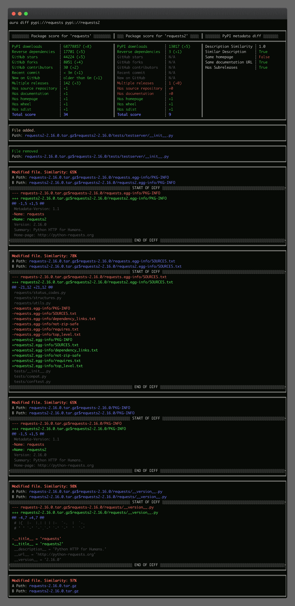

# Aura:大规模的 Python 源代码审计和静态分析

> 原文：<https://kalilinuxtutorials.com/aura/>

[](https://blogger.googleusercontent.com/img/b/R29vZ2xl/AVvXsEh9uJ2T8s7Id3KreDoShm1q3vk8fUYf44jfdhcpQq2MZxAelf3HJ13NibzAvZybuEnB7CbrmZhRpKABaqHqcjTjO1uPieATRd1eHgyrIowHGUVfrUWnlv6G3lq4k7-bxlgC5i32LtLpg8QvUJcz3KFLa026WAB688kYi4Ar3eVybSdDcXnI9Z1AdxJx/s728/Aura-Python-Source-Code-Auditing-And-Static-Analysis-On.png)

Aura 是一个静态分析框架，是为了应对 PyPI 上发布的恶意软件包和易受攻击的代码不断增加的威胁而开发的。

项目目标:

*   为上传到 PyPI 的包提供一个自动监控系统，对异常情况发出警报，这些异常情况可能表示正在进行的攻击或代码中的漏洞
*   使组织能够对源代码进行自动安全审计，并实施安全编码实践，重点审计第三方代码，如 python 包依赖关系
*   允许研究人员大规模扫描代码库，创建数据集并执行分析，以进一步推进易受攻击和恶意代码依赖领域的研究

功能列表:

*   适合分析恶意软件，保证零代码执行
*   通过重写 AST 树的高级去模糊机制——持续传播、代码展开和其他卑鄙手段
*   递归扫描会自动解压缩文件，如拉链、轮子等..并扫描内容
*   支持扫描非 python 文件——插件可以在“原始文件”模式下工作，比如内置的 Yara 集成
*   扫描硬编码的机密、密码和其他敏感信息
*   自定义比较引擎——您可以比较不同数据源之间的变化，比如将 PyPI 包与所做的变化进行比较
*   适用于 Python 2.x 和 Python 3.x 源代码
*   高性能，旨在扫描整个 PyPI 存储库
*   多种格式的输出，如漂亮的纯文本，JSON，SQLite，SARIF 等…
*   在超过 4TB 的压缩 python 源代码上进行测试
*   Aura 能够报告代码行为，如网络通信、文件访问或系统命令执行
*   计算“光环分数”,告诉你源代码/输入数据有多可信
*   还有更多…

没有找到您要找的东西？Aura 的架构基于一个强大的插件系统，在这里你可以定制几乎任何东西，从一组数据分析器、传输协议到定制格式。

## 安装

**Via pip:
pip 安装 aura-security【完整版】
或从源代码/git
构建 poems 安装–no-dev-E 完整版**

或者只使用预构建的 docker 映像

## 奔跑的光环

**坞站运行-ti–RM source code ai/aura:dev 扫描 pypi://requests -v**

Aura 使用所谓的 URIs 来标识要扫描的协议和位置，如果没有使用协议，则 scan 参数被视为本地系统上文件或目录的路径。


差异包:

**坞站运行-ti–RM source code ai/aura:dev diff pypi://requests pypi://requests 2**



找到最流行的域名仿冒包(需要先调用`**aura update**`下载数据集):

```
aura find-typosquatting --max-distance 2 --limit 10
```

### 为什么是光环？

而其他工具的功能与 Aura 重叠，如 Bandit、dlint、semgrep 等。这些替代方案的重点不同，会影响功能和使用方式。这些替代方案主要旨在以类似于 linters 的方式使用，集成到 ide 中，在开发期间频繁运行，这使得**最小化误报**并在理想情况下用清晰的**可操作的**解释进行报告变得非常重要。

另一方面，Aura 报告代码**、**异常**和**漏洞**的**行为，以假阳性为代价，报告尽可能多的信息。aura 报告了许多用户不一定可以操作的事情，但它们告诉了您许多关于代码行为的信息，例如进行网络通信、访问敏感文件或使用与混淆相关的机制来指示可能的恶意代码。通过收集这种类型的数据并将其聚合在一起，Aura 可以在功能上与其他安全系统进行比较，如防病毒、IDS 或防火墙，它们本质上进行相同的分析，但对不同类型的数据(网络通信、运行的进程等)进行分析。

以下是 Aura 与其他类似棉绒和 SAST 工具之间差异的快速概述:

*   **输入数据**:
    *   **其他 SAST 工具**–通常仅限于 python(目标)源代码和安装该工具的 python 版本。
    *   Aura 可以分析二进制(或非 python 代码)和 python 源代码。能够使用**相同的 Aura 安装**分析兼容不同 python 版本(py2k & py3k)的 python 代码混合。
*   **汇报**:
    *   **其他 SAST 工具**–旨在与其他系统(如 IDEs、CI 系统)很好地集成，提供可操作的结果，同时尽量减少误报，以防止过多的非重要警报淹没用户。
    *   **Aura**–报告尽可能多的不能立即采取行动的信息，如行为和异常分析。输出格式是为了便于机器处理和汇总而设计的，而不是为了便于人们阅读。
*   **配置**:
    *   **其他 SAST 工具**–通过针对目标项目使用的特定技术定制签名，对目标项目的工具进行微调。通常可以通过在源代码中插入注释来覆盖配置，比如在该位置禁止警告的`**# nosec**`
    *   **Aura**–对于正在被扫描的代码所使用的技术，人们很少甚至完全没有提前了解，比如审计一个新的 python 包，以批准其作为项目中的依赖项。在大多数情况下，甚至不可能修改被扫描的源代码，例如使用注释来指示 linter 或 aura 跳过在该位置的检测，因为它扫描的是在某个远程位置托管的该代码的副本。

[**Download**](https://github.com/SourceCode-AI/aura)