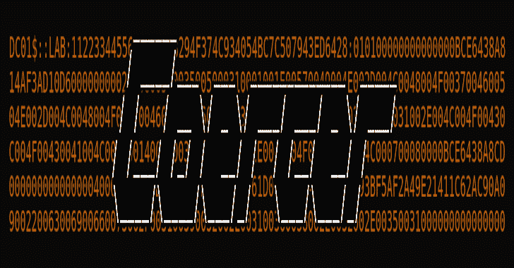
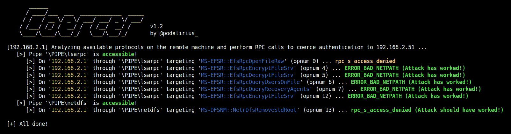
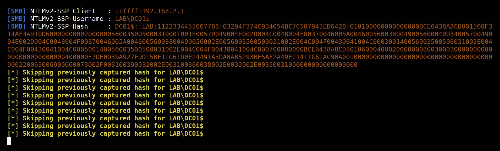

# 强制:一个 Python 脚本，自动强制 Windows 服务器在任意机器上进行身份验证

> 原文：<https://kalilinuxtutorials.com/coercer/>

.png)

**compressor**是一个 python 脚本，通过 9 种方法自动强制 Windows 服务器在任意机器上进行身份验证。

## 特征

*   自动检测远程机器上打开的 SMB 管道。
*   逐个调用所有易受攻击的 RPC 函数来强制服务器在任意机器上进行身份验证。
*   使用`**--analyze**`分析模式，该模式仅列出易受攻击的协议和功能监听，而不执行强制认证。
*   使用`**--targets-file**`对文件中的目标列表执行强制攻击
*   用`**--webdav-host**`和`**--webdav-port**`强制一个 WebDAV 目标

## 安装

您现在可以使用以下命令从 pypi(最新版本是)安装它:

**sudo python3 -m pip 安装胁迫器**

## 使用

**$。/compressor . py-h
*_//*_*_ _ _ _ _ _**_//_ \/*/*/_ \/*/
//////////v 1.6 _/_/_ _ _/*/_ _*/_ _ _/*/by @ podalirius*
用法:compressor . py
选项:
-h，–帮助显示此帮助消息并退出
-u 用户名，–用户名用户名
用户名，以向端点进行身份验证。
-p PASSWORD，–PASSWORD PASSWORD
对终端进行身份验证的密码。(如果省略，除非指定了-no-pass，否则会询问)
-d DOMAIN，–DOMAIN DOMAIN
向端点进行身份验证的 Windows 域名。
–hashes[LM hash]:n hash
NT/LM hashes(LM hash 可以为空)
–no-pass 不要询问密码(对-k 有用)
-v，–Verbose Verbose 模式(默认:False)
-a，–Analyze 分析模式(默认:攻击模式)
-k，–kerberos 使用 Kerberos 认证。根据目标参数从 ccache 文件(KRB5CCNAME)中获取凭据。如果找不到有效的凭证，它将使用在
命令行
–域控制器的 dc-ip ip 地址 ip 地址中指定的凭证。如果省略，它将使用目标参数
-t TARGET、–TARGET TARGET
目标机器的 ip 地址或主机名
-f TARGETS_FILE、–TARGETS-FILE TARGETS _ FILE
目标机器的 IP 地址或主机名
–TARGET-IP IP 地址
目标机器的 IP 地址。如果省略，它将使用指定为目标的任何内容。当 target 是 NetBIOS 名称或 Kerberos 名称，并且您无法解析它时，这很有用。
-l LISTENER，–LISTENER LISTENER
监听程序机器的 IP 地址或主机名
-wh WEBDAV_HOST，–WEBDAV-HOST WEBDAV _ HOST
要验证到的服务器的 WebDAV IP。
-wp WEBDAV_PORT，–WEBDAV-PORT WEBDAV _ PORT
要验证的服务器的 WEBDAV 端口。**

## 强制 WebDAV 身份验证演示

如果您想要触发 HTTP 认证，您可以使用 WebDAV 和`**--webdav-host**`以及您的攻击机器的 netdbios 名称！

## 示例输出

在攻击模式下(没有`**--analyze**`选项),您会得到以下输出:

在所有的 RPC 调用之后，您会在 Responder 中获得大量的身份验证:

[**Download**](https://github.com/p0dalirius/Coercer)