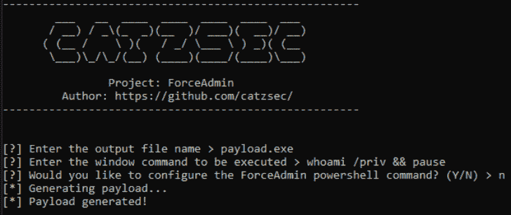

# ForceAdmin:创建无限 UAC 提示，强制用户以管理员身份运行

> 原文：<https://kalilinuxtutorials.com/forceadmin/>

.png)

ForceAdmin 是一个 c#有效载荷构建器，创建无限 UAC 弹出窗口，直到用户允许程序运行。输入的命令是通过 powershell 调用 cmd.exe 运行的，应该使用批处理语法。为什么用？一些用户将 UAC 设置为总是显示，所以 UAC 旁路技术是不可能的。但是，这次攻击将迫使他们以管理员身份运行。绕过这些设置。

## 需要

对于您自己的构建，需要以下 NuGet 包

*   `**Fody**`:“可扩展的编织工具。net 程序集。
*   `**Costura.Fody**`"用于将引用作为资源嵌入的 Fody 外接程序。"
*   `**Microsoft.AspNet.WebApi.Client**`"此软件包为 System.Net.Http 添加了对格式和内容协商的支持。它包括对 JSON、XML 和表单 URL 编码数据的支持。"

## 装置

你可以点击这里下载最新的 tarball 或者点击这里下载最新的 zipball。

下载项目:

**git 克隆 https://github . com/catzsec/force admin . git**

进入项目文件夹

**$ cd ForceAdmin**

运行 ForceAdmin:

**$ dotnet 运行**

[**Download**](https://github.com/catzsec/ForceAdmin)